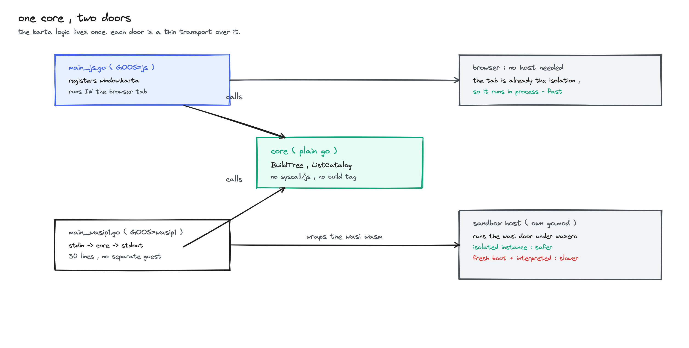

<!--
SPDX-License-Identifier: Apache-2.0
Copyright (c) 2026 NVIDIA Corporation
-->

# karta in wasm

run the Karta engine in a browser. this module compiles Karta to WebAssembly and
exposes a few read-only calls to javascript , so the Headlamp plugin can build a
workload tree and read status without a round trip to a server.

## the idea

karta is go. a browser is javascript. so we compile karta to wasm and put a thin
bridge on top. the logic stays in go , the bridge only moves json across.

```
browser ( js )  ->  window.karta.buildTree( def, workload )  ->  wasm ( go )  ->  a workload tree
```

## the two doors



the karta logic lives in one place and every door is thin :

```
karta-wasm/
  core/          the karta calls , plain go , no syscall/js , no build tag
  main_js.go     the browser door  ( //go:build js )     - registers window.karta
  bindings.go    the browser adapters : js args -> core -> envelope
  codec.go       the {data,error} envelope the js side unwraps
```

- `core` holds `BuildTree` , `DecodeDefinition` , `DecodeWorkload` , `ListCatalog`. it
  imports no `syscall/js` , so it is not tied to the browser.
- `main_js.go` + `bindings.go` are the browser transport. they unpack the js string
  arguments , call `core` , and wrap the result in the envelope.

because `core` is transport-agnostic , a second door can reuse it unchanged. a wasi
build ( `//go:build wasip1` ) driven by stdin/stdout would call the same
`core.BuildTree` - only the transport differs. the same `core` compiles for both
`GOOS=js` and `GOOS=wasip1`.

## the api

`window.karta` exposes three calls. arguments and results are json strings ; the
typed wrappers in the Headlamp plugin ( `headlamp-plugin/src/lib/karta` ) handle the
stringify / parse.

| call | takes | returns |
|---|---|---|
| `buildTree( definitionJSON, workloadJSON )` | a Karta definition + a workload | the workload tree , including the root status |
| `listCatalog()` | - | the definitions built into the module |

every call returns one envelope so the js side has a single shape to unwrap :

```json
{ "data": "<json string>", "error": null }
```

## build

```sh
make karta-wasm            # builds karta.wasm + copies wasm_exec.js
make headlamp-plugin-build # builds the wasm , then the Headlamp plugin
```

## test

the core logic is plain go and runs on the host :

```sh
make test-karta-wasm       # go -C karta-wasm test ./...
```

the browser bindings have their own tests under `//go:build js`.

## running it isolated

to run the wasi door in an isolated instance ( safer , slower ) see
[karta-wasm/sandbox](sandbox/README.md).
