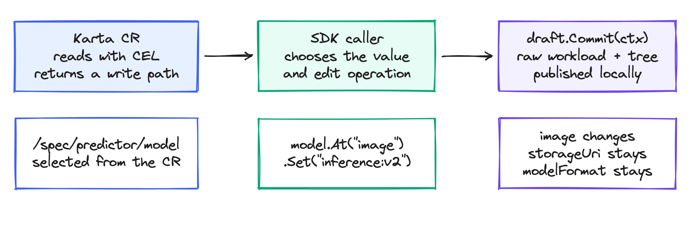

<!--
SPDX-License-Identifier: Apache-2.0
Copyright (c) 2026 NVIDIA Corporation
-->

# KEP-0001: CEL expressions and value accessors

- Status: implementable
- Authors: @AviadHayumi
- Created: 2026-09-10
- Last updated: 2026-09-10

## Summary

Karta definitions move from jq path strings to CEL, the expression language
Kubernetes itself uses for CRD validation rules and admission policies. Every
read becomes a CEL expression evaluated with the workload bound as `object`,
and every write becomes a patch the definition constructs. The change breaks
the CRD, so it ships as a new API version, and the version bump is used to
decouple the scheduling section from any single scheduler.



The diagram source is `accessor-model.excalidraw`; open it at excalidraw.com to edit.

## Motivation

Every value a Karta extracts today is a jq path. That served the first
catalog well, but it has four structural costs.

- jq is not the Kubernetes ecosystem's language. An author who writes a
  ValidatingAdmissionPolicy or a CRD validation rule already knows CEL;
  jq is one more dialect to learn and to review.
- jq is untyped over a total order. `.status.active > 0` answers `true`
  when `active` is a list of job references, silently producing a wrong
  status. CEL refuses the comparison with a typed error.
- A jq path doubles as an l-value: the engine writes through the same
  string it reads. That makes reads and writes inseparable, which blocks
  the resource-references design, where a value is read from another
  object but written to the workload.
- Evaluation has no cost model. CEL programs are compiled once, cached,
  and charged a per-step budget, so a runaway expression fails fast
  instead of stalling a reconcile.

### Goals

- One expression language, CEL, for every read in a definition.
- Reads and writes separated: `expression` reads, `patch` writes.
- A new CRD version carrying the change; the old fields are removed,
  not deprecated in place.
- A scheduler-agnostic scheduling section, decoupled from any single
  scheduler's vocabulary.
- The consumer-facing Go API (factory, accessor, component, tree) is
  unchanged: consumers recompile without edits.
- The catalog, the recorder fixtures, and the docs ship converted.

### Non-goals

- A jq compatibility layer or a dual-engine mode. Two engines means two
  sets of semantics to verify per definition.
- Automatic in-cluster conversion of stored definitions. The catalog is
  regenerated; out-of-tree definitions are rewritten by their authors
  (see Migration).
- New expression capabilities beyond what the port needs. References,
  for example, build on this KEP but are their own change.

## Proposal

### The value accessor

Every field the old API addressed with a `*Path` string becomes a value
accessor, a pair with one optional flag:

```yaml
podTemplateSpec:
  expression: object[?"spec"][?"template"].orValue(null)   # the read
  patch: '{"spec": {"template": value}}'                    # the write
  replace: true                                             # delete, then set
```

- `expression` is CEL, evaluated with the workload bound as `object`.
  Absence is explicit: `[?"key"]` and `.?field` make a missing field a
  value, and `.orValue(...)` names its default.
- `patch` is also CEL, but it constructs the change instead of naming a
  location. A map result is a JSON merge patch (null deletes); a list
  result is RFC 6902 operations. The patch sees `value` (what Karta is
  writing), `instance` and `index` (which instance of a multi-instance
  component), and `variables.<name>`.
- `replace: true` applies the patch twice: once with `value` bound to
  null to clear the field, then with the real value. A pod template
  update wants this; an annotations merge does not.
- An accessor with only an `expression` is read-only. Writing through it
  fails with a clear error instead of guessing a location.

Patches are constructed against the pre-write document and applied
all-or-nothing with a snapshot rollback, so a multi-instance write can
never land half of its changes.

### Variables

`spec.variables` names CEL expressions once and makes them available to
every expression and patch as `variables.<name>`, evaluated in order,
later ones seeing earlier ones. This is the same composition mechanism a
ValidatingAdmissionPolicy has, and it keeps the coalesce idioms out of
every field:

```yaml
variables:
  - name: specReplicas
    expression: ([dyn(object[?"spec"][?"replicas"].orValue(null))].filter(v, v != null && v != false) + [1])[0]
```

### The CRD, at a high level

The new version keeps the shape of the definition and changes only how
values are addressed:

```yaml
apiVersion: run.ai/v1beta1
kind: Karta
metadata:
  name: batch-job-v1
spec:
  variables: [ ... ]                  # named CEL expressions
  structureDefinition:
    references: [ ... ]               # KEP for references builds on this
    rootComponent:
      name: job
      kind: { group: batch, version: v1, kind: Job }
      specDefinition:
        podTemplateSpec: { expression: ..., patch: ..., replace: true }
      scaleDefinition:
        replicas: { expression: ... }
      statusDefinition:
        conditionsDefinition: { expression: ..., typeFieldName: type, ... }
        statusMappings: { running: [ { byExpression: { expression: ..., expectedResult: "true" } } ], ... }
      suspendDefinition:
        suspendActions: [ { patch: '{"spec": {"suspend": true}}' } ]
    childComponents: [ ... ]          # same accessor shapes per component
  scheduling:                         # renamed; see decoupling below
    podGroups: [ ... ]
```

Removed outright: every `*Path` field (24 across the spec), `filters`,
`groupByKeyPaths`, `expressionLanguage`, and the path-and-value form of
suspend actions.

### Decoupling the scheduling section

`optimizationInstructions` was named for one consumer. The semantics it
carries, pod grouping for gang scheduling, are not specific to any
scheduler: the same pod-group notion is consumed by KAI Scheduler, Kueue,
and Volcano. The version bump renames the section and keeps it strictly
declarative:

- `optimizationInstructions` becomes `scheduling`.
- `podGroups` stays: members name components, and `groupByExpressions`
  derive the group key from each pod, in CEL like everything else.
- Nothing in the section names a scheduler, an annotation format, or a
  CRD another project owns. Translating a Karta pod group into a
  scheduler's own object is the consumer's job, exactly like resolving
  references is.

Anything that cannot be stated scheduler-agnostically does not belong in
the CRD and is dropped in the new version.

### CEL vs jq, the whole difference

| Concern | jq (v1alpha1) | CEL (new version) |
|---|---|---|
| Read a field | `.spec.template` | `object[?"spec"][?"template"].orValue(null)` |
| Default | `.status.ready // 0` (also fires on `false`) | `object.?status.?ready.orValue(0)` (absence only) |
| Iterate | `.spec.jobs[].name` (stream) | `object.spec.jobs.map(x, x[?"name"].orValue(null))` (list) |
| Filter and test | `.status.conditions[] \| select(.type == "Ready") \| .status == "True"` | `object.status.conditions.exists(c, c.type == "Ready" && c.status == "True")` |
| Wrong-typed question | `[...] > 0` answers `true` | typed error: no matching overload |
| Write | the read path is the l-value | a patch expression constructs the change |
| Compose | `$variables.name` (engine-specific) | `variables.<name>`, the VAP mechanism |
| Cost | unbounded | compiled once, cached, per-step budget |

The `//` default is the sharpest migration trap: jq falls through on
`false` as well as null. Where a definition relied on that, the CEL
spelling states it: `([dyn(X.orValue(null))].filter(v, v != null && v != false) + [D])[0]`.

### Conditional patches

A patch is an expression, so a definition can already branch on the
document and choose the shape of its own write:

```yaml
podTemplateSpec:
  expression: ...
  patch: >-
    object.?spec.?jobTemplate.hasValue()
      ? {"spec": {"jobTemplate": {"spec": {"template": value}}}}
      : {"spec": {"template": value}}
```

"If this exists, patch this way, else patch that way" is one CEL
conditional; else-if chains nest, conditions compose with `&&`, `||`,
and `variables.<name>`, and the two branches may even produce different
patch shapes (a merge patch on one side, an operation list on the
other, each wrapped in `dyn()`).

Nested ternaries stop reading well at three branches. Since this
version breaks the CRD anyway, the accessor also gains a structured
form, `patches`, mirroring the match-list idiom `statusMappings`
already uses:

```yaml
podTemplateSpec:
  expression: ...
  patches:
    - when: variables.hasJobTemplate       # CEL boolean; first match wins
      patch: '{"spec": {"jobTemplate": {"spec": {"template": value}}}}'
    - when: variables.hasTemplate
      patch: '{"spec": {"template": value}}'
    - patch: '{"spec": {"fallback": value}}'   # no when: always matches
  replace: true
```

Semantics:

- `patch` and `patches` are a one-of on the accessor.
- Entries are evaluated in order against the pre-write document; the
  first whose `when` holds supplies the patch. An entry without `when`
  always matches, so a trailing default reads like `else`.
- No entry matching is a loud error: the definition said nothing about
  this document shape, and guessing a write location is exactly what
  this KEP removes.
- Each `when` and `patch` is validated independently, which tooling and
  review diffs benefit from; a nested ternary is one opaque string.

The single `patch` stays the right tool for one or two branches; the
list earns its place at three or more.

## Examples

The same suspend action, both versions:

```yaml
# v1alpha1
suspendActions:
  - path: .spec.suspend
    value: "true"

# new version
suspendActions:
  - patch: '{"spec": {"suspend": true}}'
```

A list-instanced component, both versions:

```yaml
# v1alpha1
instanceIdPath: .spec.replicatedJobs[].name
podTemplateSpecPath: .spec.replicatedJobs[].template.spec.template

# new version
instanceIds:
  expression: object.spec.replicatedJobs.map(x, x[?"name"].orValue(null))
podTemplateSpec:
  expression: object.spec.replicatedJobs.map(x, x[?"template"][?"spec"][?"template"].orValue(null))
  patch: '[{"op": "add", "path": "/spec/replicatedJobs/" + string(index) + "/template/spec/template", "value": value}]'
```

The full converted catalog, twenty definitions, lives under
`docs/catalog/` on the implementation branch and is the richest set of
examples.

## Migration and versioning

- The change ships as a new CRD version; `v1alpha1` is removed in the
  same release. This is a breaking change and is treated as one: the
  release notes carry the field-by-field mapping.
- Definitions: every path field maps mechanically to an accessor (see
  the table and examples above). The built-in catalog ships converted.
  `hack/karta-verify` validates a rewritten definition against a real
  manifest before it is applied.
- Consumers: the Go surface is unchanged. A consumer that only uses the
  factory, accessor, component, and tree APIs recompiles without edits.
- Safety net: the recorded fixtures under `test/e2e/recorded_data/`
  replay every real operator state through the new engine offline, so a
  conversion mistake in the catalog fails a test, not a cluster.

## Alternatives considered

- Keep jq. Rejected: untyped total ordering produces silently wrong
  statuses, the path-as-l-value model blocks references, and jq is not
  the language the ecosystem reviews in.
- Support both engines behind `spec.expressionLanguage`. Rejected after
  being built: every definition doubles its verification surface, the
  API grows a mode switch forever, and the two engines disagree exactly
  in the corners that matter (defaults on `false`, list typing).
- Conditional writes through CEL ternaries only, with no structured
  form. Rejected: nested ternaries stop reading at three branches, and
  the CRD already carries the match-list idiom in `statusMappings`, so
  `patches` adds no new grammar. Conversely, a richer combinator
  language (`and`/`or` fields on the match) was also rejected: `when`
  is CEL, and CEL already has `&&` and `||`.
- Keeping `optimizationInstructions` as-is through the version bump.
  Rejected: a breaking release is the one cheap moment to remove a
  consumer-specific name from the API.

## Future work

- Resource references: read another object's values as
  `references.<name>`; designed in
  `docs/design/references/high-level-design.md` and implemented on top
  of this KEP.
- Declaring `references.<name>` and `variables.<name>` per definition in
  the CEL environment, the way a ValidatingAdmissionPolicy gates params
  on `paramKind`, so an undeclared name fails at validation rather than
  evaluation.
- A validation option that compiles every expression at admission time.

## Implementation history

- 2026-09-08: engine, API, catalog, and docs implemented on the
  `cel-native` branch; recorded fixtures replay green.
- 2026-09-09: references implemented on top (`cel-references` branch).
- 2026-09-10: KEP written; status `implementable`. The structured
  `patches` form is proposed here and not yet on the implementation
  branches; conditional ternary patches work on them today.
