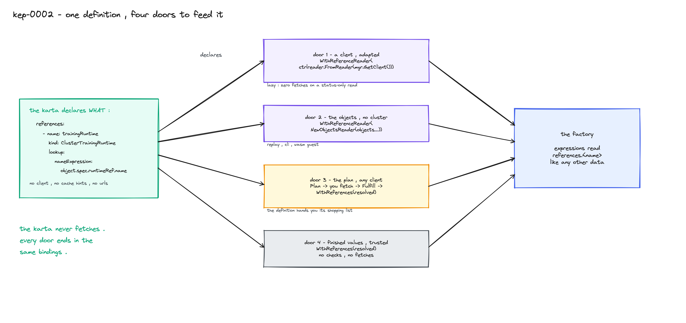
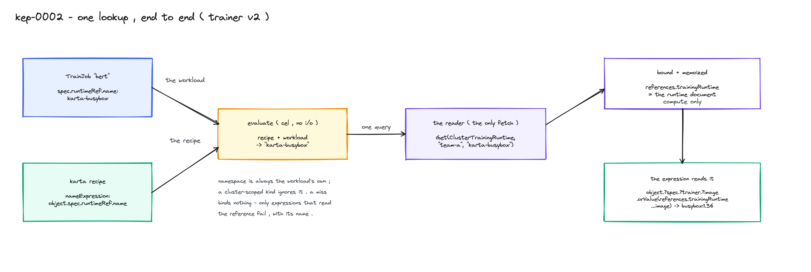
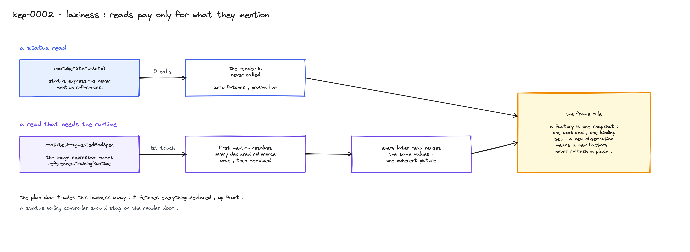
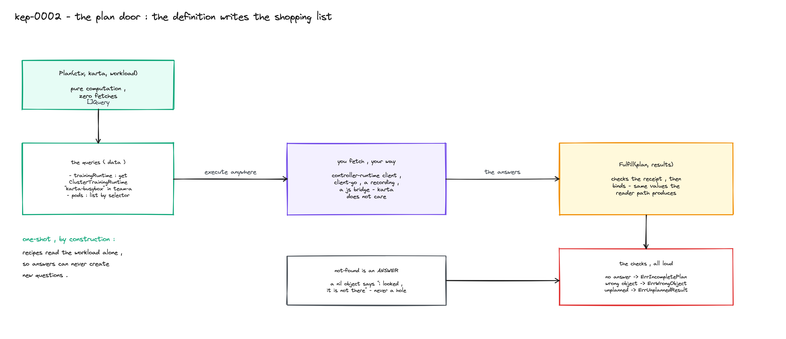

<!--
SPDX-License-Identifier: Apache-2.0
Copyright (c) 2026 NVIDIA Corporation
-->

# KEP-0002: Resource references

- Status: implementable
- Authors: @AviadHayumi
- Created: 2026-09-14
- Depends on: [KEP-0001](../0001-cel-expressions/README.md)
- Tracking issue: to be opened before this KEP merges

## Summary

A Trainer v2 TrainJob holds only overrides. Its image lives in the
ClusterTrainingRuntime that `spec.runtimeRef` names. A definition that only
sees the workload cannot answer "what is the image" for a kind like that.

So a definition can declare references: named pointers to other cluster
objects, found by name or by label selector, read by expressions as
`references.<name>`. The definition declares what it needs and never fetches.
The consumer brings the data, and there are four ways to do that:



Every door ends in the same bindings. Diagram sources sit next to this file
as `.excalidraw`; open them at excalidraw.com to edit.

## Motivation

Without references, the TrainJob definition returns null for image, resources
and node count, and every consumer writes the runtime join by hand. That join
is a per-CRD adapter, the exact thing this project exists to remove.

The pattern is not new. Admission policies declare their params and the
plugin fetches them. Composition functions return required resources and the
host fetches them. The declaration lives in the document, the fetching lives
in the host, and this KEP keeps that split.

### Goals

- Declare references in the definition: kind, name recipe or selector,
  nothing else.
- Read them in expressions like any other data, with explicit absence.
- Keep the core client-free: no client-go, no controller-runtime, wasm still
  builds.
- One line of wiring for a controller-runtime consumer; no client at all for
  replay, CLI, or a wasm host.
- A status-only read keeps making zero fetches.

### Non-goals

- Writing through a reference. Patches target the workload only.
- Reference chains (a recipe reading another reference). Ruled out by
  validation; revisit only with a real definition that needs it.
- Watches, retries, cache lifecycle. Consumer territory.
- Cross-namespace reads. There is no way to say them.

## Declaring a reference

```yaml
spec:
  structureDefinition:
    references:

      # one object, by name
      - name: trainingRuntime
        apiVersion: trainer.kubeflow.org/v1alpha1
        kind: ClusterTrainingRuntime
        lookup:
          nameExpression: object.spec.runtimeRef.name

      # a set of objects, by selector
      - name: pods
        apiVersion: v1
        kind: Pod
        list:
          matchLabels:
            jobset.sigs.k8s.io/jobset-name:
              expression: object.metadata.name
          matchExpressions:
            - key: trainer.kubeflow.org/trainjob-ancestor-step
              operator: In
              values:
                - value: trainer
```

`nameExpression` does not say a name. It says where the name is found on each
workload, so one definition serves every TrainJob that points at a
ClusterTrainingRuntime. (A TrainJob can also point at a namespaced
TrainingRuntime; that variant is out of scope here.)

There is no namespace field and no fetch knob. A reference resolves in the
workload's own namespace, and the definition cannot say "use the cache" or
"call this URL". A definition is portable data; the same file has to mean the
same thing against a live cluster, a recording, and an in-memory store.

<details>
<summary>the exact rules</summary>

- `name` is a CEL identifier, unique, not a reserved word (`object`, `value`,
  `instance`, `index`, `variables`, `references`). Expressions use it as
  `references.<name>`.
- Exactly one of `lookup` or `list`.
- `lookup.nameExpression` must resolve to a non-empty string at run time.
- `list` maps onto a standard label selector. Values take `value` (literal)
  or `expression` (CEL over the workload); operators are `In`, `NotIn`,
  `Exists`, `DoesNotExist`. At least one of `matchLabels` or
  `matchExpressions`.
- Kinds use the flat `apiVersion` + `kind` form from KEP-0001.
- Namespace: a namespaced kind resolves in the workload's namespace, a
  cluster-scoped kind ignores it, and an empty workload namespace is an
  error for a namespaced target, never an all-namespaces read. The executor
  behind the reader knows which kinds are cluster-scoped.
- On fetch knobs, the precedent that convinced us to keep them out: Kyverno
  policies can carry API calls (URL, method, body), and its own docs list
  the cost, an offline CLI that cannot evaluate them and refresh-based
  staleness
  ([external data sources](https://kyverno.io/docs/policy-types/cluster-policy/external-data-sources/)).
</details>

## Reading a reference



The catalog's TrainJob image, verbatim:

```yaml
image:
  expression: >-
    object.?spec.?trainer.?image.orValue(
      references.trainingRuntime.spec.template.spec.replicatedJobs
        .filter(j, j.?template.?metadata.?labels
          ["trainer.kubeflow.org/trainjob-ancestor-step"]
          .orValue("") == "trainer")[0]
        .template.spec.template.spec.containers
        .filter(c, c[?"name"].orValue("") == "node")[0]
        [?"image"].orValue(null))
```

The override wins when set, otherwise the expression walks into the runtime.
No new syntax; the reference is a document and CEL reads documents. A lookup
that found nothing stays unbound, so `references.?trainingRuntime` with a
default is how a definition tolerates a missing runtime. A list that matched
nothing binds `[]`.

Resolution is lazy, and that is worth real money in a controller:



<details>
<summary>the fine print: absence, errors, laziness</summary>

- Not found is data. A lookup miss binds nothing; only expressions that read
  the reference fail, by name. A failure is different: a recipe error, a
  denied read, or a fetch error fails any evaluation that needs resolution,
  and never degrades into an absent value.
- Dependency detection is syntactic. A mention anywhere in the expression or
  its variables counts, even on a branch evaluation would not take. The
  image expression above depends on the runtime even when the override is
  set, because the fallback names it.
- The first dependent read resolves every declared reference. Success is
  cached for the factory's lifetime; a failed attempt is not cached and
  retries on the next dependent read.
- The frame rule: a factory is one snapshot, one workload observation, one
  binding set. New observation, new factory. Nothing refreshes in place.
- Lists are sorted by namespace then name by the shared binder, whichever
  door supplied them, so replay and live bind identical values.
- Using an undeclared `references.<name>` fails when the definition is
  validated, not at first evaluation. That check is new work in this KEP.
</details>

## Feeding the data

The core owns a small reading contract and no client:

```go
type ResourceReader interface {
    Get(ctx context.Context, gvk schema.GroupVersionKind,
        namespace, name string) (*unstructured.Unstructured, error)
    List(ctx context.Context, gvk schema.GroupVersionKind,
        query ListQuery) ([]unstructured.Unstructured, error)
}

type ListQuery struct {          // grows by fields, never options
    Namespace string
    Selector  labels.Selector
}

var ErrNotFound = errors.New("resource not found")
var ErrPermissionDenied = errors.New("resource read denied")
```

It is controller-runtime's own read surface
([client.Reader](https://github.com/kubernetes-sigs/controller-runtime/blob/main/pkg/client/interfaces.go))
minus the parts an offline implementer should not carry: no client-go
dependency, results returned instead of written into caller-supplied objects,
a closed query struct instead of variadic options, sentinels instead of
status errors.

The factory takes exactly one reference source:

```go
func WithReferenceReader(reader references.ResourceReader) FactoryOption
func WithReferences(resolved references.ResolvedReferences) FactoryOption
```

### Door 1: a client

```go
reader := ctrlreader.FromReader(mgr.GetAPIReader())
factory := resource.NewComponentFactoryFromObject(trainJobKarta, trainJob,
    resource.WithReferenceReader(reader))
root, err := factory.GetRootComponent()
if err != nil {
    return err
}
status, err := root.GetStatus(ctx)          // zero fetches
spec, err := root.GetFragmentedPodSpec(ctx) // one Get, memoized
if err != nil {
    return err
}
fmt.Println(spec[""].Image) // "busybox:1.36" - single-instance key is ""
```

The adapter is a separate module, `adapters/controllerruntime`, so the core
stays client-free. This is the door most consumers should use, and the docs
say so: it is the only one that defers the cluster reads themselves, so a
controller that polls status all day never pays for a reference it does not
read.

<details>
<summary>door 1 fine print</summary>

- The adapter reads unstructured objects. A default manager client bypasses
  its cache for those; enable `client.Options.Cache.Unstructured` if cached
  reference reads are wanted. `mgr.GetAPIReader()` reads direct either way.
- The adapter owns the two translations where adapter bugs live: not-found
  to `ErrNotFound`, forbidden to `ErrPermissionDenied` (dual-wrapped, so
  `errors.Is` and `apierrors.IsForbidden` both hold).
- `FromClientWithAccessReviews` adds a preflight that names the reference
  and verb on a denial. It is best-effort: the check carries no object name,
  so RBAC `resourceNames` rules can make it deny a read that would succeed.
  Name-scoped consumers use the plain adapter; the real read is the
  authority.
</details>

### Door 2: the objects

```go
reader := references.NewObjectsReader(recording.References()...)
```

Plain objects in, no cluster. Replay, the CLI, and a wasm guest use this
door. The point is what still runs: the name recipe still evaluates, the
lookup still happens, a wrong `nameExpression` still misses. Resolution logic
gets tested without a cluster. (The replay tests carry a private version of
this reader today; this KEP promotes it into the library.)

### Door 3: the plan

The definition can hand over its needs as data and let the consumer fetch
with anything at all:



```go
queries, err := references.Plan(ctx, trainJobKarta, trainJob) // no fetches
if err != nil {
    return err
}
results, err := fetchYourWay(queries) // any client, a recording, a bridge
if err != nil {
    return err
}
resolved, err := references.Fulfill(queries, results) // checks the answers
if err != nil {
    return err
}
factory := resource.NewComponentFactoryFromObject(trainJobKarta, trainJob,
    resource.WithReferences(resolved))
```

For `bert` in `team-a`, the plan is two queries any client can run: get
ClusterTrainingRuntime `karta-busybox`, and list pods in `team-a` matching
`jobset.sigs.k8s.io/jobset-name=bert,
trainer.kubeflow.org/trainjob-ancestor-step in (trainer)`.

The plan is one-shot by construction: recipes read the workload alone, so an
answer can never create a new question. And the trade is stated up front:
planning fetches nothing, but the fetching it drives is eager. Status
pollers belong on door 1.

<details>
<summary>door 3 signatures and checks</summary>

```go
type Query struct {           // one concrete fetch; Name XOR Selector
    Reference string
    GVK       schema.GroupVersionKind
    Namespace string
    Name      string
    Selector  labels.Selector
}

type QueryResult struct {     // nil Object = "looked, not there"
    Reference string
    Object    *unstructured.Unstructured
    Items     []unstructured.Unstructured
}

func Plan(ctx context.Context, karta *v1alpha2.Karta,
    workload any) ([]Query, error)
func Fulfill(plan []Query, results []QueryResult) (ResolvedReferences, error)
func ReferencedKinds(karta *v1alpha2.Karta) []schema.GroupVersionKind
```

`Fulfill` exists because "I forgot to look" and "I looked and it is not
there" must never be confused; without the check both are an empty value and
the definition silently computes wrong answers.

| the answers | result |
|---|---|
| a planned query has no answer | `ErrIncompletePlan`, naming the reference |
| a lookup answered nil, a list answered empty | fine: explicit miss / binds `[]` |
| an unplanned or duplicate answer, or both object and items set | `ErrUnplannedResult` |
| wrong GVK, name or namespace, a member outside the selector, duplicates | `ErrWrongObject` |

Over-fetching while acquiring is fine, but answers must be exact: the
consumer partitions before `Fulfill`, and extras inside a claimed answer are
rejected so a dropped selector term is visible. The namespace check is
lenient for cluster-scoped answers, which carry none.

`ReferencedKinds` needs no workload; it exists for watch setup and RBAC
precomputation.

Prior art for the round question: Crossplane functions fetch in rounds
because their requirements grow from fetched data
([proto](https://github.com/crossplane/crossplane/blob/main/proto/fn/v1/run_function.proto),
[docs](https://docs.crossplane.io/latest/composition/compositions/));
Karta's cannot, so it takes the idea and drops the loop.
</details>

### Door 4: finished values

```go
resolved := references.ResolvedReferences{
    "trainingRuntime": references.NewLookupValue(runtimeObject), // a hit
    "pods":            references.NewListValue(nil),             // empty list
}
factory := resource.NewComponentFactoryFromObject(karta, workload,
    resource.WithReferences(resolved))
```

The trusted escape hatch: no checks, no fetches, for consumers with their own
fetch layer. `NewLookupValue(nil)` says "looked, not there" explicitly. An
omitted declared list binds empty; an omitted lookup stays unbound. Anyone
who wants the checks uses `Fulfill` first.

### One pipeline

Internally, `Resolve` IS `Plan` plus execute plus bind. The reader path and
the plan path share the compiler and the binder, so they cannot drift apart.
A conformance suite (`referencestest.Conformance`) runs the same scenarios
over the shipped adapter, the objects reader, and any consumer's reader:
hit, miss, namespace scoping, cluster-scoped kinds, selectors, denials,
order. A reader that passes behaves like the others on everything the
resolver asks.

## Prior art

- ValidatingAdmissionPolicy params: `paramKind` in the policy, `paramRef`
  with name XOR selector in the binding, the plugin fetches, CEL gets
  resolved values. The closest shape to this design.
  ([docs](https://kubernetes.io/docs/reference/access-authn-authz/validating-admission-policy/))
- Crossplane functions: requirements as data, host fetches. The plan door's
  origin. ([docs](https://docs.crossplane.io/latest/composition/compositions/))
- Gatekeeper: sync configs declare referential data, the CLI evaluates
  offline over user-supplied data; its descriptive `requires-sync-data`
  annotation drifts because only a linter reads it, which is why Karta's
  declarations are engine-enforced.
  ([sync](https://github.com/open-policy-agent/gatekeeper/blob/master/website/docs/sync.md),
  [gator](https://open-policy-agent.github.io/gatekeeper/website/docs/gator/))
- Kyverno: the cautionary tale for fetch mechanics inside the document, cited
  in the declaring section.
- TrainJob runtimeRef, the motivating workload:
  [trainjob_types.go](https://github.com/kubeflow/trainer/blob/master/pkg/apis/trainer/v1alpha1/trainjob_types.go).

## Migration and versioning

Additive, in the same `run.ai/v1alpha2` KEP-0001 introduces. A definition
without references is unchanged; a consumer that passes no reference source
still works until an expression reads a reference, and that read fails with
a sentinel saying the factory has no reference source. No conversion, no
storage change beyond KEP-0001's.

## Validation

| expression | sees |
|---|---|
| reference recipes (nameExpression, label values) | `object` only |
| definition expressions | `object`, `variables`, `references` |
| pod-side expressions | one pod |

Admission checks the structure (identifiers, one-ofs, selector rules) and
compiles every expression: recipes compile in the workload-only environment,
which is the rule that keeps plans one-shot, and definition expressions may
only use declared reference names. Those compile-time checks are new work in
this KEP. What depends on the workload stays a run-time check: a resolved
lookup name must be a non-empty string, errors name their reference.

## Test plan

- Unit: recipes (empty name, non-string), selectors across all operators and
  both value sources, miss and empty bindings, order, every row of the
  `Fulfill` table, reserved names and one-ofs.
- Conformance: the suite over the shipped adapter (fake client), the objects
  reader, and the replay reader; reader-resolved equals plan-fulfilled on
  the same inputs.
- Live e2e: the TrainJob flow: effective image and resources through the
  runtime, zero fetches on a status-only pass, a denial naming the
  reference.
- Replay: recorded trainer lifecycles replay identical to the live run.

## Risks and mitigations

- Stale joins. Two objects, two reads, never one instant; no Kubernetes API
  offers a cross-object snapshot. The frame rule plus level-based
  reconciliation is the answer: one factory per observation, converge on the
  next event.
- A recording can predate a declaration and replay that reference as a miss.
  Checking a recording's inventory against the declarations is future work;
  until then the gap is documented, not detected.
- A reader that silently caps a list changes counts and comprehensions. The
  contract forbids it: complete set or error. `Fulfill` catches unanswered
  queries, not dishonest ones.
- Trust: a definition is data from anyone, and reads run under the
  consumer's credentials. Declarations bound what can be named (kinds,
  same-namespace); the consumer bounds what its reader serves, via RBAC or
  a reader that pins namespaces and allow-lists kinds. Recordings contain
  referenced objects and deserve the same handling as the workloads they
  capture. Errors name references and kinds, never contents.

## Alternatives considered

- `client.Reader` as the seam, adapter-free. Cheaper by one import for
  controllers; drags client-go into the CLI, replay, and wasm, and makes
  offline implementers fabricate status errors. The adapter closes the gap
  to one constructor call.
- Iterative plan rounds. Machinery without a driver; recipes cannot grow
  from fetched data.
- Fetch mechanics in the CRD. Portability and a load lever handed to
  definition authors; see the Kyverno note.
- A namespace field on references. A definition that can name other
  namespaces is a definition that can read them.
- An unchecked `Plan` + `WithReferences` shortcut. Incomplete fetching must
  not look like success; that is the entire reason `Fulfill` exists.

## Future work

- A per-reference not-found action (the `parameterNotFoundAction` shape) if
  the catalog grows misses that should fail fast.
- Field selectors on lists, as a `ListQuery` field flowing into `Query`.
- Recording inventory validation against declarations.
- Watch helpers on top of `ReferencedKinds`.

## Implementation history

- 2026-09-12: declarations, resolver, recorder support, and the live
  TrainJob flow prototyped; recorded fixtures replay green.
- 2026-09-14: this KEP; status `implementable`. The adapter module, the
  exported objects reader, the plan door, the usage-against-declarations
  checks, and the conformance suite are proposal only.
