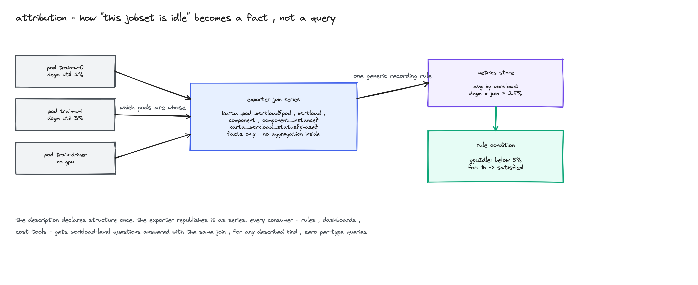

<!--
SPDX-License-Identifier: Apache-2.0
Copyright (c) 2026 NVIDIA Corporation
-->

# KEP-0003: Runtime rules

- Status: provisional
- Authors: @AviadHayumi
- Created: 2026-09-11
- Depends on: [KEP-0001](../0001-cel-expressions/README.md) (CEL expressions)
- Tracking issue: to be opened before this KEP merges

## Summary

Idle accelerators are one of the largest recurring costs in AI clusters.
A training job hangs after epoch 40 and keeps its 64 GPUs. An inference
endpoint nobody calls holds 8 more. Today no tool can act on this with one
rule: every engine either cannot address the workload, cannot express the
condition without a hand-written query, or acts with the wrong verb.

This KEP proposes two components on top of Karta definitions. A metrics
exporter that republishes the structure a definition already declares as
Prometheus series, so "this JobSet is idle" becomes a fact any consumer can
read. And a runtime rules controller that acts on such facts: one
filter / condition / action rule, enforced across every described type,
acting once through the type's own suspend handle, with an allowance clock,
a receipt, and a kill switch.


Diagram sources sit next to this file as `.excalidraw`; open them at
excalidraw.com to edit.

## Motivation

Take one concrete request an admin actually makes: "suspend a workload when
its GPU utilization stays below 5% for an hour."

Walk it through the tools that exist today:

- KEDA cannot address the workload. `scaleTargetRef` needs a `/scale`
  subresource and a JobSet has none. The trigger is a PromQL string the
  admin writes and maintains by hand, and the only verb is replicas. Their
  own tracker asks for suspendable workloads
  ([keda#7548](https://github.com/kedacore/keda/issues/7548), open, no
  owner).
- Kyverno owns the policy half convincingly: matching, cluster versus
  namespace authority, distribution. But its scheduled path only deletes,
  so "suspend after an hour idle" becomes "destroy after an hour idle". A
  real suspend is a mutation the engine re-applies forever: in a run
  against v1.19.1 (2026-09-10), a user who resumed a suspended Job got 43
  seconds before the background scan re-suspended it, with no write from
  anyone. That is correct behavior for a convergence engine and the
  opposite of what reclaiming capacity needs. Their tracker asks for
  runtime re-evaluation too
  ([kyverno#16214](https://github.com/kyverno/kyverno/issues/16214), open,
  no maintainer response).
- Kubernetes itself has acknowledged the missing verb since January 2022:
  the generic suspend subresource proposal never produced a KEP
  ([kubernetes#107294](https://github.com/kubernetes/kubernetes/issues/107294)).

Two things are missing everywhere, and they are the two things a Karta
definition already declares:

- Perception. Which pods form this workload, which of them hold GPUs, what
  its status means. Today that knowledge lives in a query string an admin
  maintains per type.
- Actuation. How to stop this type without destroying it. `.spec.suspend`
  here, `.spec.runPolicy.suspend` there, an annotation elsewhere. Seven
  vocabularies for one intent.

A definition closes both gaps once, declaratively. This KEP makes that
knowledge operational.

### Goals

- Republish definition structure as metric series: a pod-to-workload join
  key and normalized status, versioned, facts only.
- One rule across all described types: filter and condition are type
  agnostic, only the action is type specific and it resolves through the
  definition, never through controller code.
- Actions are one-shot and reversible: suspend through the type's native
  handle, resume belongs to the user, a resumed workload gets a fresh
  allowance window instead of an instant re-action.
- Safe by default: the controller installs observing, a service-level gate
  caps everything to observe and doubles as the kill switch, actions are
  bounded by blast-radius caps, unsupported types are skipped and reported.
- Every action is answerable: a reason on the workload, and a receipt that
  survives the workload's deletion.
- A new type becomes governable by writing a definition, not by forking
  the controller.

### Non-goals

- No replica management and no autoscaling. Demand-driven scaling belongs
  to HPA and KEDA; this acts on waste, and composes with both.
- No admission control, no mutation compliance, no general policy engine.
  Kyverno keeps that ground; the relationship section below shows how the
  two compose.
- No new telemetry pipeline. The exporter republishes attribution facts;
  utilization comes from the cluster's existing pod metrics (DCGM,
  kubelet), joined in the metrics store.
- Actions are bounded to workload lifecycle: observe, suspend, delete.
  Nothing else.

## Proposal

Three parts, in reading order: what a definition must supply, what the
exporter publishes, and what the rules controller does with both.

### The contract a definition supplies

Everything this KEP needs already exists in the CRD. A definition is
governable when it provides:

- normalized status: the `statusMappings` block that maps raw fields to
  initializing / running / suspended / completed / failed
- pod attribution: `podSelector` per component
- a suspend handle: the `suspendDefinition` block

The JobSet catalog definition carries this handle today
(`docs/catalog/jobset-x-k8s-io-jobset-v1alpha2.yaml`):

```yaml
suspendDefinition:
  suspendActions:
    - path: .spec.suspend
      value: "true"
  resumeActions:
    - path: .spec.suspend
      value: "false"
```

Describable is not the same as governable. A definition without a
`suspendDefinition` (Knative Service has no hold mechanism at all) still
gets observe and delete; suspend is skipped and reported. Where the native
stop is destructive for the type (RayJob suspend tears down the RayCluster
and reruns from scratch), the action is classified destructive and gets the
same safeguards as delete.

### The metrics exporter

The exporter reads the Kubernetes API only and republishes what
definitions declare, as series. It emits facts and never aggregates;
consumers join and aggregate in their own metrics store.

| Series | Meaning |
|---|---|
| `karta_pod_workload` | the join key: one series per attributed pod, labels for workload, component, component instance |
| `karta_workload_status` | one 0/1 series per normalized phase per workload |
| `karta_workload_info` | identity anchor: GVK and governing definition |
| `karta_exporter_freshness` | time since last successful reconciliation, so consumers can refuse stale facts |

Series names are provisional until the implementation review. A
proof-of-concept (2026-08-19) drove one Grafana dashboard across JobSet,
PyTorchJob, LeaderWorkerSet and Deployment with zero per-type code, and
surfaced a real imbalance: one component instance at 92% utilization while
its sibling sat at 2.5%.



The join is the point. `avg by (workload) (DCGM_FI_DEV_GPU_UTIL * on(pod)
group_left(workload) karta_pod_workload)` answers "is this workload idle"
for any described kind. The admin writes zero per-type queries. When a pod
belongs to two described owners along an ownership chain, metrics
attribute to the top-level owner only, so every pod counts exactly once.

### The runtime rules controller

One rule, three parts, evaluated left to right:

```yaml
kind: RuntimeRule
metadata:
  name: reclaim-idle-training
spec:
  filter:
    types:
      - apiVersion: jobset.x-k8s.io/v1alpha2
        kind: JobSet
      - apiVersion: kubeflow.org/v1
        kind: PyTorchJob
    namespaceSelector:
      matchLabels:
        team: research
  condition:
    gpuIdle:
      below: "5"
      for: 1h
  action: suspend
```

The exact group, kind and Go types belong in the implementation PR. The
semantics are the proposal:

- Filter selects a standing population: types, namespaces, labels.
  Exclusions are first class.
- Conditions are type agnostic because they read normalized status and
  attributed metrics: resource idle, absolute runtime, time in status, or
  any metric scoped to the workload. Conditions compose.
- The action is the least destructive the type supports. A filter spanning
  types that cannot all suspend applies where supported and
  skips-and-reports the rest. Escalation from suspend to delete never
  happens silently.

The part that has no analog in any engine we surveyed is the action
protocol:


1. A candidate must pass the global observe gate and reserve a
   blast-radius budget slot.
2. A receipt is persisted before a destructive act: rule, observed value,
   threshold, timestamp, allowance epoch. If the receipt cannot be
   written, the action does not happen.
3. The action is applied once, through the definition's handle, with a
   fresh re-check of the target at dispatch.
4. The workload owner sees the reason on the workload itself, and the
   receipt outlives the workload.
5. A resume by the user, under their own RBAC, starts a new epoch: the
   clock resets and a full new condition window must pass before the rule
   may act again.

<details>
<summary>protocol fine print: gates, caps, failure behavior</summary>

- The controller installs in global observe mode. Enforcement needs both
  the gate opened and the rule set to enforce. Closing the gate returns
  the whole cluster to observe immediately.
- Caps follow the disruption-budget shape proven by node autoscalers:
  integer or percent, per reason, most restrictive wins, misconfiguration
  fails closed to zero.
- Missing or stale telemetry degrades safely: skip and report, never act.
  The exporter's freshness series is the staleness check.
- Missing permissions are surfaced at rule admission (a
  SelfSubjectAccessReview preflight for the acting identity), not
  discovered as a silent no-op at runtime.
- Outcomes include Unknown: a lost API response is reconciled before any
  retry, and a receipt is never silently rewritten.
- When several rules match one workload, the first condition to fire acts,
  actions apply serially, later rules see the post-action state. Only an
  action whose own condition fired is ever applied.
- If the controller is down nothing is actioned; in-flight actions and
  allowance windows survive a restart.

</details>

### Relationship to Kyverno

Kyverno is a policy engine: policies are Kubernetes resources, evaluated
at admission by webhooks, and converged in the background. It validates,
mutates, generates, verifies images, and deletes on schedules. For
admission, compliance and configuration governance it is the right tool
and this proposal does not touch that ground.

The two contracts differ where runtime reclamation lives. A convergence
engine re-applies desired state forever and reports current compliance; a
governor acts once, remembers, and answers for it. Both behaviors are
correct for their own job. The comparison below was verified hands-on
against Kyverno v1.19.1 on 2026-09-10.

<details>
<summary>capability comparison, verified on v1.19.1</summary>

| Capability | Kyverno v1.19.1 | Runtime rules (proposed) |
|---|---|---|
| Acts when | admission; per-policy cron for delete only; a global background scan (default 1h) re-applies mutations | continuously, per-rule windows |
| Perceives | object fields; CEL with HTTP and context lookups; queries are authored per type | normalized status plus attributed metrics, no per-type queries |
| Acts with | JSON patches re-applied on drift; scheduled delete | observe / suspend via the native handle / delete, least destructive per type |
| Can the user resume | no: the resume was reverted by the next scan (measured 43 seconds) | yes: one-shot action, fresh allowance on resume |
| Explains itself | mutation reports track current compliance; a deletion leaves a timestamp on the policy object | reason on the workload plus a receipt that survives deletion |
| Safety | exceptions and global filters; no observe mode for actions, no caps, no gate | observe-first install, global gate, caps, skip-and-report |

</details>

They compose rather than compete:

- Kyverno validates RuntimeRule objects at admission: who may author rules
  at which scope, mandatory observe-first, cap ceilings.
- Karta facts can feed Kyverno: a GlobalContextEntry over the exporter or
  over definitions makes admission policies workload aware.
- Optionally, a Kyverno GeneratingPolicy emits an action request that this
  controller validates and executes under its own protocol. A request is
  an intent, never an authorization.

## Examples

The admin journey, end to end:

```console
$ helm install runtime-rules ...        # installs observing; the gate is closed
$ kubectl apply -f reclaim-idle-training.yaml
$ kubectl get runtimerule reclaim-idle-training
NAME                     MODE      MATCHED   WOULD-ACT   ACTED
reclaim-idle-training    observe   214       14          0
```

Two weeks of observe mode produce the number that justifies enforcement:
14 workloads, the GPU-hours they hold, zero risk taken. Then:

```console
$ kubectl patch runtimerulesconfig global --type=merge -p '{"spec":{"gate":"enforce"}}'
$ kubectl patch runtimerule reclaim-idle-training --type=merge -p '{"spec":{"mode":"enforce"}}'
```

The researcher journey, after a suspension:

```console
$ kubectl describe jobset train-llm | tail -3
Events:
  Suspended  runtime-rules  rule reclaim-idle-training: gpu utilization 2.4% for 61m (threshold 5% for 60m)
$ kubectl patch jobset train-llm --type=merge -p '{"spec":{"suspend":false}}'
```

The resume works, stays, and starts a fresh allowance window. No ticket,
no admin, no policy edit. Discovering why after the JobSet was deleted
works too, because the receipt is not owned by the workload.

## Prior art

The mechanisms are individually proven; the combination is not supplied by
any engine we read.

- Kueue and the KAI scheduler flip the same native suspend fields, at
  admission time, on quota pressure. Same handle, different trigger; the
  mechanism is accepted practice.
  ([kueue](https://github.com/kubernetes-sigs/kueue))
- Karpenter's disruption budgets are the cap shape this KEP adopts.
  ([karpenter disruption docs](https://karpenter.sh/docs/concepts/disruption/))
- The descheduler ships per-namespace and total eviction caps and the
  dry-run-first workflow.
  ([descheduler](https://github.com/kubernetes-sigs/descheduler))
- Cloud Custodian's mark-for-op is deferred action with state on the
  resource: the pattern works, and its limits (editable, no receipts) are
  the argument for a real ledger.
  ([cloud custodian](https://cloudcustodian.io/docs/quickstart/policyStructure.html))
- kube-green sleeps workloads on schedules and restores replica counts on
  wake; gpu-pruner culls on DCGM idle windows by scaling to zero across a
  hardcoded type list. Both prove demand; both stop at replicas.
  ([kube-green](https://github.com/kube-green/kube-green),
  [gpu-pruner](https://github.com/wseaton/gpu-pruner))

<details>
<summary>the wider survey</summary>

Thirty repositories that act on running workloads were read for this
proposal: cullers, sleepers, evictors, janitors, remediation engines,
schedulers. Every one bottoms out at replicas-to-zero, evict or delete;
every one hardcodes its type list or asks the user to author raw patches;
none keeps per-action state that survives the workload. Mechanisms worth
adopting were adopted (budget schema, condition-anchored timers,
reset-on-reactivate state, restore memory, notify-then-act ladders).
JupyterHub's idle culler and the Kubeflow notebook controller prove the
platform-attributed activity pattern this KEP generalizes.
([jupyterhub-idle-culler](https://github.com/jupyterhub/jupyterhub-idle-culler),
[kubeflow notebooks](https://github.com/kubeflow/notebooks),
[sablier](https://github.com/sablierapp/sablier) for wake-on-demand,
[py-kube-downscaler](https://github.com/caas-team/py-kube-downscaler),
[k8s-cleaner](https://github.com/gianlucam76/k8s-cleaner),
[robusta](https://github.com/robusta-dev/robusta))

</details>

## Migration and versioning

- No CRD change is required: the contract (status mappings, pod selectors,
  suspend handles) exists in the current definition schema. Definitions
  without a suspend handle stay valid and are observe-or-delete only.
- The exporter's series names and labels are a public, versioned
  interface once they leave review; renames are breaking changes.
- RuntimeRule is a new CRD in its own group, versioned independently of
  the definition CRD, starting at v1alpha1.
- One active definition per workload type: an in-cluster definition takes
  precedence over the embedded catalog. Rules never reference a definition
  directly; the controller resolves type to definition.

## Validation

- Rule admission validates scope (a namespace author cannot affect other
  namespaces), caps against admin ceilings, and the acting identity's
  permissions for every type the filter can reach.
- A definition is marked governable only when its suspend handle is
  present and its type passed the conformance checks below.
- Conditions that need telemetry validate that the exporter contract is
  reachable; when it is not, affected rules surface it in status instead
  of silently idling.

## Test plan

- Unit: the allowance state machine (epoch transitions, restart recovery,
  no double action), the action resolver (least destructive selection,
  skip-and-report), cap accounting including the fail-closed paths.
- Integration, on a kind cluster: observe to enforce promotion; suspend
  then user resume then fresh window; receipt survives workload deletion;
  gate closure stops everything; missing telemetry degrades to skip;
  coexistence with a GitOps controller that re-applies specs.
- Conformance, per catalog type: suspend releases the resources, resume
  restores the object, destructive stops are classified as such. The
  action tier of every shipped definition is asserted by a test, not by a
  table in a document.
- Exporter: attribution parity against hand-written queries for the four
  proof-of-concept types; freshness behavior under API pressure.

## Risks and mitigations

- Fighting other controllers. A GitOps engine that self-heals will revert
  a governed suspend exactly like the scan revert this KEP criticizes.
  The controller must detect managed-by markers (Argo CD, Flux) and
  either integrate or skip-and-report; this is a named requirement, not a
  footnote. The same applies to autoscalers that own replica fields.
- Destructive stops. RayJob suspend reruns from scratch; a StatefulSet
  scaled to zero with a delete-on-scale claim policy loses volumes. The
  per-type classification is part of the definition contract and the
  conformance suite, and destructive actions take the delete-grade
  safeguards.
- Stale facts. Acting on old attribution is worse than not acting. The
  freshness series gates every metric condition; stale means skip.
- Fleet-scale mistakes. A bad rule at cluster scope is bounded by the
  observe-first default, the global gate, and the caps. The measured
  failure mode this protects against is real: a scoping mistake in a
  policy engine applied an action to every workload of a kind with no
  warning.
- Scale. Thousands of workloads, per-rule windows: the controller anchors
  clocks on status transitions and requeues at deadlines instead of
  polling, the pattern shared by the schedulers we read.

## Alternatives considered

- Extend Kyverno. Priced honestly against v1.19.1: what Kyverno supplies
  (matching, CEL, distribution, reports) is the cheap part, and the parts
  this KEP adds (allowance state, receipts, gates, caps, the resolver)
  form one execution protocol that contradicts the convergence contract
  its engine is built on. The engineering estimate came out comparable to
  a dedicated build, with delivery gated on an upstream sponsor that has
  not appeared: the issue asking for exactly this capability has no
  maintainer response. Composition keeps every benefit of Kyverno without
  the wait.
- A Kyverno policy pack with state in annotations. Cloud Custodian proves
  the pattern at cloud scope. It buys scan-tick latency, no caps, no
  receipts, and state any writer can edit. It may still ship as a
  reduced-contract option for clusters that want nothing new installed,
  clearly labeled as such.
- KEDA. Cannot address non-scale kinds, replicas is the only verb, and
  the suspendable-workloads request is open without an owner. KEDA stays
  the demand-side partner; a suspended service can even wake on traffic
  in front of it.
- Exporter only. Attribution alone makes dashboards and alerts better,
  and the value of acting then leaks to ad-hoc scripts with none of the
  safety above. The landscape already shows where that ends: every
  existing actor stopped at replicas-to-zero with a hardcoded type list.
- Per-type operators. One controller per workload type is exactly the
  adapter spread Karta exists to remove.

## Future work

- Wake-on-demand: a suspended service that holds its URL behind a proxy
  and resumes on the first request.
- State-preserving suspend for GPUs: checkpoint-based pausing is maturing
  in the ecosystem; when it can hold GPU memory it becomes a new action
  tier above stop-and-restart.
- A conformance and readiness command that shows, per rule, what it can
  reach, act on, and why, before enforcement is enabled.
- Attribution consumers beyond rules: dashboard packs, cost attribution,
  trace enrichment.
- An action-request adapter so external engines can submit intents
  through the same protocol.

## Implementation history

- 2026-07-29: capability comparison against Kyverno v1.18.2 run on a live
  cluster (research, proposal-only).
- 2026-08-19: exporter proof of concept: four types, one dashboard, zero
  per-type code (proposal-only).
- 2026-08-31: exporter requirements revision (proposal-only).
- 2026-09-10: comparison re-verified against Kyverno v1.19.1 on a live
  cluster; thirty adjacent projects read for prior art (research,
  proposal-only).
- 2026-09-11: this KEP.

Nothing in this KEP is implemented. The definition contract it relies on
(status mappings, pod selectors, suspend handles) ships today; the
exporter and the rules controller are the proposal.
