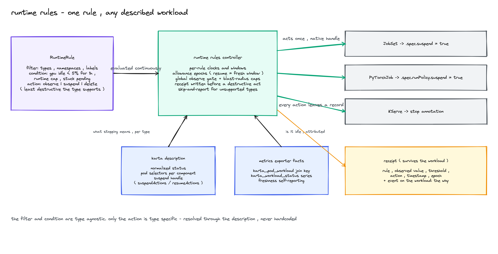
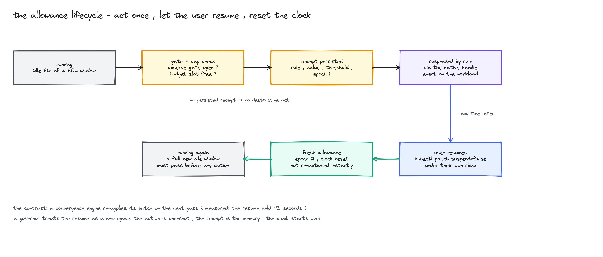

<!--
SPDX-License-Identifier: Apache-2.0
Copyright (c) 2026 NVIDIA Corporation
-->

# KEP-0003: Runtime rules

- Status: provisional
- Authors: @AviadHayumi
- Created: 2026-09-11
- Depends on: [KEP-0001](../0001-cel-expressions/README.md) (CEL expressions),
  [KEP-0004](https://github.com/AviadHayumi/workload-map/blob/kep-metrics-exporter/keps/0004-metrics-exporter/README.md)
  (metrics exporter, proposed separately)
- Tracking issue: to be opened before this KEP merges

## Summary



A Karta definition already knows how to read a workload: which pods are
its, what its status means, which field suspends it. The exporter
(KEP-0004) publishes those facts as Prometheus series. This KEP adds the
part that acts on them: one rule for every described type, act once per
allowance, leave a receipt that survives the workload.

Sections 1 and 2 happened;
sections 3 and 4 are what broke and the proposal. Numbers cite captures
from
[the integration lab](https://github.com/AviadHayumi/workload-map/tree/exporter-integration-lab/labs/exporter-kyverno-rr);
proposed things are labeled.

## 1. What the exporter gives us, on a real workload

We took a real distributed inference workload: dynamo, one frontend, one
decode worker, one prefill worker (the Llama-3.1-8B mocker), run by the
real dynamo operator 1.2.1 on a kind cluster. All three pods were
Running and the operator reported `successful` (capture 61).

The exporter watched the cluster and published this (capture 61):

```text
karta_workload_status{workload="dynamo-smoke",phase="Running",...} 1
karta_pod_workload_info{pod="dynamo-smoke-frontend-59d8d4c776-v7nx8",
    component_instance="Frontend",workload="dynamo-smoke",...} 1
karta_pod_workload_info{pod="dynamo-smoke-decode-e03467c0-8568474b87-tdfr6",
    component_instance="decode",workload="dynamo-smoke",...} 1
karta_pod_workload_info{pod="dynamo-smoke-prefill-e03467c0-7bf477dcd9-n6l6b",
    component_instance="prefill",workload="dynamo-smoke",...} 1
karta_workload_component_replicas{component_instance="prefill",...} 1
karta_workload_component_pods{component_instance="decode",phase="Running",...} 1
```

- The operator wrote `state: successful`; the definition turns that into
  `Running`, the same phase a Job gets, so one query fits both
  (capture 61).
- Every pod carries its part: `Frontend`, `decode`, `prefill`. Nobody
  wrote dynamo code for this; the definition declares where pods hang
  (capture 61).
- Wanted vs actually running, per part: 1 and 1, for all three
  (capture 61).
- `karta_pod_workload_info` is the join key: GPU and CPU numbers already
  exist per pod, and these labels tie them to the workload and its
  parts.

Six workload metric families, all gauges:

| Series | What it says |
|---|---|
| `karta_workload_info` | the workload exists, and which definition read it (always 1) |
| `karta_workload_status` | one 0/1 line per phase |
| `karta_pod_workload_info` | this pod belongs to that workload and part (always 1, the join key) |
| `karta_workload_component_replicas` | wanted count per part |
| `karta_workload_component_pods` | actual pods per part, by pod phase |
| `karta_workload_generation` | the workload's `metadata.generation` |

How it works: watch events update the cache; a scrape reads it and
counts the pods. The always-1 series and the 0/1 phases are the same
tricks kube-state-metrics uses, so queries look the way people already
write them.

Things you could write with this, illustrative, not run in this lab:

- Suspend on idle GPU (the rule in section 4).
- Catch stuck starts: `Initializing` still 1 after 15 minutes.
- Replica shortfall: wanted vs actually `Running`, per part.
- One `Failed` or `Degraded` alert across kinds.
- Plot generation changes alongside the other series.

<details>
<summary>fine print: provenance, mechanics, the join</summary>

Provenance: cluster kind-karta-e2e (Kubernetes v1.34.0), dynamo-platform
1.2.1 installed by `hack/e2e/operators/dynamo/install.sh`, the smoke
DynamoGraphDeployment from `hack/e2e/operators/dynamo/smoke.yaml`
extended with a third service, prefill, running the mocker's
`--is-prefill-worker` mode. The exporter is the metrics-exporter branch
run with `--use-catalog`. The cluster view, edited (unrelated pods and
the RESTARTS column trimmed):

```console
$ kubectl get dgd,pods -n default
NAME           READY   BACKEND   AGE
dynamo-smoke   True              89s

NAME                                             READY   STATUS    AGE
dynamo-smoke-decode-e03467c0-8568474b87-tdfr6    1/1     Running   89s
dynamo-smoke-frontend-59d8d4c776-v7nx8           1/1     Running   88s
dynamo-smoke-prefill-e03467c0-7bf477dcd9-n6l6b   1/1     Running   88s
```

[Capture 61](https://github.com/AviadHayumi/workload-map/blob/exporter-integration-lab/labs/exporter-kyverno-rr/captures/61-dynamo-prefill-metrics.txt)
holds the scrape filtered to this workload; capture 60 is the earlier
two-service run. It also shows `karta_workload_generation` at 1,
`karta_workload_info` with
`karta="nvidia-com-dynamographdeployment-v1beta1"`, and the operator's
intermediate Deployments tracked as workloads of their own kind.

Mechanics fine print: phase series exist for kinds whose definition maps
status, and replica counts when the definition provides them (that also
bounds the illustrative phase queries above). A phase-only pod update
skips the attribution rules; a scrape renders the cache and counts its
pod records. Inactive phases stay 0 while the workload is tracked;
duration queries still need freshness and sample-coverage checks,
including missing data. The exporter publishes its own health too
(`karta_exporter_*`: tracked workloads, unattributed pods, last event
timestamp).

The illustrative GPU join, not run in this dynamo test:

```promql
avg by (namespace, workload) (
  DCGM_FI_DEV_GPU_UTIL
  * on(namespace, pod) group_left(workload) karta_pod_workload_info
)
```

</details>

## 2. Wiring the facts into Kyverno

Prometheus scrapes the exporter every 5s, and a Kyverno mutate-existing
policy reads the history. Our lab has no GPUs, so the tested rule used
Running time as the stand-in for the GPU-idle join, same mechanism:
suspend when every `Running` sample in the last two minutes is 1.
Shortened, non-runnable example; the
[tested manifest](https://github.com/AviadHayumi/workload-map/blob/exporter-integration-lab/labs/exporter-kyverno-rr/manifests/05b-kyverno-metric-suspend-http.yaml)
also limits targets to jobs in one namespace and skips already suspended
ones:

```yaml
apiVersion: policies.kyverno.io/v1beta1
kind: MutatingPolicy
spec:
  evaluation:
    admission: {enabled: false}
    mutateExisting: {enabled: true}
  targetMatchConditions:
    - name: exporter-says-running-2m
      expression: >-
        object.metadata.name in
        http.Get('http://prometheus...min_over_time(karta_workload_status{
          namespace="ai-team",phase="Running",workload_kind="Job"}[2m])==1')
        .data.result.map(r, r.metric.workload)
  mutations:
    - patchType: JSONPatch
      jsonPatch:
        expression: "[JSONPatch{op: 'add', path: '/spec/suspend', value: true}]"
```

It worked, both ways we tried:

- Direct query, above: policy applied at 17:45:19.049, job seen
  suspended at 17:45:19.693, 644ms (capture 10). Second cluster: applied
  18:20:47.211, both trainers seen suspended at 18:20:50.608, 3.4s
  (capture 30).
- Through Kyverno's cache (a GlobalContextEntry polling the same API):
  trainer-gce still unsuspended at 18:09:26, seen suspended at 18:09:59
  (capture 19).

Reading the facts is not the gap.

<details>
<summary>fine print: what the query does and does not check</summary>

The condition asks whether every `Running` sample in the trailing 2
minutes equals 1. It does not check that 2 full minutes of samples
exist; a young series can pass early. The production contract in
section 4 requires coverage checks. Timestamps above are when the checks
first saw the change, not exact mutation times.

</details>

## 3. The gaps the runs hit

- Failures look like success. We shipped a rule whose expression fails
  at runtime. Kyverno worked it, finished it, deleted the work item, and
  touched nothing; the policy stayed ready (capture 31):

```text
ADDED      ur-97xsp   rr-cel-runtime-error   cel-mutate
MODIFIED   ur-97xsp   rr-cel-runtime-error   cel-mutate   Pending
MODIFIED   ur-97xsp   rr-cel-runtime-error   cel-mutate   Completed
DELETED    ur-97xsp   rr-cel-runtime-error   cel-mutate   Completed
(4 rounds like this; job suspend=false; policy ready: true)
```

  The captured log search found no lines naming the policy. Reporting
  said "mutation is not applied"; the policy's error count was 4.
  Neither included the CEL error (capture 31).
- A user resume gets reverted. A human resumed a suspended job; 123.947s
  later the rule suspended it again (capture 30). Not a bug, that is
  convergence. This rule had no saved allowance.
- Nothing remembers. After deleting the acted-on job, the inspected
  surfaces had no reports and no work items, just seven temporary
  events. None tied the action to its evaluation and evidence
  (capture 17). And turning on more reporting does not change it: those
  report entries belong to the workload and die with it, and cluster
  reports only hold cluster-scoped resources.

We did try to close the resume gap with authoring alone: two policies
and a state annotation held a user resume for 7 minutes under the 60s
scan (capture 50). So act-once is writable. But the state lived in an
editable job annotation, this policy pack wrote no receipt, and the run
did not resolve the known write races.

## 4. What runtime rules adds



One rule, three parts: pick workloads, set a condition, choose an
action. The definition tells the controller how to suspend each kind.
Proposed API; the lab prototype tested the Running-history condition on
Jobs:

```yaml
apiVersion: rules.run.ai/v1alpha1   # provisional group
kind: RuntimeRule
metadata:
  name: reclaim-idle-training
spec:
  filter:
    types:
      - apiVersion: jobset.x-k8s.io/v1alpha2
        kind: JobSet
    namespaceSelector:
      matchLabels: {team: research}
  condition:
    gpuIdle: {below: "5", for: 1h}
  action: suspend
```

What the prototype did, on the same cluster and the same series Kyverno
used:

- With re-arming off, it left the resumed job running. It saw the resume
  in 0.692s, and where Kyverno had re-suspended (123.947s, a different
  job on the same cluster), it wrote an escalation receipt instead
  (124.526s). The job was still running 300s after the resume
  (capture 22):

```text
[18:28:44.598] receipt ResumeDetected      (0.692s after the resume)
[18:30:48.432] receipt EscalatedNeedsHuman (instead of re-suspending)
[18:33:44.053] trainer-f suspend=false active=1
```

- Receipts survive. Intent lands before the patch (Intended at
  18:26:34.226, Executed at 18:26:34.539, capture 21). We deleted the
  job: four receipts stayed, Intended, Executed and two WouldAct
  (capture 24). The Executed one, selected fields; Executed means the
  patch was accepted, not that the controller converged:

```json
{
  "rule": "suspend-running-2m",
  "phase": "Executed",
  "workload": {"namespace": "ai-team", "name": "trainer-e", "kind": "Job"},
  "evidence": {
    "promql": "min_over_time(karta_workload_status{namespace=\"ai-team\",phase=\"Running\"}[2m]) == 1",
    "value": "1"
  },
  "patchPointer": "/spec/suspend",
  "patchValue": true
}
```

- Not being able to act is a state you can see. Permission revoked:
  SkippedNotReady. Restored: Intended, then Executed (capture 23).
  Observe mode: WouldAct, jobs untouched. A kind with no suspend handle:
  SkippedNoHandle (capture 20).

Still to build: allowance epochs that re-arm on a user resume by
default (the tested run had re-arming off), observe-by-default install
with a global gate as the kill switch, and blast-radius caps. Kyverno
keeps admission and compliance and can read the same series; this
controller adds the acting contract. Dynamo: reading it works
(capture 61), rules over it are proposed, and without a suspend handle
in its definition they would only observe.

<details>
<summary>the proposed contract, in full</summary>

- Enforcement needs the global gate opened and the rule set to enforce.
  Gate closure stops new dispatches; accepted writes complete and stay
  in receipts.
- A receipt is persisted before a destructive act. No receipt, no
  action. Receipts are never silently rewritten; lost API responses
  reconcile to Unknown before any retry. The full receipt also carries
  uid, time, and operation identity.
- Caps follow the disruption-budget shape: integer or percent, per
  reason, most restrictive wins, misconfiguration fails closed to zero.
- Metric conditions require fresh attribution and sample coverage over
  the window; missing input produces Unknown and blocks action. A final
  query re-checks the condition at dispatch.
- Object conditions ride watches with deadline requeues; metric
  conditions evaluate on a stated cadence.
- Rule admission validates scope and caps and runs a best-effort
  permission preflight with the executor's identity.
- Several rules on one workload: first condition to fire acts, actions
  apply serially, later rules see the post-action state.
- Controller down means nothing is actioned; windows and in-flight
  actions survive restart.
- Suspend effects differ per type (RayJob suspension tears down its
  cluster and reruns). A capability contract must classify action
  effects per definition before enforcement; unclassified types stay
  observe-only. Its home (annotation, descriptor, or schema field) is
  decided at implementation review.

</details>

<details>
<summary>non-goals, alternatives, prior art</summary>

Non-goals: no replica management or autoscaling (HPA and KEDA own
demand; this acts on waste), no admission control, no new telemetry
pipeline, no process-state restoration promise. Actions are observe,
suspend, delete.

Alternatives: extending Kyverno reuses matching and distribution, but
the acting contract is new work in either home and needs an upstream
sponsor that has not appeared; the annotation state machine we built
(capture 50) may ship as a reduced-contract policy pack, clearly
labeled; KEDA cannot address non-scalable workloads and its
suspendable-workloads request sits unassigned
([keda#7548](https://github.com/kedacore/keda/issues/7548));
exporter-only leaves the acting layer to scripts.

Closest prior art: kueue (native suspend via compiled adapters; here
the handle comes from definitions), karpenter (the disruption-budget
cap shape), cloud custodian (mark-for-op state in editable tags, the
argument for a real ledger), kube-green (scheduled suspension, fixed
types). The
[lab log](https://github.com/AviadHayumi/workload-map/blob/exporter-integration-lab/labs/exporter-kyverno-rr/INTEGRATION-LOG.md)
compares Kyverno with the rules prototype and records the policy
workarounds tested.

</details>

<details>
<summary>test plan, versioning, history</summary>

- Unit: the allowance state machine (epoch transitions, restart
  recovery, no double action), the action resolver (explicit verb,
  skip-and-report), cap accounting including fail-closed, staleness and
  coverage gates.
- Integration on kind: observe to enforce promotion; suspend, user
  resume, fresh window; receipt survives workload deletion; gate
  closure stops dispatch; missing telemetry degrades to skip;
  coexistence with a GitOps controller that re-applies specs.
- Conformance per catalog type: suspend releases resources, resume
  behaves as the definition documents, destructive effects classified
  correctly, asserted by test.
- The exporter's series names and labels are a public versioned
  interface once they leave review (KEP-0004); renames are breaking.
- RuntimeRule and RuntimeRulesConfig are new CRDs in their own group,
  starting at v1alpha1. Definitions without a suspend handle stay valid
  and observe-only.

History: 2026-07-29 capability comparison against Kyverno v1.18.2;
2026-08-19 exporter proof of concept (four types, one dashboard);
2026-09-10 re-verified on v1.19.1, thirty adjacent projects read;
2026-09-11 this KEP; 2026-09-14 external review, leanness pass;
2026-09-14 to 2026-09-16 the live integration lab, sections rebuilt from
its captures, real dynamo runs added 2026-09-16.

</details>

The exporter and a rules prototype ran in the lab. The production
runtime rules API, the controller, and the action-effect contract remain
proposed.
