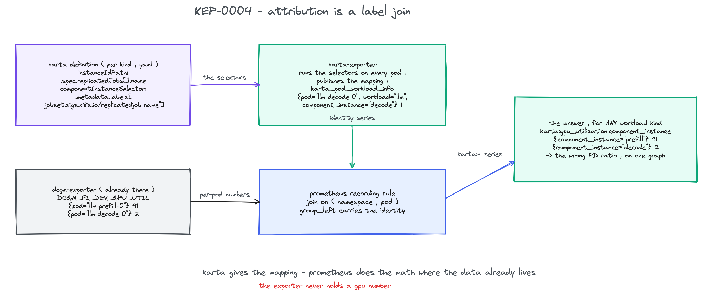
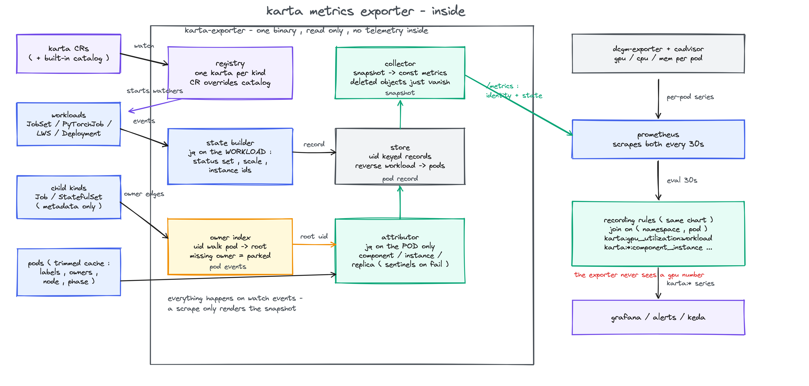
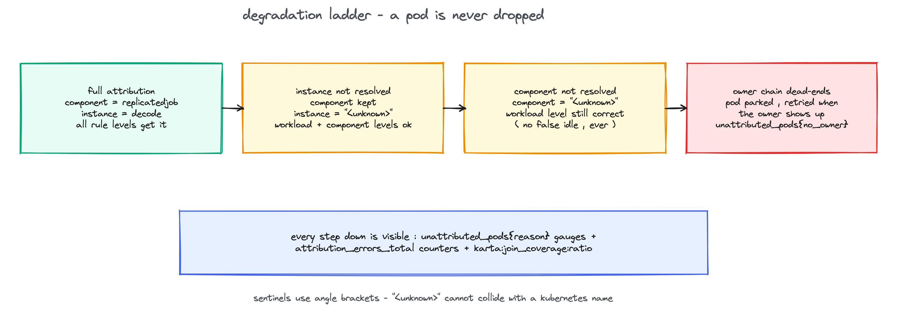

<!--
SPDX-License-Identifier: Apache-2.0
Copyright (c) 2026 NVIDIA Corporation
-->

# KEP-0004: Metrics exporter

- Status: provisional
- Authors: @AviadHayumi
- Created: 2026-08-20
- Tracking issue: run-ai/karta#250

## Summary

A new `karta-exporter` binary makes any cluster's existing pod metrics
addressable at workload, component, and component-instance scope. It watches
Karta definitions, the workloads they describe, and pods, and publishes one
identity series per attributed pod plus the state only Karta knows:
normalized status, desired replicas, observed pod counts, and the workload
generation. Recording rules shipped in the same Helm chart join the identity
series with the DCGM and cadvisor series that already exist, producing
stable `karta:*` aggregates. The exporter never holds a telemetry value.



Diagram sources sit next to this file as .excalidraw; open them at
excalidraw.com to edit.

## Motivation

An NCP platform team runs disaggregated LLM inference on JobSets: prefill
and decode are two replicatedJobs of one workload. Prefill runs at 90
percent GPU utilization, decode at 2. The ratio is wrong, capacity is
burning, and nobody sees it, because dcgm-exporter only says "pod
llm-decode-0 is idle" and nothing in the cluster knows what llm-decode-0
is. Answering "utilization of the decode instance of this JobSet" today
means hand-writing a query against `jobset.sigs.k8s.io/replicatedjob-name`
pod labels, and a different query for PyTorchJob, and another for
LeaderWorkerSet. For most workload kinds nobody ever writes them.

The same team wants one suspend policy: reclaim any workload under 5
percent for 15 minutes, whatever its kind. That needs one utilization
signal per workload with the same name and labels for every kind. Karta
already knows how pods map to components; this KEP makes that knowledge a
metrics interface.

### Goals

- GPU utilization and memory queryable per workload, per component, and
  per component instance, uniform across workload kinds.
- CPU and memory at the same granularities.
- Normalized workload status as a time series, so time-in-phase is a query.
- Desired replicas vs observed pods per component instance.
- 30 second or finer resolution.
- Only Karta-described workloads, and no idleness judgment: thresholds and
  windows belong to the consumer.

### Non-goals

- Re-exporting pod-level telemetry. It already exists in dcgm-exporter and
  kube-state-metrics.
- Application metrics (TTFT, ITL, throughput).
- Cluster or namespace rollups, multi-cluster.
- Running inside the operator process.

## Proposal

### The metric contract

Every workload-scoped series carries `namespace`, `workload`,
`workload_kind`, and `workload_group`. Labels are additive-only: a released
metric never loses or renames a label. The exporter emits five families:

```text
# one series per attributed pod, value always 1 - the attribution primitive
karta_pod_workload_info{namespace, pod, uid, workload, workload_kind,
                        workload_group, component, component_instance,
                        replica} 1

# identity and provenance; workload_version lives only here so a CRD
# storage-version bump does not split every dashboard
karta_workload_info{..., workload_version, karta} 1

# dense state set over the full normalized vocabulary; several phases can
# be 1 at once (Running and Degraded is a real combination)
karta_workload_status{..., phase} 0|1
# phase: Initializing Running Completed Failed Degraded
#        Suspended Suspending Resuming Undefined

# desired vs observed, per component instance
karta_workload_component_replicas{..., component, component_instance} N
karta_workload_component_pods{..., component, component_instance, phase} N

# spec changes step this up; consumers draw deploy markers from it
karta_workload_generation{...} N
```

The status set is dense on purpose: every phase always has a series, so
`avg_over_time(karta_workload_status{phase="Running"}[1h])` is
time-in-phase with no missing-series edge cases. `Undefined` means the
mappings matched nothing; a Karta with no StatusDefinition emits no status
series at all, which is a different fact.

Failed attribution degrades instead of dropping the pod:
`component="<unknown>"` when component inference failed,
`component_instance="<unknown>"` when the id matched no declared instance.
Angle brackets cannot collide with a Kubernetes name, and a plain empty
`component_instance=""` stays what it always was, a single-instance
component.

### How attribution works inside



The binary is five small pieces, all event driven; a scrape only renders a
snapshot.

The registry watches Karta CRs, validates each with the library validator,
and picks exactly one Karta per root group and kind, so one set of objects
is never watched twice: oldest CR wins, losers surface as
`karta_exporter_kartas{valid="false", reason="shadowed"}`. With
`--use-catalog` the built-in catalog seeds the registry as a fallback tier;
a CR always overrides the catalog entry for its kind, and deleting the CR
falls back. The bare-Pod catalog entry is skipped, otherwise every pod on
the cluster becomes a workload.

For each chosen Karta the exporter starts one full informer on the root
kind and metadata-only informers on the child kinds (the `kind` of child
components plus `additionalChildKinds`). Pods come from a single informer
whose cache is trimmed to metadata, `spec.nodeName`, and `status.phase`,
which is everything pod selectors read; `--full-pod-cache` is the escape
hatch for a custom Karta that reads deeper.

A workload event runs jq on the workload once: the status mappings, the
scale paths, and the instance ids, stored as one record. A pod event walks
controller owner references through the owner index until it reaches a
kind with a chosen Karta. Pods register their own owner edge too, because
pods can be middle owners: a LeaderWorkerSet worker StatefulSet is owned by
its leader pod, so a worker's chain is pod, StatefulSet, Pod, StatefulSet,
LeaderWorkerSet. A walk that dead-ends on a not-yet-observed owner parks
the pod and retries when that owner arrives; informers deliver out of
order and that is normal, not an error.

The attributor then runs the Karta pod selectors on the pod only. The
workload side of the question, which instance ids exist, comes from the
stored record, so per-pod cost is a few jq evaluations against a small pod
object and nothing else. This is what a JobSet definition gives it, from
`docs/catalog/jobset-x-k8s-io-jobset-v1alpha2.yaml`:

```yaml
childComponents:
  - name: replicatedjob
    instanceIdPath: .spec.replicatedJobs[].name
    scaleDefinition:
      replicasPath: .spec.replicatedJobs[] | .replicas * .template.spec.parallelism
    podSelector:
      componentInstanceSelector:
        idPath: .metadata.labels["jobset.sigs.k8s.io/replicatedjob-name"]
```

Records land in a store keyed by object UID with a reverse
workload-to-pods index, so a workload event re-attributes only its own
pods, and only when its instance set changed. The collector renders a
consistent snapshot as const metrics on scrape: no gauge bookkeeping, so a
deleted object simply stops being rendered and Prometheus staleness closes
its series. `/readyz` stays false until every informer syncs; a restarting
exporter is a visible scrape gap, never plausible zeros.

### The join

The chart ships a PrometheusRule. The workload-level GPU rule, as rendered:

```yaml
- record: karta:gpu_utilization:workload
  expr: |
    avg by (namespace, workload, workload_kind, workload_group) (
      DCGM_FI_DEV_GPU_UTIL
      * on (namespace, pod) group_left (workload, workload_kind, workload_group)
      max by (namespace, pod, workload, workload_kind, workload_group)
        (karta_pod_workload_info)
    )
```

Three decisions in that expression carry the correctness story:

- Every granularity is computed from the raw per-pod join, never from
  another recorded average. A prefill pod with 8 GPUs at 90 next to a
  decode pod with 1 GPU at 0 must record the pod-weighted 80, not 45. The
  rule tests assert exactly that case.
- The `max by` guard on the identity side keeps the join evaluating when a
  deleted and recreated pod briefly leaves two identity series with the
  same name; without it the whole rule group errors on many-to-many.
- Sentinel pods are excluded from component-level rules but kept at
  workload level, so a broken selector can never produce a false idle for
  the suspend policy.

The same shape records `karta:gpu_memory_used_bytes` and
`karta:gpu_memory_total_bytes` (FB_USED plus FB_FREE; FB_TOTAL is not in
dcgm-exporter's default counter list), and `karta:cpu_usage_cores` and
`karta:memory_working_set_bytes` from cadvisor. cadvisor is the CPU source
because metrics-server is an API, not Prometheus series, so it cannot
join, and node exporter is node-granular. Source metric names and join
labels are Helm values, so a relabeling scheme that renames `pod` is fixed
by a values change. One more rule watches the join itself:

```yaml
- record: karta:join_coverage:ratio
```

the fraction of pod-labeled GPU series that joined. Free GPUs carry no pod
label and are excluded from both sides. A drop below 1 is the day-one
alert: it means the telemetry labels and the identity labels disagree.

### Degradation



### Consuming it

The same chart installs it, off by default, next to the operator or
without it (the exporter is read only and needs just the CRD plus
definitions):

```bash
helm install karta charts/karta \
  --set exporter.enabled=true \
  --set exporter.serviceMonitor.enabled=true \
  --set exporter.useCatalog=true
```

`useCatalog=true` means zero Karta CRs are required: the built-in catalog
covers about twenty workload kinds out of the box. The PrometheusRule is
on by default when the exporter is on and the prometheus-operator CRDs
exist. The exporter gets its own ServiceAccount and an
enumerated-resource ClusterRole with an aggregationRule: access for a
custom Karta is one ClusterRole labeled
`karta.run.ai/exporter-rbac: "true"`, no chart upgrade.

Two scrape details matter: the exporter's ServiceMonitor sets
`honorLabels: true`, because the identity series carry the attributed
pods' `namespace` and `pod` labels and Prometheus would otherwise
overwrite them with the exporter's own target labels, silently emptying
every join. And `scrapeTimeout` defaults to 25s; the exposition grows with
pod count.

With the metrics in place, the motivating queries are one-liners for every
workload kind at once:

```promql
# the suspend policy signal (UC-1); the consumer owns threshold and window
max_over_time(karta:gpu_utilization:workload[15m]) < 5

# the prefill/decode imbalance (UC-2)
karta:gpu_utilization:component_instance{workload="llm"}

# under-replication a Running aggregate status hides (UC-4)
karta_workload_component_replicas
  - on (namespace, workload, workload_group, workload_kind, component, component_instance)
    karta_workload_component_pods{phase="Running"} > 0
```

## Why this design

The prototype was chosen by studying eight projects that touch this
problem and by a design bakeoff of five independent proposals; the written
research lives with the prototype. Nobody in the ecosystem re-exports
another exporter's telemetry: everyone who attributes does it with an info
series and a label join, and the projects that tried the alternatives
document the cost. Keeping the values in Prometheus means the exporter has
no wrong-number path, GPU samples keep DCGM's timestamps and staleness,
and the whole binary stays around two thousand lines for every workload
kind at once.

## Prior art

- kube-state-metrics codifies build-on-watch-events, serve-on-scrape, the
  dense state set, and the no-pre-computation rule:
  https://github.com/kubernetes/kube-state-metrics/blob/main/docs/design/metrics-best-practices.md
- mpi-operator documents exactly this join recipe (an info gauge joined
  via group_left):
  https://github.com/kubeflow/training-operator/blob/master/docs/legacy-v1/user-guides/mpi.md
- dcgm-exporter attributes device telemetry to pods and never fails a
  scrape on enrichment errors:
  https://github.com/NVIDIA/dcgm-exporter/blob/main/internal/pkg/transformation/kubernetes.go
- opencost joined through Prometheus queries in-process and later built a
  direct path away from it:
  https://github.com/opencost/opencost/tree/develop/modules/collector-source
- kueue shows the cost of the imperative alternative: one hand-written Go
  adapter package per workload kind:
  https://github.com/kubernetes-sigs/kueue/tree/main/pkg/controller/jobs

## Migration and versioning

No CRD change and no library change; the exporter is a new module consuming
the existing public packages. The five metric families and the `karta:*`
rule output names are the public contract, additive-only. A golden
exposition file in the tests is the enforcement: any label change fails a
test visibly.

## Validation

The exporter revalidates every Karta with the library validator before
serving it; invalid ones surface as
`karta_exporter_kartas{valid="false", reason="invalid"}` and start no
watchers. Everything that can go wrong per pod has a signal:
`karta_exporter_unattributed_pods{reason}` for `no_owner`,
`unknown_instance`, and `jq_error`,
`karta_exporter_attribution_errors_total` for the event-level errors, and
`karta_exporter_last_event_timestamp_seconds` as a freshness witness.

## Test plan

- Unit: attribution table tests over the real catalog definitions (JobSet
  instance selectors, LeaderWorkerSet positional roles and the
  worker-through-leader-pod owner chain, PyTorchJob), registry dedup and
  catalog override and fallback, the store under the race detector.
- Contract: the golden exposition file plus promlint, and `promtool test
  rules` running against the rendered chart output so template drift is
  caught; fixtures include the pod-weighted average and the pod-recreate
  join guard.
- Live: the prototype ran on a kind cluster with fake DCGM series, four
  workload kinds at once, suspend and resume flipping the status series.
  Three real defects were found only there: the missing honorLabels on the
  scrape, an apply conflict between Helm and the RBAC aggregation
  controller on the aggregated ClusterRole, and the LeaderWorkerSet worker
  chain passing through the leader pod.
- Planned: an envtest suite scraping the live handler, and a hack/e2e
  scenario evaluating the shipped rules against fake-gpu-operator.

## Risks and mitigations

- The metrics endpoint serves cluster-wide workload identity without
  authentication. v1 ships a NetworkPolicy template; authenticated serving
  is tracked follow-up work.
- Consumers with no rule-loading machinery never get the `karta:*` names.
  Accepted: identity, status, and replica series work standalone, the raw
  join query is documented, and a direct-scrape layer remains the designed
  escape hatch if this blocks real adoption.
- Series volume: about 190k exporter series at 5000 workloads and 50000
  pods, kube-state-metrics territory. Levers: namespace allowlists and
  relabel-dropping `uid` and `replica`.
- A trimmed pod cache silently mismatches a custom Karta whose selectors
  read non-metadata pod fields; such pods surface only as unattributed.
  `--full-pod-cache` is the documented escape hatch.

## Alternatives considered

- Exporter scrapes DCGM and kubelet and re-emits aggregates: doubles the
  telemetry path and the failure surface; kept as the follow-up layer, not
  the foundation.
- Exporter queries Prometheus and joins in Go: query load, staleness, and
  a hard dependency; opencost walked away from this shape at fine
  resolution.
- A Go adapter per workload kind: the maintenance model Karta exists to
  remove.
- Inside the operator: couples a cluster-wide pod cache to the admission
  path and inflates the webhook-writing ServiceAccount.
- Sparse status series or a collapsed single phase: breaks time-in-phase
  math, and collapsing multi-valued status is a consumer policy, not the
  exporter's.

## Future work

- Authenticated metrics serving.
- envtest and hack/e2e automation for the live-cluster assertions.
- A benchmark for the 50000-pod initial sync against the readiness gate.
- A shipped Grafana dashboard.
- A direct-scrape layer for rule-less consumers, if demand appears.

## Implementation history

- 2026-08-19: research across eight projects, a five-proposal design
  bakeoff, and a working prototype: the `exporter/` module, the chart
  pieces, the rule tests, and a live run on kind. Everything is
  proposal-only; nothing here is merged. The prototype sits on the
  `metrics-exporter` branch of this fork, installable with the Helm
  command above (build the image from `exporter/Dockerfile`, or use the
  throwaway public image `ttl.sh/karta-exporter-kep0004:24h`, valid for a
  day after each push).
- 2026-08-20: this KEP.
