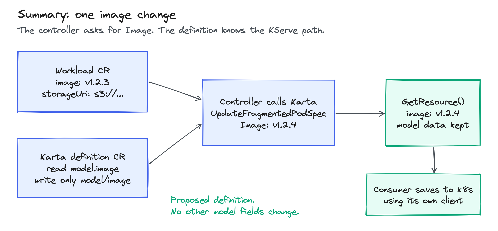
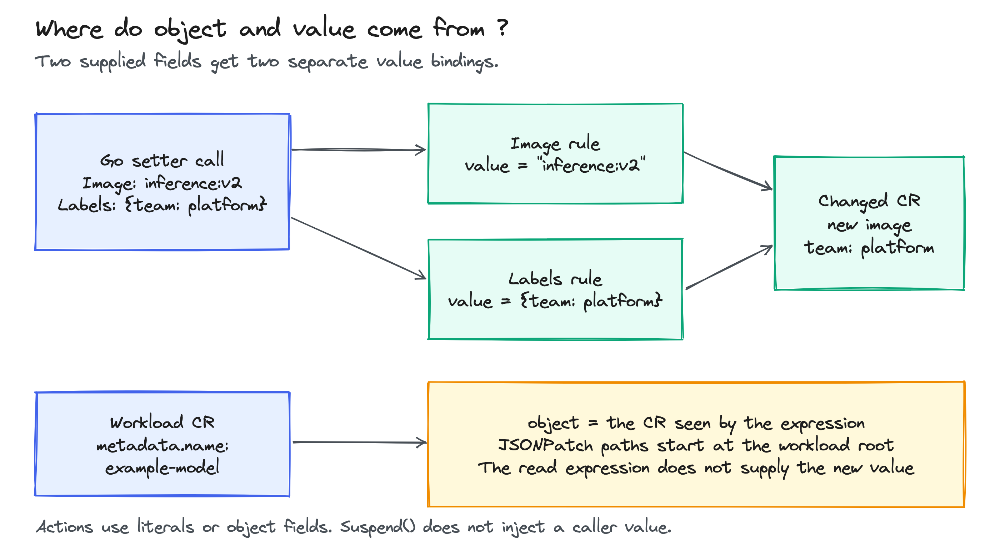
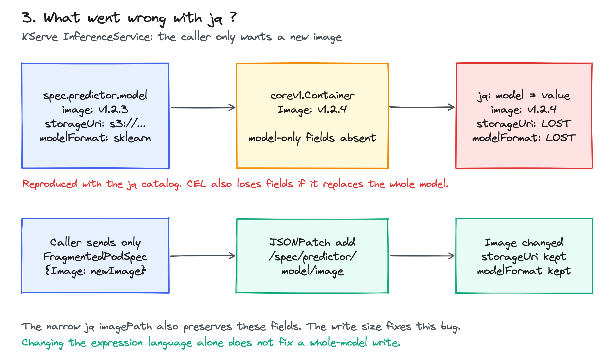
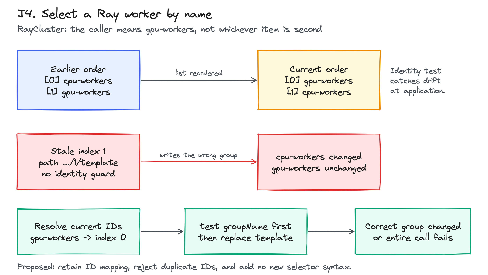
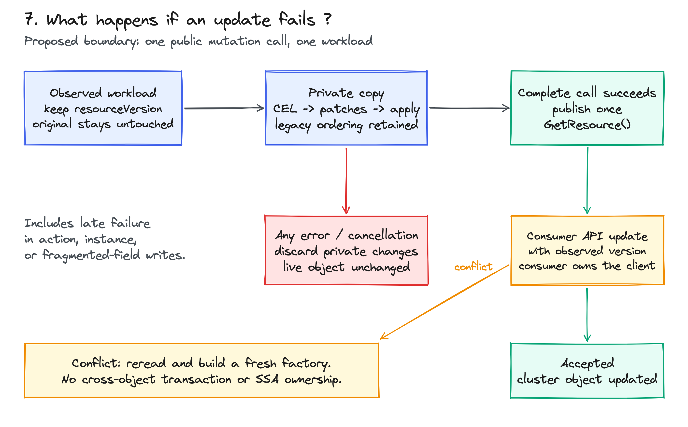

<!-- SPDX-License-Identifier: Apache-2.0 -->
<!-- Copyright (c) 2026 NVIDIA Corporation -->

# KEP-0005: Karta mutations

A Karta definition tells the library where a workload stores a field and how
to change it. Example: the controller supplies a new Image; Karta writes
KServe's model.image and keeps its storageUri.

This page proposes the future `run.ai/v1alpha2` YAML shape. It is not an
installable released API. The Go examples run against the available
`v1alpha1` CEL prototype. The checks adapt the API version and field layout.

[Karta fields](#karta-fields) | [JSONPatch walkthrough](#jsonpatch-walkthrough) |
[MergePatch walkthrough](#mergepatch-walkthrough) | [Why these choices](#mutation-justification)

<a id="karta-fields"></a>

## Karta CRD: what can the mutation definition contain ?

The CRD is the schema: it defines allowed fields. A Karta CR is one definition
written using that schema. The workload CR is the object being changed,
such as a KServe InferenceService. The next two sections show both CRs.

This is the mutation field layout, not a complete manifest:

```text
Karta
  spec
    variables[]                         optional named CEL expressions
    structureDefinition
      rootComponent                     the workload, such as InferenceService
      childComponents[]                 views inside it, such as predictor
        name, apiVersion, kind, ownerRef component identity
        specDefinition
          fragmentedPodSpecDefinition
            image / labels / ...        a field the caller can read or write
              expression                optional: read the current value
              patches[]                 candidates for writing this field
                matchConditions[]       optional: all must return true
                  name, expression
                patchType               JSONPatch or MergePatch
                expression              build the patch
              patchStrategy             MergePatch only: Merge (default) / Replace
        suspendDefinition
          suspendActions[]              patches run during Suspend()
          resumeActions[]               patches run during Resume()
```

The root can also declare these component rules. The layout puts them under
a child only to show where the KServe predictor examples belong.

patchStrategy affects only MergePatch entries. Omit it for JSONPatch-only
accessors. The proposed CRD will reject an explicit strategy when there is
no MergePatch candidate; [validation examples](#patch-strategy-crd-validation)
show accepted and rejected combinations. This check is not implemented yet.

### Fields and allowed values

A field rule is called an accessor in the code. For example, the Image
accessor can read the current image and define patches to change it.

| Field | What it can contain | Example and reason |
| --- | --- | --- |
| Accessor `expression` | Optional CEL string that reads a value | `object.spec.predictor.model.image` reads the old image; it does not perform a write |
| `patches` | Ordered list of patch candidates | One candidate writes model.image; another can handle sklearn.image. Only the first matching candidate runs |
| `matchConditions` | Optional list of named boolean expressions | Require a model map to exist before writing into it. All conditions must pass |
| Condition `name` and `expression` | Both required when a condition is present | `model-exists` names the condition in an error; its expression returns true or false |
| `patchType` | Required: `JSONPatch` or `MergePatch` | JSONPatch returns operations; MergePatch returns a partial object |
| Patch `expression` | Required CEL string that builds the patch | Turns the Go Image input into an operation that sets model.image. [Input -> expression -> patch](#patch-expression-explained) |
| `patchStrategy` | MergePatch only. Optional: `Merge` or `Replace`; default Merge. Proposed CRD check requires a MergePatch candidate when set | For labels, Merge keeps labels not supplied by the caller; Replace can clear them first. [Same input, both results](#patch-strategy-explained) |
| `suspendActions` / `resumeActions` | Ordered lists using the same patch-entry fields | Suspend writes true; Resume writes false. All matching actions run, unlike first-match accessor candidates |

No patches means a read-only accessor. A write with no matching candidate
fails. A condition that errors or returns a non-boolean also fails.

`path`, `op`, `from`, and `value` are fields inside a generated JSONPatch
operation. They are not extra top-level Karta CRD fields. There is no separate
`target` field in this proposal: JSONPatch uses path; MergePatch uses object nesting.

<details>
<summary id="patch-expression-explained">Patch expression: how a Go value becomes a write</summary>

The controller supplies `Image: "inference:v2"`. Karta makes that string
available to the Image accessor under the CEL variable name `value`.
The definition contains this patch entry:

```yaml
patchType: JSONPatch
expression: '[{"op":"add","path":"/spec/predictor/model/image","value":value}]'
```

CEL evaluates the expression and returns this data:

```json
[{"op":"add","path":"/spec/predictor/model/image","value":"inference:v2"}]
```

Karta then applies that operation to the workload. For example:

```text
Before model: {image: inference:v1, storageUri: "s3://example-bucket/model"}
After model:  {image: inference:v2, storageUri: "s3://example-bucket/model"}
```

`op` says what to do, `path` says where, and the operation's `value` holds
what to write. CEL constructs the instructions; the patch engine performs
the write. This example requires the model parent to exist.
[The complete Karta CR](#the-karta-definition-cr) adds that condition.

The accessor's other expression is a read: `object.spec.predictor.model.image`
returns the current image. It does not change it.

</details>

<details>
<summary id="patch-strategy-explained">patchStrategy: same label input, Merge versus Replace</summary>

Suppose the predictor already has two labels, and Go supplies one:

```text
Existing labels: {team: ml, owner: alice}
Go Labels input: {team: platform}
```

This accessor fragment writes the supplied map into predictor.labels:

<!-- verify: strategy-labels -->
```yaml
labels:
  patchStrategy: Merge
  patches:
    - patchType: MergePatch
      expression: '{"spec":{"predictor":{"labels":value}}}'
```

| Setting on this accessor | Labels after the call | What happened to owner? |
| --- | --- | --- |
| `patchStrategy: Merge`, or omit it | `{team: platform, owner: alice}` | Kept: the patch did not mention owner |
| `patchStrategy: Replace` | `{team: platform}` | Removed: Karta cleared labels before adding the input |

With Merge, Karta generates one partial object:

```json
{"spec":{"predictor":{"labels":{"team":"platform"}}}}
```

With Replace, Karta evaluates the same expression twice and applies the
two generated patches in order:

1. Clear: bind value to null. The generated patch removes labels:

   ```json
   {"spec":{"predictor":{"labels":null}}}
   ```

2. Fill: bind value to the Go map, `{"team":"platform"}`. The generated patch
   creates labels containing only team:

   ```json
   {"spec":{"predictor":{"labels":{"team":"platform"}}}}
   ```

The first patch removes labels because null deletes a map member in
[JSON Merge Patch](https://www.rfc-editor.org/rfc/rfc7396#section-2).
These are local patch steps, not two Kubernetes API requests.

This two-pass behavior is Karta's compatibility option. MergePatch itself
has no Merge/Replace setting. It works here because the expression puts
value directly at labels; an expression that rejects null or changes its
destination when value is null may not clear the intended field.

For the JSONPatch image example, omit patchStrategy. JSONPatch operations
already state what to do. The proposed CRD will reject patchStrategy on a
JSONPatch-only accessor. If candidates mix both patch types, the strategy
affects only the selected MergePatch entry; a selected JSONPatch entry still
runs once. [CRD validation examples](#patch-strategy-crd-validation).
To replace an entire labels map with JSONPatch,
use [the explicit labels assignment](#j2-replace-labels). To preserve other
labels, use [the complete MergePatch walkthrough](#mergepatch-walkthrough).

</details>

<details>
<summary id="why-both-patch-types">Why keep both? When JSONPatch is needed, and when MergePatch is simpler</summary>

Each patch entry chooses one format. It does not run both formats in sequence.
For example, the Image rule can use JSONPatch while the Labels rule uses MergePatch.
patchStrategy is a separate setting that affects only MergePatch entries.

JSONPatch plus CEL can cover the mutations in this proposal. Keeping MergePatch
is a convenience and compatibility choice, not a requirement for correctness.

| Request | JSONPatch | MergePatch |
| --- | --- | --- |
| Change one item in a list, keep every other item | Addresses the selected item | Must supply the entire replacement list |
| Require the old image to equal v1 before changing it | Has a test operation | Has no test operation; needs a separate condition |
| Store a literal null in a map field | Can assign null | Null means delete the field |
| Add several labels and keep unknown existing labels | Can do it with per-key operations and parent handling | A partial labels map does it directly |
| Update several nested map fields and keep siblings | Can do it with separate operations | A partial nested object does it directly |

[JSONPatch examples](#jsonpatch-advantages) | [MergePatch examples](#mergepatch-advantages)

<details>
<summary id="jsonpatch-advantages">Where MergePatch cannot express the same operation directly</summary>

### 1. Change one container, without resending the list

Before, a Pod's spec contains two containers:

```json
{"spec":{"containers":[
  {"name":"inference","image":"inference:v1"},
  {"name":"metrics","image":"metrics:v1"}
]}}
```

This JSONPatch checks the selected name and changes only its image:

```json
[
  {"op":"test","path":"/spec/containers/0/name","value":"inference"},
  {"op":"replace","path":"/spec/containers/0/image","value":"inference:v2"}
]
```

After:

```json
{"spec":{"containers":[
  {"name":"inference","image":"inference:v2"},
  {"name":"metrics","image":"metrics:v1"}
]}}
```

Trying this shorter MergePatch would delete the metrics container:

```json
{"spec":{"containers":[{"name":"inference","image":"inference:v2"}]}}
```

MergePatch replaces arrays as a whole. It does not match array entries by name.
To get the same successful result, its patch must contain the entire after-list,
including metrics and every other field on both containers. CEL could build
that list from object, but the patch would still replace the whole list.

Karta should select the current index by name, then check that name. The fixed
index above only explains the operation. [The Ray example](#j4-ray-input) shows
selection that handles reordered entries. Neither patch format alone prevents
a later Kubernetes API write from overwriting a concurrent change;
[the consumer's version check](#c1-save) handles that.

### 2. Check the old value as part of the patch

For the KServe model, this JSONPatch means "change v1 to v2, but reject any
other starting image":

```json
[
  {"op":"test","path":"/spec/predictor/model/image","value":"inference:v1"},
  {"op":"replace","path":"/spec/predictor/model/image","value":"inference:v2"}
]
```

| Starting image | Result in Karta |
| --- | --- |
| inference:v1 | Changes to inference:v2 |
| inference:v3 | Test fails; the image is not changed |

The MergePatch `{"spec":{"predictor":{"model":{"image":"inference:v2"}}}}`
would overwrite either starting image. It has no built-in test operation.
Karta can add a separate matchCondition such as
`object.spec.predictor.model.image == "inference:v1"` to get this guard for
a single write. This is extra rule logic, not a MergePatch operation.
If no candidate matches, Karta fails the write.

### 3. Store null instead of deleting a field

For an arbitrary CR field whose schema permits null, suppose the existing
fragment is `{"spec":{"lastError":"timeout"}}`:

| Generated patch | Result |
| --- | --- |
| JSONPatch: `[{"op":"add","path":"/spec/lastError","value":null}]` | `{"spec":{"lastError":null}}` |
| MergePatch: `{"spec":{"lastError":null}}` | `{"spec":{}}` |

Those results differ: the first retains the field with a null value; the
second removes the field. This is a generic nullable-field example, not a
KServe image field. Use JSONPatch when the distinction is part of the CR's API.

The operation and array rules come from [JSON Patch](https://www.rfc-editor.org/rfc/rfc6902)
and [JSON Merge Patch](https://www.rfc-editor.org/rfc/rfc7396).

</details>

<details>
<summary id="mergepatch-advantages">The opposite direction: what MergePatch makes easier, with JSONPatch equivalents</summary>

There is no example here that requires MergePatch and cannot be expressed
with JSONPatch plus CEL. Its advantage is how little the author needs to write.

### 1. Add labels without knowing the existing label keys

Before, predictor.labels is `{"owner":"alice","team":"ml"}`.
The caller supplies `Labels: {"team":"platform","cost-center":"research"}`.
The result should be:

```json
{"owner":"alice","team":"platform","cost-center":"research"}
```

MergePatch expresses this with one partial object:

```json
{"spec":{"predictor":{"labels":{"team":"platform","cost-center":"research"}}}}
```

It also creates labels if that map is absent. The Karta expression is
`{"spec":{"predictor":{"labels":value}}}` with patchStrategy omitted or Merge.
[The full Labels definition and Go function](#mergepatch-walkthrough) show the call.

JSONPatch can produce the same result. When labels exists, add its members separately:

```json
[
  {"op":"add","path":"/spec/predictor/labels/team","value":"platform"},
  {"op":"add","path":"/spec/predictor/labels/cost-center","value":"research"}
]
```

For arbitrary Go label keys, CEL would build one operation per key and escape
slashes or tildes in each path. Under standard JSONPatch rules, an absent labels
map needs a different operation that creates the map first. Karta's existing
[missing-parent extension](#missing-parents) can create absent map parents;
[Kyverno's example](#j6-kyverno-label) uses an explicit branch instead.

Setting the whole labels map with one JSONPatch add operation would remove owner.
That is valid when replacement is intended, but it is not the partial update above.

### 2. Change nested settings while keeping sibling settings

Before, a Pod's spec fragment is:

```json
{"spec":{
  "nodeSelector":{"region":"east","disk":"ssd"},
  "securityContext":{"runAsUser":1000,"runAsNonRoot":true}
}}
```

Request: select region west and user 2000; keep disk and runAsNonRoot.
MergePatch only includes the requested changes:

```json
{"spec":{"nodeSelector":{"region":"west"},"securityContext":{"runAsUser":2000}}}
```

After:

```json
{"spec":{
  "nodeSelector":{"region":"west","disk":"ssd"},
  "securityContext":{"runAsUser":2000,"runAsNonRoot":true}
}}
```

The equivalent JSONPatch, with those parent maps present, is:

```json
[
  {"op":"add","path":"/spec/nodeSelector/region","value":"west"},
  {"op":"add","path":"/spec/securityContext/runAsUser","value":2000}
]
```

Both are correct. MergePatch resembles the part of the CR being changed;
JSONPatch lists the individual writes. These are workload fragments to explain
the formats, not an additional public Karta setter.

</details>

Recommendation for Karta: teach JSONPatch first; retain MergePatch as an optional
shortcut for partial maps and for existing definitions. For example, use
JSONPatch for a selected container's image and MergePatch for several labels.
If reducing the number of supported formats becomes the priority, JSONPatch-only
is a viable design, with migration work for existing MergePatch definitions.

[Cluster API's external patch hook](#cluster-api-external) accepts this same pair.
Kyverno is useful evidence for JSONPatch, but its strategic merge and
ApplyConfiguration options are different formats, not Karta's MergePatch.

</details>

### Where do the values come from ?

| Name in CEL | Where Karta gets it | Example |
| --- | --- | --- |
| `object` | Workload passed to the factory | `object.metadata.name` reads example-model from the InferenceService |
| `value` | The Go field currently being written | `Image: "inference:v2"` binds the Image patch's value to that string |
| `references.name` | An external resource supplied by Go or fetched through the configured reader | `references.config.data.reason` reads a reason from a ConfigMap |
| `variables.name` | A named expression under spec.variables | A variable can choose whether the CR uses model or sklearn |
| `instance`, `index` | The selected component instance and its current position | Ray's gpu-workers might currently be at index 1 |

`"value": value` means: put the Go-supplied variable into the JSONPatch member
named value. For example, it becomes `"value": "inference:v2"`.
Suspend/resume actions have no setter-supplied value binding; they use literals
or fields from object. [Examples of two inputs and CR-derived values](#value-examples).

<details>
<summary id="why-value-not-dollar">Why value, not $value or "$value"? Kubernetes and Kyverno examples</summary>

The expression language decides how variables are written. CEL uses a plain
name such as `value`. jq uses a dollar-prefixed name such as `$val`.
YAML does not choose the expression language or inject the value.

Assume Go supplied `Image: "inference:v2"`. These are different CEL expressions:

| Inside the patch expression | Meaning | Result |
| --- | --- | --- |
| `value` | Read Karta's supplied variable | `"inference:v2"` |
| `"value"` | A literal string | `"value"` |
| `"$value"` | A literal string containing a dollar sign | `"$value"` |
| `$value` | Invalid CEL syntax | Compilation fails |

For example, `"value": value` puts inference:v2 in the generated operation.
Writing `"value": "$value"` instead puts the literal text $value there.
It would not use the Go Image input, and that text is not a usable image reference.
The surrounding single quotes in YAML `expression: '...'` only delimit the
YAML string; the CEL parser still sees the inner double quotes.

There is no universal Kubernetes variable called value. These systems bind
different inputs, but their CEL expressions use the same plain-name syntax:

| System | Example value source | Who supplies it? |
| --- | --- | --- |
| Karta CEL | `value`, or `object.metadata.name` | The Go setter, or the workload passed to the factory |
| Kubernetes MutatingAdmissionPolicy | `params.spec.image`, or `object.metadata.name` | The selected parameter resource, or the admission request's workload |
| Kyverno CEL MutatingPolicy | `object.metadata.name`, or `variables.image` | The incoming workload, or a named policy variable |
| Kyverno classic ClusterPolicy | `"{{ request.object.metadata.name }}"` | Kyverno substitutes a JMESPath result in a template; this is not CEL |

For example, these illustrative CEL operations both put the workload's name
in an annotation. They require an existing annotations map:

```cel
// Karta: a CEL map. object.metadata.name supplies the annotation value.
{"op": "add", "path": "/metadata/annotations/example.org~1workload-name",
 "value": object.metadata.name}

// Kubernetes / Kyverno CEL: a typed JSONPatch object, using the same read.
JSONPatch{op: "add", path: "/metadata/annotations/example.org~1workload-name",
          value: object.metadata.name}
```

Each operation belongs inside a list in its own patch expression, not together
in one expression. If the workload name is example-model, both produce an
annotation value of `"example-model"`. Their enclosing policy APIs differ.

For an external image, Kubernetes can use `value: params.spec.image` once
paramKind and a binding's paramRef are configured. Karta uses `"value": value`
for its Go Image argument. [The three-input comparison](#external-input-compatibility)
shows the distinction; renaming value does not create parameter-resource support.
See [Kubernetes' documented bindings](https://kubernetes.io/docs/reference/access-authn-authz/mutating-admission-policy/#jsonpatch)
and [Kyverno's classic template syntax](https://kyverno.io/docs/policy-types/cluster-policy/variables/).

Recommendation: keep `value` for Karta's existing typed setters and keep CEL
syntax unchanged. The familiar part is plain names and expressions, not a
claim that every Kubernetes API exposes Karta's value binding. Do not add a
dollar-sign substitution layer. For multiple configuration values, first use
[existing resource references](#external-input-compatibility). A separate per-call
parameter bag would need an explicit API, such as the proposed typed params input.

<details>
<summary id="value-binding-implementation">Inside the code: how Karta and the policy engines supply variables</summary>

Karta declares a variable name when it creates the CEL environment:

```go
cel.Variable("value", cel.DynType)
```

For each selected accessor, Karta passes a map containing the actual inputs:

```go
vars := map[string]any{"value": value, "instance": instance, "index": i}
```

The evaluator adds the workload as object and evaluates the compiled expression
with these bindings. It does not replace a substring in the expression.
For example, a Labels input remains a map; `value["team"]` reads its team entry.
An Image input remains a string. Image and Labels accessors receive separate
value bindings in the same call.

Source: the inspected CEL prototype's
`pkg/cel/evaluator.go` (newEvaluator and EvaluateWithVariables) and
`pkg/resource/accessor.go` (applyPatches), commit
`0fff67e9402425fbaeecb03543d1f7a7af60bcc2`.

Kubernetes follows the same declaration-and-binding approach. It declares
object and, when enabled, params; ResolveName returns the matching request
or parameter object. Kyverno's CEL compiler declares object and variables,
then evaluates policy variables against its input map. Examples:
`params.spec.image` reads Kubernetes' parameter object;
`variables.image` reads a Kyverno policy variable named image.
Sources: [Kubernetes declarations](https://github.com/kubernetes/kubernetes/blob/6737adf59793fd79cb4a0c65ef36340b66f4643e/staging/src/k8s.io/apiserver/pkg/admission/plugin/cel/compile.go#L251),
[Kubernetes runtime bindings](https://github.com/kubernetes/kubernetes/blob/6737adf59793fd79cb4a0c65ef36340b66f4643e/staging/src/k8s.io/apiserver/pkg/admission/plugin/cel/activation.go#L109),
[Kyverno declarations](https://github.com/kyverno/kyverno/blob/b458f43a845a87d472737a0b3ab16c18f365bcfd/pkg/cel/policies/mpol/compiler/compiler.go#L170),
and [Kyverno named-variable evaluation](https://github.com/kyverno/kyverno/blob/b458f43a845a87d472737a0b3ab16c18f365bcfd/pkg/cel/policies/mpol/compiler/policy.go#L72).

The older Karta jq runner builds `(path) = $val` and binds $val through
gojq.WithVariables. For example, `(.spec.predictor.model.image) = $val`
sets that field from the Go argument. That dollar sign belongs to jq's
variable syntax. It did not cause the [broad-write field-loss bug](#broad-write).
Source: the jq worktree's `pkg/jq/execution/runner.go`, Assign and compile,
at `f91136d8c82b6cbfa5c78f39e53334bef094549b`.

</details>

</details>

<details>
<summary id="other-mutation-fields">Other writable fields, whole-object views, and optional rules</summary>

The field layout above focuses on mutations, not status or pod discovery.
The available field families are:

| Location | Fields | Example |
| --- | --- | --- |
| fragmentedPodSpecDefinition | image, labels, annotations, schedulerName, priorityClassName, resources, resourceClaims, podAffinity, nodeAffinity, container, containers | Change Image without resending a whole Container |
| specDefinition | podTemplateSpec, or podSpec with metadata, or fragmentedPodSpecDefinition | Choose one representation; a whole template write can intentionally replace everything inside that template |
| scaleDefinition | replicas, minReplicas, maxReplicas | Change a replica count using the same accessor shape |
| instanceIDs | Read-only accessor identifying repeated components | Return Ray worker group names; it cannot declare patches |
| spec.variables | Entries with name and expression | Compute variables.containerKey once per relevant evaluation context |
| suspendDefinition | suspendActions and resumeActions | Both action lists belong to the suspend definition; their entries do not have patchStrategy |

Named variables are ordered; a later one can use an earlier one.
An accessor's unconditional patch candidate must be last. For example, a
model-specific condition must precede an always-matching fallback.
The ordinary Merge strategy is enough for the examples below. Legacy Replace
is not another patch type; [its compatibility behavior](#rules-migration-and-versioning)
needs care with expressions that behave differently when value is null.

The prototype spells instanceIds and uses nested group/version/kind objects.
This proposal follows KEP-0001's future instanceIDs and flat apiVersion/kind shape.

</details>

<a id="jsonpatch-walkthrough"></a>

## JSONPatch: change one image

Request: change the model image from v1.2.3 to v1.2.4. Keep its model data.

Why JSONPatch here: set one field without resending the model. For example,
writing model.image leaves storageUri untouched. Kyverno uses the same
operation/path/value pattern; expand its policy example below.

<details>
<summary id="j6-kyverno-label">How Kyverno does it: complete JSONPatch policy, input, and result (J6)</summary>

This is the structure of Kyverno's JSONPatch admission example, with its
policy name shortened. The API version below is from the pinned source revision.
It matches Deployment creation in namespace dev:

```yaml
apiVersion: policies.kyverno.io/v1beta1
kind: MutatingPolicy
metadata:
  name: label-dev-deployments
spec:
  matchConstraints:
    resourceRules:
      - apiGroups: [apps]
        apiVersions: [v1]
        operations: [CREATE]
        resources: [deployments]
  matchConditions:
    - name: is-dev-namespace
      expression: request.namespace == 'dev'
  mutations:
    - patchType: JSONPatch
      jsonPatch:
        expression: >-
          has(object.metadata.labels) ?
            [JSONPatch{op: "add", path: "/metadata/labels/managed", value: "true"}] :
            [JSONPatch{op: "add", path: "/metadata/labels", value: {"managed": "true"}}]
```

Read the rule in this order:

| Part | What it does in this example |
| --- | --- |
| matchConstraints | Selects CREATE requests for apps/v1 Deployments |
| matchConditions | Runs only when request.namespace is dev |
| has(object.metadata.labels) | Checks whether the labels parent exists |
| First branch | Adds managed to the existing labels map |
| Second branch | Creates labels containing managed when labels is absent |

For example, the incoming Deployment contains this metadata fragment:

```yaml
metadata:
  name: inference
  namespace: dev
  labels:
    owner: alice
```

The first branch generates:

```json
[{"op":"add","path":"/metadata/labels/managed","value":"true"}]
```

After the mutation, that fragment is:

```yaml
metadata:
  name: inference
  namespace: dev
  labels:
    owner: alice
    managed: "true"
```

The operation writes only managed, so owner stays. This is the same reason
Karta's image-only operation preserves storageUri. These are metadata
fragments; the rest of the Deployment is unchanged.

| Deployment before | After the matching policy |
| --- | --- |
| labels: {owner: alice} | labels: {owner: alice, managed: "true"} |
| No labels member | labels: {managed: "true"} |
| Creation outside dev | No change from this policy |

Why this matters to Karta: adding one member preserves siblings when
the parent exists; creating the parent is a separate, visible branch.
The model-only Image example chooses another explicit rule: require
the parent model map to exist, otherwise fail.

The value here is the literal string "true", suitable for a Kubernetes label.
There is no externally injected Karta value. For a value from the workload,
the CEL operation could instead use `value: object.metadata.name`; on this
Deployment it would write "inference". Both use plain CEL variable names.

Kyverno constructs typed `JSONPatch{...}` objects. Karta's prototype constructs
CEL maps `{"op": ..., "path": ..., "value": ...}`. The generated operation
has the same fields, but the expression wrappers are not interchangeable.
This example concerns Kyverno's CEL MutatingPolicy API, not classic
ClusterPolicy templates. Karta can reuse the operation model without
embedding Kyverno's admission controller.

Source: [Kyverno's policy example](https://github.com/kyverno/kyverno/blob/b458f43a845a87d472737a0b3ab16c18f365bcfd/test/conformance/chainsaw/mutating-policies/admission/jsonpatch/policy.yaml).

</details>

### JSONPatch / 1. Karta CR: the definition

<a id="the-karta-definition-cr"></a>

<!-- verify: kserve-narrow -->
```yaml
apiVersion: run.ai/v1alpha2
kind: Karta
metadata:
  name: serving-kserve-io-inferenceservice-v1beta1
spec:
  structureDefinition:
    rootComponent:
      name: inferenceservice
      apiVersion: serving.kserve.io/v1beta1
      kind: InferenceService
    childComponents:
      - name: predictor
        apiVersion: apps/v1
        kind: Deployment
        ownerRef: inferenceservice
        specDefinition:
          fragmentedPodSpecDefinition:
            image:
              expression: 'object[?"spec"][?"predictor"][?"model"][?"image"].orValue(null)'
              patches:
                - matchConditions:
                    - name: model-exists
                      expression: 'object.?spec.?predictor.?model.hasValue() && type(object.spec.predictor.model) == map'
                  patchType: JSONPatch
                  expression: '[{"op": "add", "path": "/spec/predictor/model/image", "value": value}]'
```

The first expression reads Image. The patch expression builds one operation.
`add` sets the image member whether absent or already present; the condition
requires its model parent to be a map. Only model.image is written.
The predictor's Deployment kind describes a component view; this call changes
the supplied InferenceService, not a generated Deployment. Discovery and status
rules are omitted from this mutation-only definition.

### JSONPatch / 2. Go input: where value is injected

Pass `image = "ghcr.io/example/inference:v1.2.4"` to this function.
Karta binds that string as value when it evaluates the Image patch.

<details>
<summary id="image-go-call">Complete Go function: changeImage</summary>

```go
func changeImage(ctx context.Context, definition *v1alpha1.Karta,
    workload *unstructured.Unstructured, image string) (resource.KubernetesObject, error) {
    if image == "" {
        return nil, fmt.Errorf("image must be non-empty")
    }
    factory := resource.NewComponentFactoryFromObject(definition, workload)
    predictor, err := factory.GetComponent("predictor")
    if err != nil {
        return nil, err
    }
    if err := predictor.UpdateFragmentedPodSpec(ctx,
        map[string]resource.FragmentedPodSpec{"": {Image: image}}); err != nil {
        return nil, err
    }
    return factory.GetResource()
}
```

The empty map key selects the single predictor instance. This function rejects
an empty image because today's typed setter treats some empty values as omitted.
GetResource returns a local object; [saving with a version check](#c1-save) is separate.

</details>

The generated patch is:

```json
[{"op":"add","path":"/spec/predictor/model/image","value":"ghcr.io/example/inference:v1.2.4"}]
```

### JSONPatch / 3. Workload CR before

<a id="the-workload-cr"></a>

<!-- verify: kserve-input -->
```yaml
apiVersion: serving.kserve.io/v1beta1
kind: InferenceService
metadata:
  name: example-model
  namespace: default
spec:
  predictor:
    minReplicas: 2
    model:
      image: ghcr.io/example/inference:v1.2.3
      modelFormat:
        name: sklearn
      storageUri: s3://example-bucket/model
```

### JSONPatch / 4. Workload CR after

<!-- verify: kserve-output -->
```yaml
apiVersion: serving.kserve.io/v1beta1
kind: InferenceService
metadata:
  name: example-model
  namespace: default
spec:
  predictor:
    minReplicas: 2
    model:
      image: ghcr.io/example/inference:v1.2.4
      modelFormat:
        name: sklearn
      storageUri: s3://example-bucket/model
```

Only image changed. modelFormat, storageUri, and minReplicas stayed.

<details>
<summary id="kserve-model-explained">How this maps to KServe: real fields, an image-only patch, and the old bug</summary>

KServe defines the InferenceService fields. Kubernetes or Karta applies the
patch to that object; KServe does not evaluate Karta's CEL expression.

The workload above uses KServe's model shape. This is its predictor fragment,
with each field's role shown:

```yaml
spec:
  predictor:
    minReplicas: 2
    model:
      image: ghcr.io/example/inference:v1.2.3
      modelFormat:
        name: sklearn
      storageUri: s3://example-bucket/model
```

| Field | What it describes | Where KServe defines it |
| --- | --- | --- |
| model.image | Container image override for the predictor | The embedded corev1.Container |
| model.modelFormat.name | Model format, sklearn in this example | ModelSpec.ModelFormat |
| model.storageUri | Location of the trained model data | PredictorExtensionSpec.StorageURI |
| predictor.minReplicas | Minimum replica count | ComponentExtensionSpec.MinReplicas |

The image and the trained model are separate inputs. For example, changing
the container image to v1.2.4 does not mean moving its model data to another
bucket. The storageUri should stay at s3://example-bucket/model.

For a familiar Kubernetes comparison, save the [complete before CR](#the-workload-cr)
as inferenceservice.yaml and preview this ordinary JSONPatch locally:

```sh
kubectl patch --local -f inferenceservice.yaml --type=json \
  -p '[{"op":"add","path":"/spec/predictor/model/image","value":"ghcr.io/example/inference:v1.2.4"}]' \
  -o yaml
```

This prints the same image-only change shown above. The [--local flag](https://kubernetes.io/docs/reference/kubectl/generated/kubectl_patch/)
means it does not update a cluster. It demonstrates patching, not a running model.
Karta builds the same operation from the Go Image argument; it does not
invoke kubectl.

Why the old Karta jq write lost data:

| Read into Go | What that type can retain | Result of replacing the whole model |
| --- | --- | --- |
| corev1.Container | image and other standard container fields | storageUri and modelFormat are lost because that type has no such fields |
| KServe's full ModelSpec | Container fields plus KServe's model fields | Can represent those extra fields, but requires a KServe-specific type |
| Narrow Karta Image setter | Only the requested image string | Does not replace model, so its other members remain |

The generic library does not need a KServe-specific Go adapter for this
change. It needs a definition that writes model/image and a caller that
supplies only Image. The jq failure came from replacing a broad object
after conversion to a smaller Go type; jq itself did not delete unknown fields.
[Expand the real Karta getter/setter reproduction](#broad-write).

Sources: [KServe ModelSpec](https://github.com/kserve/kserve/blob/2797996f1b50bd0687ee25995ae52d9fa1343b79/pkg/apis/serving/v1beta1/predictor_model.go#L32),
[storageUri and embedded Container](https://github.com/kserve/kserve/blob/2797996f1b50bd0687ee25995ae52d9fa1343b79/pkg/apis/serving/v1beta1/predictor.go#L122),
and [minimum replicas](https://github.com/kserve/kserve/blob/2797996f1b50bd0687ee25995ae52d9fa1343b79/pkg/apis/serving/v1beta1/component.go#L81).

The CR uses real field names with placeholder image and storage values.
Running it would require an installed KServe setup, a compatible serving
runtime and image, and accessible model artifacts. The local example makes
no claim that those placeholders form a deployable model service.

</details>

### One external value plus two values from the CR

The same patch expression can use all three sources. For example, an Image
update can also record the previous image and the workload name:

| Destination | CEL value | Source |
| --- | --- | --- |
| model.image | `value` | New Image string supplied by Go |
| previous-image annotation | `object.spec.predictor.model.image` | Old image in this CR |
| workload-name annotation | `object.metadata.name` | Name in this CR |

This adds two explicit side effects to the Image definition. Ordinary Image
updates do not create these annotations unless the author adds the operations.
[Open the full input, Image rule, and result](#three-value-example).

<details>
<summary id="three-value-example">One Image call: external image + old CR image + CR name</summary>

Use the full Karta definition above, replacing only its Image accessor with
the following rule. Start with this workload:

<!-- verify: three-values-input -->
```yaml
apiVersion: serving.kserve.io/v1beta1
kind: InferenceService
metadata:
  name: example-model
  namespace: default
  annotations:
    owner: alice
spec:
  predictor:
    minReplicas: 2
    model:
      image: ghcr.io/example/inference:v1.2.3
      modelFormat:
        name: sklearn
      storageUri: s3://example-bucket/model
```

The Image accessor is:

<!-- verify: three-values-accessor -->
```yaml
image:
  expression: 'object[?"spec"][?"predictor"][?"model"][?"image"].orValue(null)'
  patches:
    - matchConditions:
        - name: old-image-present
          expression: 'object.?spec.?predictor.?model.?image.hasValue() && type(object.spec.predictor.model.image) == string'
        - name: annotations-map-present
          expression: 'object.?metadata.?annotations.hasValue() && type(object.metadata.annotations) == map'
      patchType: JSONPatch
      expression: >-
        [{"op": "add", "path": "/spec/predictor/model/image", "value": value},
         {"op": "add", "path": "/metadata/annotations/example.org~1previous-image",
          "value": object.spec.predictor.model.image},
         {"op": "add", "path": "/metadata/annotations/example.org~1workload-name",
          "value": object.metadata.name}]
```

Call changeImage with `ghcr.io/example/inference:v1.2.4`, using the same Go
function shown above. No extra Go input is needed for the name or old image.
All three operation values are computed before applying this patch list, so
previous-image receives v1.2.3 even though the image operation is first.

<!-- verify: three-values-output -->
```yaml
apiVersion: serving.kserve.io/v1beta1
kind: InferenceService
metadata:
  name: example-model
  namespace: default
  annotations:
    owner: alice
    example.org/previous-image: ghcr.io/example/inference:v1.2.3
    example.org/workload-name: example-model
spec:
  predictor:
    minReplicas: 2
    model:
      image: ghcr.io/example/inference:v1.2.4
      modelFormat:
        name: sklearn
      storageUri: s3://example-bucket/model
```

The condition requires an existing annotations map to stay within ordinary
JSONPatch parent rules. The existing owner annotation stays. `~1` encodes
the slash in an annotation key; it does not add another path segment.

</details>

<details>
<summary id="external-input-compatibility">Several external values: current Karta limits and the Kubernetes pattern</summary>

Several operations can use different values without several external arguments:
the example above uses one Go Image and two fields from object.
For two external Karta fields, [Image plus Labels](#v1-two-inputs) uses the existing
typed setter. Each accessor gets its own value, not a shared parameter bundle.

An Image setter cannot accept `{"image":"v2","reason":"refresh"}` as value.
Its Go field is a string. A Labels setter accepts a map, but that map is labels,
not an arbitrary bag of inputs for another accessor.

There is also an existing way to supply external resource data: references.
For example, cfg can be an already fetched ConfigMap containing data.image
and data.reason. Supply it when constructing the factory:

```go
factory := resource.NewComponentFactoryFromObject(definition, workload,
    resource.WithReferences(references.ResolvedReferences{
        "config": references.NewLookupValue(cfg),
    }))
```

This is a factory-construction fragment from the current prototype API;
cfg is a *unstructured.Unstructured, and references is Karta's pkg/references
package. The patch can read `references.config.data.image` and
`references.config.data.reason`. WithReferenceReader is the alternative when
Karta should resolve the definition's declared resource references through a reader.

For example, an Image mutation can use `value` for the new Go-supplied image,
`references.config.data.reason` for a separately supplied reason, and
`object.metadata.name` for the workload name. A spec.variables entry named
reason with expression `references.config.data.reason` lets the patch use
`variables.reason` instead. That is an alias for a read, not another injection
mechanism. Constants in spec.variables are definition configuration, not
new arguments to the Image setter.

Source: the inspected prototype's `pkg/resource/component_factory.go`
(WithReferences and WithReferenceReader) and `pkg/references/reader.go`
(ResolvedReferences and Bindings). These resource inputs already exist;
the generic params API below does not.

Kubernetes MutatingAdmissionPolicy separates the workload (`object`) from
external configuration (`params`). The policy declares paramKind; its binding
selects a parameter resource through paramRef. For example, with a parameter
resource whose spec.image is inference:v2, a policy expression can combine it
with two fields read from the Pod:

```cel
[
  JSONPatch{op: "replace", path: "/spec/containers/0/image",
            value: params.spec.image},
  JSONPatch{op: "add", path: "/metadata/annotations/example.org~1previous-image",
            value: object.spec.containers[0].image},
  JSONPatch{op: "add", path: "/metadata/annotations/example.org~1workload-name",
            value: object.metadata.name}
]
```

This is an illustrative upstream CEL fragment, not a complete policy. The Pod
must have container 0 and an annotations map. Another external setting could be
read as params.spec.reason if its declared parameter schema contains that field.
See [Kubernetes parameter resources and JSONPatch expressions](https://kubernetes.io/docs/reference/access-authn-authz/mutating-admission-policy/#parameter-resources).

| Concept | Karta today | Kubernetes MutatingAdmissionPolicy |
| --- | --- | --- |
| Read the workload | object | object |
| Supply outside values | Typed Go field as value; external resources as references.name | Parameter resource, bound as params |
| Name a derived expression | spec.variables, then variables.name | spec.variables, then variables.name |
| Construct operations | CEL maps in a list | Typed JSONPatch values in a list |
| Apply operations | Local library result | Admission-time mutation |

The familiar parts are CEL, object reads, named variables, and JSONPatch
operations. The enclosing YAML and external-input wiring are different;
these are not interchangeable manifests.

Recommendation for the three-value example: keep the typed Image input and
read the two existing values from object. For settings held in another resource,
reuse references. Only if callers need a separate per-call parameter bag should
Karta add an optional typed params input, following Kubernetes' separation and
validation while keeping existing setters. That would be a new Karta API proposal.
It is not implemented or silently injected by today's Image setter.
Renaming value to params alone would not add it.

</details>

### JSONPatch: every operation

These small JSON objects isolate the operation, so the change is easy to see.
They are object fragments, not additional fields proposed for the Karta CRD.

<!-- verify-table: json-operations -->
| Operation | Before | Generated JSONPatch | After |
| --- | --- | --- | --- |
| add: create a member | `{}` | `[{"op":"add","path":"/x","value":"new"}]` | `{"x":"new"}` |
| add: overwrite a member | `{"x":"old"}` | `[{"op":"add","path":"/x","value":"new"}]` | `{"x":"new"}` |
| replace: require the member | `{"x":"old"}` | `[{"op":"replace","path":"/x","value":"new"}]` | `{"x":"new"}` |
| remove: delete a member | `{"x":1,"keep":2}` | `[{"op":"remove","path":"/x"}]` | `{"keep":2}` |
| copy: keep the source | `{"x":1}` | `[{"op":"copy","from":"/x","path":"/y"}]` | `{"x":1,"y":1}` |
| move: remove the source | `{"x":1}` | `[{"op":"move","from":"/x","path":"/y"}]` | `{"y":1}` |
| test: check, do not write | `{"x":1}` | `[{"op":"test","path":"/x","value":1}]` | `{"x":1}` |
| add into an array: insert | `{"x":[1,2]}` | `[{"op":"add","path":"/x/0","value":9}]` | `{"x":[9,1,2]}` |
| add at the end: append | `{"x":[1,2]}` | `[{"op":"add","path":"/x/-","value":9}]` | `{"x":[1,2,9]}` |
| empty operation list | `{"x":1}` | `[]` | `{"x":1}` |

Every operation requires op and path. Add, replace, and test also require value.
Copy and move require from. Remove needs no value.
Missing required targets and failed tests are errors; an array index is not a
stable name. [The Ray example](#j4-ray-input) selects and checks gpu-workers.
These operations follow [JSON Patch](https://www.rfc-editor.org/rfc/rfc6902).
Karta also retains a missing-map-parent extension, explained under [parent rules](#missing-parents).

<details>
<summary id="json-value-types">JSONPatch: every value type, including empty values and null</summary>

Add and replace assign the supplied value as a whole. Unlike MergePatch,
a JSONPatch null stores null; deleting a member uses remove.

<!-- verify-table: json-values -->
| Value case | Before | Generated JSONPatch | After |
| --- | --- | --- | --- |
| string | `{"x":"old"}` | `[{"op":"replace","path":"/x","value":"new"}]` | `{"x":"new"}` |
| integer, including zero | `{"x":3}` | `[{"op":"replace","path":"/x","value":0}]` | `{"x":0}` |
| fractional number | `{"x":1}` | `[{"op":"replace","path":"/x","value":1.5}]` | `{"x":1.5}` |
| boolean true | `{"x":false}` | `[{"op":"replace","path":"/x","value":true}]` | `{"x":true}` |
| boolean false | `{"x":true}` | `[{"op":"replace","path":"/x","value":false}]` | `{"x":false}` |
| map replaces the map | `{"x":{"team":"ml","owner":"alice"}}` | `[{"op":"replace","path":"/x","value":{"team":"platform"}}]` | `{"x":{"team":"platform"}}` |
| list replaces the list | `{"x":["api","metrics"]}` | `[{"op":"replace","path":"/x","value":["api"]}]` | `{"x":["api"]}` |
| empty string | `{"x":"old"}` | `[{"op":"replace","path":"/x","value":""}]` | `{"x":""}` |
| empty map | `{"x":{"team":"ml"}}` | `[{"op":"replace","path":"/x","value":{}}]` | `{"x":{}}` |
| empty list | `{"x":[1]}` | `[{"op":"replace","path":"/x","value":[]}]` | `{"x":[]}` |
| explicit null | `{"x":"old"}` | `[{"op":"replace","path":"/x","value":null}]` | `{"x":null}` |

These are generated patch values, not all valid inputs to an Image setter.
A Kubernetes field must also accept the resulting type. For example, a model
image cannot become a number just because JSONPatch can represent a number.
[The typed setter's empty-value limits](#empty-values) still apply before patch evaluation.

</details>

<a id="mergepatch-walkthrough"></a>
<a id="m1-merge-labels"></a>

## MergePatch: change one label and keep the others

Request: change predictor label team from ml to platform. Keep owner: alice.

Why MergePatch here: the caller supplies a partial labels map. Karta merges
the supplied keys and preserves keys the caller did not mention. No separate
operation is needed for each label. JSONPatch could do this too; MergePatch
is a shorter option for this map-shaped request.

### MergePatch / 1. Karta CR: the definition

<!-- verify: merge-labels-karta -->
```yaml
apiVersion: run.ai/v1alpha2
kind: Karta
metadata:
  name: serving-kserve-io-inferenceservice-v1beta1
spec:
  structureDefinition:
    rootComponent:
      name: inferenceservice
      apiVersion: serving.kserve.io/v1beta1
      kind: InferenceService
    childComponents:
      - name: predictor
        apiVersion: apps/v1
        kind: Deployment
        ownerRef: inferenceservice
        specDefinition:
          fragmentedPodSpecDefinition:
            labels:
              expression: 'object[?"spec"][?"predictor"][?"labels"].orValue(null)'
              patches:
                - patchType: MergePatch
                  expression: '{"spec": {"predictor": {"labels": value}}}'
              patchStrategy: Merge
```

The expression returns an object, not a list of operations. Its nesting is
the destination: spec, then predictor, then labels. The Merge strategy is
the default and is written explicitly here so the intended behavior is visible.
This is a proposed labels definition, not the current catalog's two-pass Replace rule.

### MergePatch / 2. Go input: where value is injected

Pass `map[string]string{"team": "platform"}` to this function.
Karta binds that map as value for the Labels accessor. It does not contain owner.

<details>
<summary id="merge-go-call">Complete Go function: changePredictorLabels</summary>

```go
func changePredictorLabels(ctx context.Context, definition *v1alpha1.Karta,
    workload *unstructured.Unstructured, labels map[string]string) (resource.KubernetesObject, error) {
    if len(labels) == 0 {
        return nil, fmt.Errorf("this example requires at least one label")
    }
    factory := resource.NewComponentFactoryFromObject(definition, workload)
    predictor, err := factory.GetComponent("predictor")
    if err != nil {
        return nil, err
    }
    if err := predictor.UpdateFragmentedPodSpec(ctx,
        map[string]resource.FragmentedPodSpec{"": {Labels: labels}}); err != nil {
        return nil, err
    }
    return factory.GetResource()
}
```

The input must contain at least one label. This function does not promise
that an empty Go map clears labels; [the caller limitations](#empty-values) explain why.

</details>

The generated patch is:

```json
{"spec":{"predictor":{"labels":{"team":"platform"}}}}
```

### MergePatch / 3. Workload CR before

<!-- verify: merge-labels-input -->
```yaml
apiVersion: serving.kserve.io/v1beta1
kind: InferenceService
metadata:
  name: example-model
  namespace: default
spec:
  predictor:
    labels:
      team: ml
      owner: alice
    minReplicas: 2
    model:
      image: ghcr.io/example/inference:v1.2.3
      modelFormat:
        name: sklearn
      storageUri: s3://example-bucket/model
```

### MergePatch / 4. Workload CR after

<!-- verify: merge-labels-output -->
```yaml
apiVersion: serving.kserve.io/v1beta1
kind: InferenceService
metadata:
  name: example-model
  namespace: default
spec:
  predictor:
    labels:
      team: platform
      owner: alice
    minReplicas: 2
    model:
      image: ghcr.io/example/inference:v1.2.3
      modelFormat:
        name: sklearn
      storageUri: s3://example-bucket/model
```

team changed. owner, image, modelFormat, storageUri, and minReplicas stayed.
These are [KServe predictor labels](https://github.com/kserve/kserve/blob/2797996f1b50bd0687ee25995ae52d9fa1343b79/pkg/apis/serving/v1beta1/component.go),
not labels on the InferenceService's own metadata.

### MergePatch: every value type and empty case

The patch must be an object at its root in Karta. Its members can contain
strings, numbers, booleans, maps, lists, or null. The following fragments
show exactly what those values do. Each row is an independent example.

<!-- verify-table: merge-values -->
| Value case | Before | Generated MergePatch | After |
| --- | --- | --- | --- |
| string | `{"x":"old"}` | `{"x":"new"}` | `{"x":"new"}` |
| integer, including zero | `{"x":3}` | `{"x":0}` | `{"x":0}` |
| fractional number | `{"x":1}` | `{"x":1.5}` | `{"x":1.5}` |
| boolean true | `{"x":false}` | `{"x":true}` | `{"x":true}` |
| boolean false | `{"x":true}` | `{"x":false}` | `{"x":false}` |
| map: keep unmentioned keys | `{"x":{"team":"ml","owner":"alice"}}` | `{"x":{"team":"platform"}}` | `{"x":{"team":"platform","owner":"alice"}}` |
| nested map: same rule recursively | `{"x":{"model":{"image":"v1","storageUri":"s3://example/model"}}}` | `{"x":{"model":{"image":"v2"}}}` | `{"x":{"model":{"image":"v2","storageUri":"s3://example/model"}}}` |
| list: replace the whole list | `{"x":["api","metrics"]}` | `{"x":["api"]}` | `{"x":["api"]}` |
| list of objects: still replace | `{"x":[{"name":"api"},{"name":"metrics"}]}` | `{"x":[{"name":"api"}]}` | `{"x":[{"name":"api"}]}` |
| empty string: set empty | `{"x":"old"}` | `{"x":""}` | `{"x":""}` |
| empty list: clear the list | `{"x":[1,2]}` | `{"x":[]}` | `{"x":[]}` |
| empty map over a map: keep its keys | `{"x":{"team":"ml"}}` | `{"x":{}}` | `{"x":{"team":"ml"}}` |
| empty map over an absent member: create it | `{}` | `{"x":{}}` | `{"x":{}}` |
| empty map over a scalar: replace it | `{"x":"old"}` | `{"x":{}}` | `{"x":{}}` |
| null member: delete it | `{"x":"old","keep":1}` | `{"x":null}` | `{"keep":1}` |
| null for an absent member: no change | `{"keep":1}` | `{"x":null}` | `{"keep":1}` |
| null inside a list: keep the list element | `{"x":[1]}` | `{"x":[null]}` | `{"x":[null]}` |
| omitted member: leave it alone | `{"x":"old","keep":1}` | `{"keep":2}` | `{"x":"old","keep":2}` |
| empty patch object: no change | `{"x":"old"}` | `{}` | `{"x":"old"}` |

The three easily confused cases are: `{}` does not clear an existing map;
`[]` replaces a list with an empty list; a null map member deletes that member.
To store an explicit null member, use JSONPatch. These rules follow
[JSON Merge Patch](https://www.rfc-editor.org/rfc/rfc7396).

Karta rejects a MergePatch expression whose entire result is a scalar,
list, or null. For example, `expression: 'false'` is invalid; an object
containing it, such as `expression: '{"spec":{"suspend":false}}'`, is valid.
Kubernetes still validates the destination field's type when the consumer saves.
Generated false, zero, or empty values are separate from the typed Go setter's
[omission rules](#empty-values).

<a id="mutation-justification"></a>

## Why keep these choices ?

| Choice | Concrete justification | Where to see it |
| --- | --- | --- |
| Write a narrow field | Image should change without deleting storageUri; converting a whole model to Go Container loses that field | [The reproduced jq bug](#3-what-went-wrong-with-jq) |
| Make the operation explicit | The same labels path can mean keep owner or remove owner. A path alone does not choose | Compare the JSONPatch map row with the MergePatch map row above |
| Teach JSONPatch first | It handles exact assignment, deletion, list operations, and checks with familiar operation names | [Kyverno](#j6-kyverno-label), [Kubernetes](#kubernetes-json), and [Cluster API inline examples](#cluster-api-inline) |
| Keep MergePatch as an option | It already exists in the prototype and makes partial map writes short. It is not required to make these mutations possible | [Cluster API external hooks](#cluster-api-external) accept this exact pair of patch types |
| Keep names separate from list positions | gpu-workers can move from index 1 to index 0; a fixed path can change CPU instead | [Ray CR, rule, and Go call](#j4-ray-input) |
| Add whole-call rollback | If action 1 suspends and action 2 fails, the caller should not get half an update | [Current failure and proposed result](#failed-update) |

Recommendation: retain JSONPatch and MergePatch, add narrow catalog rules,
check instance identity, and extend rollback to the whole public call.
JSONPatch plus CEL can express all the mutations discussed here. MergePatch
is an optional map shortcut, not a second mandatory step.

Kyverno's classic strategic merge and its CEL ApplyConfiguration are not
Karta's MergePatch. [The format comparison](#which-project-supports-which-format)
shows which project supports which format, with examples.

<details>
<summary id="value-examples">More value examples: two Go inputs, two operations, and values read from the CR</summary>

<details>
<summary id="v1-two-inputs">V1. One Go call supplies different Image and Labels values</summary>

Use [the narrow KServe definition](#the-karta-definition-cr) and add
[M1's Labels accessor](#m1-merge-labels) beside Image. The input CR has
predictor labels `{team: ml, owner: alice}` and image inference:v1.2.3.

```go
func changeImageAndLabels(ctx context.Context, definition *v1alpha1.Karta,
    workload *unstructured.Unstructured, image string,
    labels map[string]string) (resource.KubernetesObject, error) {
    if image == "" || len(labels) == 0 {
        return nil, fmt.Errorf("this example requires an image and labels")
    }
    factory := resource.NewComponentFactoryFromObject(definition, workload)
    predictor, err := factory.GetComponent("predictor")
    if err != nil {
        return nil, err
    }
    updates := map[string]resource.FragmentedPodSpec{
        "": {Image: image, Labels: labels},
    }
    if err := predictor.UpdateFragmentedPodSpec(ctx, updates); err != nil {
        return nil, err
    }
    return factory.GetResource()
}
```

Call it with image `ghcr.io/example/inference:v1.2.4` and
labels `map[string]string{"team": "platform"}`.

| Evaluation | Injected value | Changed field |
| --- | --- | --- |
| Image patch expression | `"ghcr.io/example/inference:v1.2.4"` | model.image |
| Labels patch expression | `{"team":"platform"}` | predictor.labels.team |

Output: new image, team platform, owner alice. storageUri and modelFormat remain.
There is no single global value shared by the two accessors. Karta extracts
each submitted Go field and binds it for that field's patch expression.

This uses the existing typed setter, not a new generic mutation request API.
The inputs are non-empty to avoid its current empty-value limitation.

</details>

<details>
<summary id="v2-two-operations">V2. One Image update writes two different values</summary>

Start with [the KServe workload](#the-workload-cr), with this metadata
addition. The annotations map must exist for this version of the example:

```yaml
metadata:
  name: example-model
  namespace: default
  annotations:
    owner: alice
```

Replace the Image accessor's patches with this variant. It explicitly adds a
second effect to an Image update: record the old image in an annotation.

<!-- verify: inject-two-ops -->
```yaml
patches:
  - matchConditions:
      - name: old-image-present
        expression: 'object.?spec.?predictor.?model.?image.hasValue() && type(object.spec.predictor.model.image) == string'
      - name: annotations-map-present
        expression: 'object.?metadata.?annotations.hasValue() && type(object.metadata.annotations) == map'
    patchType: JSONPatch
    expression: >-
      [{"op": "add", "path": "/spec/predictor/model/image", "value": value},
       {"op": "add", "path": "/metadata/annotations/example.org~1previous-image",
        "value": object.spec.predictor.model.image}]
```

Call [changeImage](#image-go-call) with
`ghcr.io/example/inference:v1.2.4`.

| Operation | Where its value comes from | Result |
| --- | --- | --- |
| Write image | `value`: the new Go Image argument | model.image becomes v1.2.4 |
| Write previous-image annotation | `object.spec.predictor.model.image`: the CR before this patch | Annotation gets v1.2.3 |

The entire CEL expression runs before the patch list is applied.
The second operation already contains the old image string when the first
operation changes the CR. It does not reread Image during patch application.
The existing owner annotation stays alice; storageUri and modelFormat stay.

This is one patch entry containing two operations. It is not two alternative
entries under patches. [J5](#j5-two-shapes) shows that different first-match behavior.

</details>

<details>
<summary id="v3-read-from-cr">V3. Read the CR name into an annotation during suspend</summary>

Input RayCluster fragment:

```yaml
metadata:
  name: example-ray
  annotations:
    owner: alice
spec:
  suspend: false
```

Replace [M2's suspendActions](#m2-suspend) with this action:

<!-- verify: inject-from-cr -->
```yaml
suspendActions:
  - patchType: MergePatch
    expression: >-
      {"spec": {"suspend": true},
       "metadata": {"annotations": {"example.org/paused-workload": object.metadata.name}}}
```

Call [setSuspended](#m2-suspend) with true. The Go boolean chooses Suspend
rather than Resume; it is not injected into CEL as value.

The expression uses two sources: literal true and the CR's metadata.name.
Result: suspend is true, paused-workload is example-ray, and owner stays alice.
MergePatch creates the annotations map if it was absent.

There is no extra injection step for a CR field. The factory already binds
the workload as object. To derive a string, CEL can also compute from it,
for example `"paused-" + object.metadata.name` gives paused-example-ray.

Separate matching actions run in order and can see earlier action results.
Within this one expression, both values are computed before its patch is applied.

</details>

</details>

<details>
<summary id="design-reference">More examples, diagrams, the jq bug, implementation rules, and sources</summary>

The walkthrough above is enough for an image or labels change. This reference
keeps the other cases and the design evidence on the same page. Links open the
relevant nested section directly.

- Status: provisional
- Authors: @AviadHayumi
- Created: 2026-09-15
- Depends on: [KEP-0001](../0001-cel-expressions/README.md) (CEL) and the read-only reference boundary in [KEP-0002](../0002-resource-references/README.md)
- Related issues: [#346: pod write-back loses workload fields](https://github.com/dsx-ai-factory/karta/issues/346), [#183: separate reads from writes](https://github.com/dsx-ai-factory/karta/issues/183)

## Summary

Karta should change the fields the caller asks for and keep the others.
For example, changing a KServe image must keep its model data location.
Use JSONPatch for exact changes and keep MergePatch for partial map updates.
If one update fails halfway through, none of that call's changes should remain.
The YAML below proposes `run.ai/v1alpha2`; it is not a released API.



The reference below expands the implementation and comparison details.

[CRs and values](#2-what-do-the-objects-look-like) | [Jq bug](#3-what-went-wrong-with-jq) |
[Go usage](#image-go-call) | [Patch types](#5-which-patch-type-should-the-definition-use) |
[Path-only gaps](#6-what-does-a-path-alone-leave-unanswered) | [Sources](#source-ledger)

## 1. What is a mutation ?

A mutation is a change to an object.
For example: change `image: inference:v1` to `image: inference:v2`.

A path says where the field is. An operation says what to do there:

```text
path:       /spec/predictor/model/image
operation:  add (set this object member)
new value:  ghcr.io/example/inference:v1.2.4
```

The controller supplies the new image through the Karta library.
The Karta definition contains the KServe-specific path.
The controller does not need to know where KServe stores images.

## 2. What do the objects look like ?

There are two objects. The workload holds the data. The Karta definition
tells the library how to read and change that data.

[The full workload CR](#the-workload-cr) appears in the JSONPatch walkthrough above.

[The full Karta definition](#the-karta-definition-cr) appears in the JSONPatch walkthrough above.

### Where do object and value come from ?



`object` is the workload CR passed to `NewComponentFactoryFromObject`.
For this example, `object.metadata.name` is `example-model`.
It is the whole InferenceService, not just its predictor or a generated Pod.

`value` is the new value supplied to the setter, for the field being written.
The read expression does not fill it in automatically.
In `"value": value`, the quoted word is a JSONPatch field name; the unquoted
word is the CEL variable Karta fills in. With `Image: "inference:v2"`, that
part of the generated patch becomes `"value": "inference:v2"`.

| Go input | Which rule runs | What CEL value contains |
| --- | --- | --- |
| `Image: "inference:v2"` | Image accessor | The string `"inference:v2"` |
| `Labels: {team: platform}` | Labels accessor | The map `{"team":"platform"}` |

If one call supplies both fields, Karta evaluates each field's rule with its
own value. The Labels patch does not receive the Image string.
[V1 shows the complete two-field Go call](#v1-two-inputs).

The word `expression` appears in three places. Each has a different job:

| Location | It returns | Example |
| --- | --- | --- |
| `image.expression` | The current field value | `object.spec.predictor.model.image` |
| `matchConditions[].expression` | true or false | Does the model map exist ? |
| `patches[].expression` | Instructions to apply | A JSONPatch list or a MergePatch object |

The write target comes from JSONPatch's `path`, starting at the workload root.
For MergePatch, the nesting of the returned object gives the destination.
For example, `{"spec":{"suspend":true}}` changes the workload's spec.suspend.

### Two changes with different values

A single JSONPatch expression can return several operations. Each operation
has its own `value` expression: one can use the Go-supplied value, another can
read the old image from object. [V2 changes Image and records its previous value](#v2-two-operations).

Two entries under an accessor's `patches` are alternatives, not two steps.
Only the first matching entry runs. [J5](#j5-two-shapes) chooses the
model path or the sklearn path. To run two steps, put both operations in the
selected JSONPatch list.

Suspend/resume actions are different: all matching actions run in order.
They do not get a setter-supplied `value`. They can use literals or read object.
[V3 reads the CR name into an annotation during suspend](#v3-read-from-cr).

<details>
<summary id="crd-shape">What does the Karta CRD validate ?</summary>

The Karta CRD describes the allowed fields in the definition above.
For example, `patchType` is an enum: a misspelling such as JSONPach is invalid.
This is a proposed schema excerpt for the Image accessor, not an installable CRD:

```yaml
type: object
properties:
  expression:
    type: string
  patches:
    type: array
    items:
      type: object
      properties:
        patchType:
          type: string
          enum: [JSONPatch, MergePatch]
        expression:
          type: string
      required: [patchType, expression]
```

The full schema also describes match conditions and the surrounding components.
It cannot prove that a path is correct for every workload.
For example, a valid string can still point to model.image in a CR that only has sklearn.image.
[Example J5](#j5-two-shapes) shows how the definition handles both shapes.

</details>

## 3. What went wrong with jq ?



The old KServe catalog selected the whole model using this jq rule:

```yaml
containerPath: '.spec.predictor | ( (.[]? | select(type =="object" and .storageUri )))'
```

For the CR above, it finds `spec.predictor.model` because that object has storageUri.
The same path is used for reading and writing.

| Step | What happens |
| --- | --- |
| Read the jq path | Get image, storageUri, and modelFormat |
| Convert the result to Go's `corev1.Container` | Keep image; that Go type has no storageUri or modelFormat fields |
| Controller changes `Container.Image` | The Go value now has the new image, but still lacks the model fields |
| Write through the same jq path | Replace the entire model with that smaller Go value |

The jq runner builds an assignment of the form `(path) = $val`.
For this selected model, the effect is:

```jq
.spec.predictor.model = $val
```

The returned model becomes:

```yaml
model:
  image: ghcr.io/example/inference:v1.2.4
  name: ""
  resources: {}
```

storageUri and modelFormat are gone. The empty name and resources come from
serializing the Go Container. KServe requires modelFormat, so saving this result
can fail validation. The reproduced bug is field loss in the local result.

jq itself can update just the image without losing anything:

```jq
.spec.predictor.model.image = $val
```

The old library also supports an `imagePath` for that narrower write.
The problem was the catalog's whole-container mapping and the value written through it.
Changing jq to CEL while still replacing the whole model keeps the same bug.

[Open the broad CEL rule and Go call](#broad-write) to compare it with
the image-only call below. [The reproduction notes](#checks-jq-reproduction)
record the jq code locations and both results.

<details>
<summary id="broad-write">The broad CEL write: Go Container still loses model fields</summary>

An accessor is the read/write rule for one Karta field. This existing
prototype accessor reads and writes the whole container-shaped model.
For [the KServe CR](#the-workload-cr), `variables.containerKey` is `"model"`, so the expression below
reads `object.spec.predictor.model`:

<!-- verify: kserve-broad -->
```yaml
container:
  expression: 'variables.containerKey != "" ? object.spec.predictor[variables.containerKey] : null'
  patches:
    - patchType: MergePatch
      expression: 'variables.containerKey != "" ? {"spec": {"predictor": {variables.containerKey: value}}} : {}'
  patchStrategy: Replace
```

This existing library usage looks reasonable: read the container, change
its image, and write it back. Call it with the broad KServe definition, that
CR, and `"ghcr.io/example/inference:v1.2.4"`. The problem is that the
value being written no longer contains the KServe-only fields.

```go
func changeContainerImage(ctx context.Context, definition *v1alpha1.Karta,
    workload *unstructured.Unstructured, image string) (resource.KubernetesObject, error) {
    factory := resource.NewComponentFactoryFromObject(definition, workload)
    predictor, err := factory.GetComponent("predictor")
    if err != nil {
        return nil, err
    }
    specs, err := predictor.GetFragmentedPodSpec(ctx)
    if err != nil {
        return nil, err
    }
    spec, ok := specs[""]
    if !ok || spec.Container == nil {
        return nil, fmt.Errorf("predictor container is absent")
    }
    spec.Container.Image = image
    specs[""] = spec
    if err := predictor.UpdateFragmentedPodSpec(ctx, specs); err != nil {
        return nil, err
    }
    return factory.GetResource()
}
```

Here is what the function does, and where the loss occurs:

| Call | Meaning in this example |
| --- | --- |
| `NewComponentFactoryFromObject` | Combine the KServe rules with this InferenceService; no Kubernetes object is created |
| `GetComponent("predictor")` | Select Karta's view of the predictor inside this same CR |
| `GetFragmentedPodSpec` | Read known pod-related fields; the Container value has Image but no StorageUri field |
| `specs[""]` | Select the only instance; Karta uses the empty string as its single-instance key |
| `UpdateFragmentedPodSpec` | Write the supplied Container back through the broad accessor |
| `GetResource` | Return the resulting CR in memory; it has not been saved to Kubernetes |

This is the CR returned by that broad write:

```yaml
apiVersion: serving.kserve.io/v1beta1
kind: InferenceService
metadata:
  name: example-model
  namespace: default
spec:
  predictor:
    minReplicas: 2
    model:
      image: ghcr.io/example/inference:v1.2.4
      name: ""
      resources: {}
```

storageUri and modelFormat are gone. The empty name and resources come
from serializing the Go Container value; they were not requested either.
minReplicas survives because it sits outside the replaced model.
KServe declares modelFormat required, so an API write can reject this
result. This demonstrates local field loss, not a successful cluster save.

Writing to `/spec/predictor/model` with a whole-model `Set` would have the
same problem. The smaller value still lacks storageUri. The fix for this
request is to write only `/spec/predictor/model/image`.
This is why a path to the whole model is still too broad.

</details>

## 4. How does a controller use the library ?

Use the Image field with the narrow definition from section 2.
The controller passes a new image string. It does not read and resend a whole Container.

[Open the complete changeImage function](#image-go-call).

The empty string key `""` selects the only predictor instance.
The input image must be non-empty because today's typed setter treats some
empty values as omitted. [The empty-value examples](#empty-values)
explain that limit.

With `image = "ghcr.io/example/inference:v1.2.4"`, the returned model is:

```yaml
model:
  image: ghcr.io/example/inference:v1.2.4
  modelFormat:
    name: sklearn
  storageUri: s3://example-bucket/model
```

All other fields in the input CR remain unchanged, including minReplicas.

The Go functions use the available prototype's `v1alpha1` API package.
The proposed YAML uses the future `v1alpha2` shape from KEP-0001.
The local checks adapt that version and shape; this YAML cannot be installed unchanged today.

`GetResource()` returns the changed object in memory. The consumer still saves
it with its Kubernetes client. [Example C1](#c1-save) shows the complete
save function and how to avoid overwriting a newer server version.

<details>
<summary id="c1-save">C1. Save the Karta result with a version check</summary>

This function belongs in the consuming controller, not Karta core. It
uses controller-runtime's existing client. Pass an object just read from
Kubernetes, including its resourceVersion, and the narrow KServe definition:

```go
func saveImage(ctx context.Context, c client.Client, definition *v1alpha1.Karta,
    observed *unstructured.Unstructured, image string) error {
    changed, err := changeImage(ctx, definition, observed, image)
    if err != nil {
        return err
    }
    updated, ok := changed.(*unstructured.Unstructured)
    if !ok {
        return fmt.Errorf("expected an unstructured result, got %T", changed)
    }
    patch := client.MergeFromWithOptions(observed, client.MergeFromWithOptimisticLock{})
    return c.Patch(ctx, updated, patch)
}
```

`client` is `sigs.k8s.io/controller-runtime/pkg/client`. The version check
comes from controller-runtime, not an extra Karta transaction API. For
example, if another controller updates the CR after observed was read,
this save can fail with a conflict. The consumer rereads and recomputes
instead of retrying the same stale object.

`factory.GetResource()` returns a changed object in memory. It does not
save that object to the API server. For example, changing the returned
InferenceService image does not restart a pod until the consumer saves
the change and the relevant controller acts on it.

The consumer should use its normal Kubernetes client with a version check:

| Step | Example |
| --- | --- |
| Read the object and keep its resourceVersion | Read an InferenceService with token `"42"` |
| Compute the local change using Karta | Change its image to v1.2.4 |
| Another controller might save a change meanwhile | The server's token is now `"43"` |
| Save with the originally observed version, or an optimistic-lock patch | The server rejects the stale version instead of overwriting the other change |
| On conflict, read again and recompute with a fresh factory | Apply the image change to the new object, retaining the other controller's change |

The tokens are illustrative; treat resourceVersion as opaque, not a counter
that the caller increments. A JSONPatch `test` performed locally does not
protect a later server write. For example, testing the GPU name in memory
cannot detect a reorder saved by another controller a moment later.

The guarantee covers one object and one library call. For example, if an
image update succeeds and a later, separate labels update fails, the image
update remains. Karta does not promise a transaction across those calls or
across two Kubernetes objects, and the consumer owns API conflict retries.

</details>

## 5. Which patch type should the definition use ?

### JSONPatch: give exact instructions

Use an operation, a path, and a value when the operation needs one.
The image example already uses this format.

| Request | Example to open |
| --- | --- |
| Change one image and keep the model data | [The complete KServe flow above](#image-go-call) |
| Replace the whole labels map | [J2: replace labels](#j2-replace-labels) |
| Delete one annotation | [J3: remove a resume hint](#j3-remove-annotation) |
| Find a worker by name and check before writing | [J4: Ray worker input, definition, and Go call](#j4-ray-input) |
| Handle model.image or sklearn.image | [J5: two CR shapes](#j5-two-shapes) |
| Add a label even when the labels map is absent | [J6: Kyverno's complete policy](#j6-kyverno-label) |
| Clear a map, empty a list, or store null | [J7: concrete operation results](#j7-values) |

These examples use JSONPatch rules. They do not need a new Karta path language.
For example, `remove` already says that an annotation should disappear.

<details>
<summary id="jsonpatch-examples">JSONPatch examples: images, labels, annotations, and named workers</summary>

<details>
<summary id="j2-replace-labels">J2. Replace the whole labels map</summary>

Input predictor labels: `{team: ml, owner: alice}`.
Requested new map: `{team: platform}`.

If the caller really owns the entire predictor labels map, use this
accessor instead of the merge variant:

```yaml
labels:
  expression: 'object[?"spec"][?"predictor"][?"labels"].orValue(null)'
  patches:
    - patchType: JSONPatch
      expression: '[{"op": "replace", "path": "/spec/predictor/labels", "value": value}]'
```

Use [changePredictorLabels from M1](#m1-merge-labels) with the same `{"team": "platform"}` input.
The existing labels map becomes:

```yaml
# Output CR fragment
spec:
  predictor:
    labels:
      team: platform
```

owner is removed because the new map is the complete desired value.
If labels does not exist, replace fails. Use add instead only when the
definition allows creating that member and its parent already exists.

Why keep both operations: sometimes dropping old entries is the request.
Cluster API documents the same whole-map replacement behavior and shows
how to target one label when replacement is not intended. "Merge is always
safer" would hide valid deletion and replacement requests.

</details>

<details>
<summary id="j3-remove-annotation">J3. Remove one annotation during suspend</summary>

Suppose the consumer uses a public example annotation as a resume hint:

```yaml
# Input RayCluster fragment
metadata:
  annotations:
    example.org/resume-token: retry-1
    owner: alice
spec:
  suspend: false
```

Replace the [M2 Ray definition](#m2-suspend)'s suspendActions with this list. The
first action suspends; the second removes only the resume hint when present:

```yaml
suspendActions:
  - patchType: MergePatch
    expression: '{"spec": {"suspend": true}}'
  - matchConditions:
      - name: resume-token-present
        expression: 'object.?metadata.?annotations[?"example.org/resume-token"].hasValue()'
    patchType: JSONPatch
    expression: '[{"op": "remove", "path": "/metadata/annotations/example.org~1resume-token"}]'
```

Use the [setSuspended function from M2](#m2-suspend) with suspended = true. The
result keeps owner, removes the token, and sets suspend to true:

```yaml
# Output RayCluster fragment
metadata:
  annotations:
    owner: alice
spec:
  suspend: true
```

Why the condition: removing a nonexistent member normally fails. Here
absence is acceptable, so the action is skipped when the token is absent.
Action lists execute matching entries in order; unlike an accessor's
alternative cases, more than one action can run. The `~1` addresses the
slash inside the annotation key. Cluster API's label example uses the
same JSON Pointer escaping, shown in [the Cluster API example](#cluster-api-inline).

This is an authored suspend action, not a new `DeleteField` library method.
Removing the condition changes the behavior: a missing
token becomes an error. Under the proposed whole-call rollback rule,
that error must also undo the earlier suspend action.

</details>


### J4. Select a Ray worker by name



<details>
<summary id="j4-ray-input">J4a. Input CR: CPU and GPU worker groups</summary>

An instance is one named member of a repeated component. For example,
Ray's `worker` component can have `cpu-workers` and `gpu-workers` instances.
The real CR stores them in a list called `workerGroupSpecs`. This shortened
example has two groups and small pod templates. Other RayCluster fields
are omitted; this is not a complete deployable RayCluster:

<!-- verify: ray-input -->
```yaml
# Fragment of a ray.io/v1 RayCluster spec.
workerGroupSpecs:
  - groupName: cpu-workers
    replicas: 1
    minReplicas: 0
    maxReplicas: 4
    template:
      spec:
        schedulerName: default-scheduler
        containers:
          - name: ray-worker
            image: ghcr.io/example/ray:v1
  - groupName: gpu-workers
    replicas: 2
    minReplicas: 0
    maxReplicas: 8
    template:
      spec:
        schedulerName: default-scheduler
        containers:
          - name: ray-worker
            image: ghcr.io/example/ray:v1
```

Suppose the caller wants to update `gpu-workers`. It is currently at
position 1, but that position can change:

| Moment | Position 0 | Position 1 | Correct GPU path |
| --- | --- | --- | --- |
| Before reordering | cpu-workers | gpu-workers | .../1/template |
| After reordering | gpu-workers | cpu-workers | .../0/template |

The existing API already uses names to map input values into the current
order. Keep that behavior and check the name again when applying the patch.
For example, a stale path ending in `/1/template` must fail when item 1 is
now cpu-workers. A `test` operation provides that check.

</details>

<details>
<summary id="j4-ray-rule">J4b. Karta definition: check the name before replacing the template</summary>

The proposed fragment keeps the catalog's read order and changes its
unguarded template `add` to `test` followed by `replace`. `instanceIDs`
uses the KEP-0001 spelling:

This fragment belongs to the `worker` child component of a RayCluster
Karta definition, alongside `name: worker`, `apiVersion: v1`, `kind: Pod`,
and `ownerRef: raycluster`.

<!-- verify: ray-rule -->
```yaml
instanceIDs:
  expression: object.spec.workerGroupSpecs.map(w, w.groupName)
specDefinition:
  podTemplateSpec:
    expression: object.spec.workerGroupSpecs.map(w, w.template)
    patches:
      - patchType: JSONPatch
        expression: >-
          [{"op": "test",
            "path": "/spec/workerGroupSpecs/" + string(int(index)) + "/groupName",
            "value": instance},
           {"op": "replace",
            "path": "/spec/workerGroupSpecs/" + string(int(index)) + "/template",
            "value": value}]
```

For `gpu-workers` after reordering, `instance` is `"gpu-workers"` and
`index` is 0. `int(index)` makes that numeric position explicit before
building the path. The patch first checks `/spec/workerGroupSpecs/0/groupName`,
then replaces `/spec/workerGroupSpecs/0/template`.

The check happens when the patch runs. For example, if an earlier operation
moved cpu-workers into position 0, the test now fails. A condition checked
only before that earlier operation would miss the change.

Replacing the template still replaces everything inside that template.
For example, worker replicas remain 2 because they sit beside the template,
but a template annotation omitted from the supplied value disappears.

</details>

<details>
<summary id="j4-ray-go">J4c. Go call: change the GPU scheduler</summary>

Use the Ray Karta definition with the guarded worker rule above:

```go
func changeWorkerScheduler(ctx context.Context, definition *v1alpha1.Karta,
    workload *unstructured.Unstructured, workerName, scheduler string) (resource.KubernetesObject, error) {
    factory := resource.NewComponentFactoryFromObject(definition, workload)
    worker, err := factory.GetComponent("worker")
    if err != nil {
        return nil, err
    }
    templates, err := worker.GetPodTemplateSpec(ctx)
    if err != nil {
        return nil, err
    }
    selected, ok := templates[workerName]
    if !ok {
        return nil, fmt.Errorf("worker %q not found", workerName)
    }
    selected.Spec.SchedulerName = scheduler
    templates[workerName] = selected
    if err := worker.UpdatePodTemplateSpec(ctx, templates); err != nil {
        return nil, err
    }
    return factory.GetResource()
}
```

Pass workerName `"gpu-workers"` and scheduler `"example-scheduler"`.
The function keeps the complete input map because today's API requires
all instance IDs. The changed part of the output is:

```text
cpu-workers.template.spec.schedulerName: default-scheduler  (unchanged)
gpu-workers.template.spec.schedulerName: example-scheduler  (changed)
cpu-workers.replicas: 1                                    (unchanged)
gpu-workers.replicas: 2                                    (unchanged)
```

This remains a whole-template setter, not a truly narrow SchedulerName
setter. It resubmits both typed templates and can lose fields unknown to
the Go template type. A narrow SchedulerName accessor is preferable when
that field alone should be writable; this example explains the existing
template API and its identity guard, not a field-preservation guarantee
for arbitrary future template fields.

Why names: Gatekeeper and Kustomize also select list members by keys such
as a container name. See [Gatekeeper](#gatekeeper) and [Kustomize](#kustomize-replacement). Karta already has instance IDs, so it can reuse that concept
without introducing either project's selector language.

</details>

<details>
<summary id="j5-two-shapes">J5. One Image call for model and sklearn CRs</summary>

These are alternative KServe CR fragments, not two fields to set together:

```yaml
# CR A stores its image under model
spec:
  predictor:
    model:
      image: ghcr.io/example/inference:v1.2.3
      modelFormat: {name: sklearn}
      storageUri: s3://example-bucket/model
---
# CR B uses the sklearn predictor shape
spec:
  predictor:
    sklearn:
      image: ghcr.io/example/inference:v1.2.3
      storageUri: s3://example-bucket/model
```

Replace the model-only Image accessor with this proposed two-case version:

```yaml
image:
  expression: >-
    object.?spec.?predictor.?model.?image.orValue(
      object.?spec.?predictor.?sklearn.?image.orValue(null))
  patches:
    - matchConditions:
        - name: model-map
          expression: 'object.?spec.?predictor.?model.hasValue() && type(object.spec.predictor.model) == map'
      patchType: JSONPatch
      expression: '[{"op": "add", "path": "/spec/predictor/model/image", "value": value}]'
    - matchConditions:
        - name: sklearn-map
          expression: 'object.?spec.?predictor.?sklearn.hasValue() && type(object.spec.predictor.sklearn) == map'
      patchType: JSONPatch
      expression: '[{"op": "add", "path": "/spec/predictor/sklearn/image", "value": value}]'
```

Call the [changeImage function](#image-go-call) with either CR and the same new
image string. For CR A, model.image changes. For CR B, sklearn.image
changes. Both retain storageUri. If neither case matches, the write fails.
These cases are intended for mutually exclusive predictor shapes; malformed
input with both present needs CR validation, not an invented tie-breaker.

Why conditions belong in the definition: the consumer still asks only
for Image, and does not grow an `if KServe uses sklearn` branch. Kubernetes
and Kyverno use named CEL match conditions too. Karta's first-matching
accessor entry is its own rule; it is not identical to their policy-wide
matching and sequential mutation behavior.

</details>

[J6: Kyverno's complete JSONPatch example is beside the image walkthrough](#j6-kyverno-label).


<details>
<summary id="j7-values">J7. Add, replace, remove, test, empty values, and list operations</summary>

These are JSONPatch bodies in YAML. They go in a Karta JSONPatch
expression as ordinary CEL lists/maps. For a complete definition and Go call,
start with [J1](#2-what-do-the-objects-look-like) or [J3](#j3-remove-annotation).
Parents and existing targets mentioned below must exist.

| Operation | Before | Patch | After |
| --- | --- | --- | --- |
| add an object member | `spec: {}` | `{op: add, path: /spec/suspend, value: true}` | `spec: {suspend: true}` |
| add an existing member | `suspend: false` | Same operation | `suspend: true` |
| replace a map | `labels: {team: ml}` | `{op: replace, path: /metadata/labels, value: {}}` | `labels: {}` |
| remove a member | `labels: {team: ml, owner: alice}` | `{op: remove, path: /metadata/labels/team}` | `labels: {owner: alice}` |
| clear a list | `tolerations: [{key: dedicated, operator: Exists}]` | `{op: replace, path: /spec/tolerations, value: []}` | `tolerations: []` |
| append an argument | `args: [serve]` | `{op: add, path: /spec/containers/0/args/-, value: --verbose}` | `args: [serve, --verbose]` |
| insert at position 0 | `args: [serve]` | `{op: add, path: /spec/containers/0/args/0, value: wrapper}` | `args: [wrapper, serve]` |
| test before writing | Worker 0 is cpu-workers | `{op: test, path: /spec/workerGroupSpecs/0/groupName, value: gpu-workers}` | Test fails; following operations do not run |
| write literal null | Nullable CR field `mode: automatic` | `{op: replace, path: /spec/mode, value: null}` | `mode: null`, if that CR's schema permits it |

An empty operation list `[]` changes nothing. An operation whose value is
`[]` clears its target list. These are different requests.

The existing typed Go setter cannot express every empty-value request reliably.
Use an authored patch action for explicit removal; do not assume passing
an empty Go Labels map clears labels. [The caller limitation](#empty-values) explains it.

[JSONPatch operations](https://www.rfc-editor.org/rfc/rfc6902.html#section-4)
define these results. Karta still has to implement whole-call rollback across
separate patch entries; choosing JSONPatch does not provide that automatically.

</details>

</details>

### MergePatch: supply the map members to change

Use a partial object when unmentioned map members should stay.
For example, writing `{team: platform}` into existing labels keeps owner.

| Request | Example to open |
| --- | --- |
| Change team and preserve owner | [M1: predictor labels, full Go call, and result](#m1-merge-labels) |
| Suspend or resume a RayCluster | [M2: full Karta definition and Go call](#m2-suspend) |
| Delete an annotation using null | [M3: a MergePatch action](#m3-delete-annotation) |
| Change only a model's image through nested maps | [M4: narrow nested-map update](#m4-nested-map) |
| Understand why merging a list can remove other entries | [M5: the two-container example](#m5-lists) |

MergePatch preserves unmentioned map members, not unmentioned list entries.
For example, supplying a one-container list replaces an existing two-container list.

<details>
<summary id="mergepatch-examples">MergePatch examples: labels, suspend, deletion, nested maps, and lists</summary>

[M1: the complete MergePatch labels walkthrough](#mergepatch-walkthrough) shows the definition, Go call, and both CRs.

<details>
<summary id="m2-suspend">M2. Suspend and resume: full Karta definition + Go call</summary>

The input is a RayCluster with `spec.suspend: false`. This complete
mutation-only Karta definition follows the catalog's suspend/resume
actions, using the proposed v1alpha2 API:

<!-- verify: suspend-action -->
```yaml
apiVersion: run.ai/v1alpha2
kind: Karta
metadata:
  name: raycluster-suspend-example
spec:
  structureDefinition:
    rootComponent:
      name: raycluster
      apiVersion: ray.io/v1
      kind: RayCluster
      suspendDefinition:
        suspendActions:
          - patchType: MergePatch
            expression: '{"spec": {"suspend": true}}'
        resumeActions:
          - patchType: MergePatch
            expression: '{"spec": {"suspend": false}}'
```

The consumer does not know that the field is called spec.suspend:

```go
func setSuspended(ctx context.Context, definition *v1alpha1.Karta,
    workload *unstructured.Unstructured, suspended bool) (resource.KubernetesObject, error) {
    factory := resource.NewComponentFactoryFromObject(definition, workload)
    root, err := factory.GetRootComponent()
    if err != nil {
        return nil, err
    }
    if !root.HasSuspendDefinition() {
        return nil, fmt.Errorf("this definition has no suspend actions")
    }
    if suspended {
        err = root.Suspend(ctx)
    } else {
        err = root.Resume(ctx)
    }
    if err != nil {
        return nil, err
    }
    return factory.GetResource()
}
```

| Call argument | Before | Returned CR | Worker groups |
| --- | --- | --- | --- |
| suspended = true | spec.suspend: false | spec.suspend: true | Unchanged |
| suspended = false | spec.suspend: true | spec.suspend: false | Unchanged |

Why MergePatch: one map member changes and the other members stay. This
is the same format available with `kubectl patch --type=merge`. False is
written as a real value here, not interpreted as omitted. The action's
CEL expression contains the boolean; it does not pass through the typed
fragmented setter's empty-field check.

</details>


<details>
<summary id="m3-delete-annotation">M3. Delete one annotation with MergePatch null</summary>

Start with the [Ray annotation input from J3](#j3-remove-annotation).
Replace M2's suspendActions with this action:

<!-- verify: merge-delete -->
```yaml
suspendActions:
  - patchType: MergePatch
    expression: '{"spec": {"suspend": true}, "metadata": {"annotations": {"example.org/resume-token": null}}}'
```

Call [setSuspended from M2](#m2-suspend) with true.
The token disappears, owner stays alice, and suspend becomes true.
If the token is already absent, removing it this way does not fail.

Compare [J3](#j3-remove-annotation): JSONPatch remove fails on a missing member
unless a condition skips it. MergePatch null already means "make this member absent."
Neither form is named-list merging. [The format's null rule](https://www.rfc-editor.org/rfc/rfc7396.html#section-1)
defines this behavior.

</details>


<details>
<summary id="m4-nested-map">M4. Change the model image through nested maps</summary>

Use [the KServe input](#the-workload-cr) and replace only the
Image accessor's patches with the following. Keep its model-map condition.
This is an alternative to J1, not a second write to run after it:

<!-- verify: merge-nested -->
```yaml
patches:
  - matchConditions:
      - name: model-exists
        expression: 'object.?spec.?predictor.?model.hasValue() && type(object.spec.predictor.model) == map'
    patchType: MergePatch
    expression: '{"spec": {"predictor": {"model": {"image": value}}}}'
patchStrategy: Merge
```

Call [changeImage](#image-go-call) with
`ghcr.io/example/inference:v1.2.4`. Only model.image changes.
storageUri, modelFormat, and minReplicas stay because the patch does not mention them.

The broken broad rule supplies `model: value`, where value is a whole typed
Container. This rule supplies `model: {image: value}`, where value is one string.
The size of the write matters in either patch format.

Keep `patchStrategy: Merge` here. The compatibility Replace strategy first
evaluates the expression with null; it is unnecessary for this scalar image write.
[Cluster API external hooks](#cluster-api-external) also accept JSON Merge Patch bodies.

</details>


<details>
<summary id="m5-lists">M5. A merge patch replaces lists; it does not select by container name</summary>

Input Pod fragment:

```yaml
spec:
  containers:
    - name: api
      image: ghcr.io/example/api:v1
    - name: metrics
      image: ghcr.io/example/metrics:v1
```

Plain JSON Merge Patch body:

```yaml
spec:
  containers:
    - name: api
      image: ghcr.io/example/api:v2
```

The output contains only api. metrics disappears because the supplied list
replaces the whole containers list. This can be rejected for a live Pod;
the example explains patch behavior, not permission to remove a running container.

Use a precise JSONPatch for an existing list member, as [J4](#j4-ray-rule) does,
or a format that knows the list's merge rules, as [S1](#s1-kyverno-strategic) does.
[JSON Merge Patch](https://www.rfc-editor.org/rfc/rfc7396.html#section-2)
has no container-name matching.

</details>

</details>

### Does Karta need both ?

JSONPatch plus CEL can express the mutations discussed here.
MergePatch stays as an optional shortcut because the prototype already supports it
and map definitions can be shorter. For example, M1 accepts an entire labels map
without generating a separate operation for each supplied label.

Use JSONPatch for the main teaching examples. Do not remove working MergePatch
definitions just to reduce the number of formats. Do not describe MergePatch as
named-list merging; M5 shows why that would be wrong.

### What about Kyverno's merge and ApplyConfiguration ?

They are different formats, not other names for Karta's MergePatch.
These comparisons are optional; Karta users do not need them for an image update.

| Format | Plain meaning | Examples |
| --- | --- | --- |
| Strategic merge | Merge using list rules and, in Kyverno, selection anchors | [S1: Kyverno container selection](#s1-kyverno-strategic), [S2: Kustomize image change](#s2-kustomize-strategic) |
| ApplyConfiguration | Build desired fields in CEL, then merge with schema information | [A1: Kyverno labels](#a1-apply-labels), [A2: Kubernetes service account](#a2-apply-serviceaccount) |

Neither is proposed as a Karta patch type here.
For example, merging Ray workers by groupName requires knowing that list's rules;
Karta should not assume all lists use name. [The comparison notes](#which-project-supports-which-format)
separate each project's supported formats.

<details>
<summary id="other-merge-formats">Compare Kyverno, Kubernetes, and Kustomize merge formats</summary>

These are comparisons, not Karta API examples.
They explain why Kyverno's "merge" is not the same as Karta's MergePatch.
### Strategic merge examples

Strategic merge can merge list entries using known list rules. Kyverno also
adds anchors that select existing entries. This is not JSON Merge Patch.

<details>
<summary id="s1-kyverno-strategic">S1. Kyverno: change an existing container selected by name</summary>

Use the two-container Pod input from [M5](#m5-lists).
This policy is an adaptation of Kyverno's documented conditional-anchor syntax:

```yaml
apiVersion: kyverno.io/v1
kind: ClusterPolicy
metadata:
  name: change-api-image
spec:
  rules:
    - name: change-api-image
      match:
        any:
          - resources:
              kinds: [Pod]
              operations: [CREATE]
      mutate:
        patchStrategicMerge:
          spec:
            containers:
              - (name): api
                image: ghcr.io/example/api:v2
```

Result: api uses v2; metrics stays unchanged. The `(name)` condition selects
the existing api entry. A Pod without that entry does not get a new api container.

The justification is visible in the definition: the author names the container
instead of calculating its index. The cost is Kyverno's additional anchor syntax.
Karta already has CEL and instance IDs, so this proposal does not add anchors.

Sources: [Kyverno anchor examples](https://kyverno.io/docs/policy-types/cluster-policy/mutate/#conditional-anchor),
[strategic-merge preprocessing and application](https://github.com/kyverno/kyverno/blob/b458f43a845a87d472737a0b3ab16c18f365bcfd/pkg/engine/mutate/patch/strategicMergePatch.go#L33).

</details>

<details>
<summary id="s2-kustomize-strategic">S2. Kustomize: change a Deployment container image and preserve its ports</summary>

The upstream example starts with a Deployment called dummy-app. Its nginx
container uses nginx:stable and declares an HTTP port at 80.
This is the image-changing part of its Kustomization, using the same target:

```yaml
resources:
  - deployment.yaml
patches:
  - patch: |-
      apiVersion: apps/v1
      kind: Deployment
      metadata:
        name: not-used
      spec:
        template:
          spec:
            containers:
              - name: nginx
                image: nginx:1.21.0
    target:
      labelSelector: app.kubernetes.io/name=nginx
```

Result: the selected Deployment's nginx image becomes nginx:1.21.0.
The existing port remains. Those image tags reproduce the documented example;
they are not a recommendation to deploy that version.

The container name is a merge key for this built-in type.
For a CRD list with different merge rules, Kustomize may need extra OpenAPI
configuration. Karta cannot assume every unknown CRD behaves like Deployment.

Source: [the input Deployment, strategic patch, and CRD schema guidance](https://github.com/kubernetes-sigs/kustomize/blob/f046d36815fef17364b0d38202adc1561e06512d/site/content/en/docs/Reference/API/Kustomization%20File/patches.md#L77).

</details>

### ApplyConfiguration examples

An ApplyConfiguration expression builds desired fields as a typed CEL Object.
The admission engine merges those fields using schema information.
This is supported by Kubernetes and Kyverno CEL policies, not this Karta proposal.

<details>
<summary id="a1-apply-labels">A1. Kyverno ApplyConfiguration: add a label</summary>

Start with a Deployment created in namespace applyconfiguration:

```yaml
# Input Deployment fragment
metadata:
  namespace: applyconfiguration
  labels:
    owner: alice
```

This is the mutation from Kyverno's example. The full policy also declares
Deployment CREATE matching and the namespace condition:

```yaml
mutations:
  - patchType: ApplyConfiguration
    applyConfiguration:
      expression: >-
        Object{
          metadata: Object.metadata{
            labels: Object.metadata.labels{
              foo: "bar"
            }
          }
        }
```

Result: labels become `{owner: alice, foo: bar}`.
The expression does not branch on whether labels exists, unlike [J6](#j6-kyverno-label).
This is a reason to offer a second authoring format: fewer cases in a common rule.
It is not proof that JSONPatch cannot add labels.

Source: [the complete Kyverno ApplyConfiguration policy](https://github.com/kyverno/kyverno/blob/b458f43a845a87d472737a0b3ab16c18f365bcfd/test/conformance/chainsaw/mutating-policies/admission/applyconfiguration/policy.yaml).

</details>

<details>
<summary id="a2-apply-serviceaccount">A2. Kubernetes ApplyConfiguration: set a Pod service account</summary>

Suppose an incoming Pod has `serviceAccountName: default` and
`nodeSelector: {pool: workers}`. This fragment belongs under spec in a
MutatingAdmissionPolicy that matches Pod creation:

```yaml
mutations:
  - patchType: ApplyConfiguration
    applyConfiguration:
      expression: >-
        Object{
          spec: Object.spec{
            serviceAccountName: "example"
          }
        }
```

Result: serviceAccountName becomes example; nodeSelector stays unchanged.
The service account must exist when the workload needs to use it.
This is a mutation fragment, not a complete policy and binding.

The API's own example uses this Object expression. Its merge engine requires a
type converter and rejects patches to fields declared atomic, meaning they are
treated as a single whole value. Supporting this correctly in Karta would mean
adding schema handling, not renaming MergePatch.

Sources: [API example and atomic-field restriction](https://github.com/kubernetes/kubernetes/blob/6737adf59793fd79cb4a0c65ef36340b66f4643e/staging/src/k8s.io/api/admissionregistration/v1/types.go#L1263),
[schema-based merge implementation](https://github.com/kubernetes/kubernetes/blob/6737adf59793fd79cb4a0c65ef36340b66f4643e/staging/src/k8s.io/apiserver/pkg/admission/plugin/policy/mutating/patch/smd.go#L123).

</details>

### Which project supports which format ?

| User-facing API | Formats | Concrete example |
| --- | --- | --- |
| Kyverno classic ClusterPolicy | JSONPatch + strategic merge | [S1 selects a container by name](#s1-kyverno-strategic) |
| Kyverno CEL MutatingPolicy | JSONPatch + ApplyConfiguration | [J6 handles missing labels](#j6-kyverno-label); [A1 writes labels as an Object](#a1-apply-labels) |
| Kubernetes MutatingAdmissionPolicy | JSONPatch + ApplyConfiguration | [A2 writes one desired field](#a2-apply-serviceaccount) |
| Cluster API inline ClusterClass rules | A restricted JSONPatch subset | [One-label patch](#cluster-api-inline) |
| Cluster API external mutation hooks | JSONPatch + JSONMergePatch | [Both formats for one field](#cluster-api-external) |
| Kustomize patches | JSONPatch + strategic merge | [S2 preserves the container's other fields](#s2-kustomize-strategic) |
| Gatekeeper | Assign / AssignMetadata / ModifySet / AssignImage | [Assignment plus path tests](#gatekeeper) |

This table concerns the API authors write. Admission webhook responses to
Kubernetes have a different output format: they carry JSONPatch, even when a policy
engine offers other authoring formats.
[Kubernetes webhook response format](https://kubernetes.io/docs/reference/access-authn-authz/extensible-admission-controllers/#response)
documents that boundary.

<details>
<summary id="cluster-api-external">Cluster API external hooks: the exact JSONPatch + JSONMergePatch pair</summary>

An external GeneratePatches handler returns a patch for a template identified
by its request UID. The response declares the patch type. Its patch bytes are
base64-encoded in JSON; the bodies below are decoded examples, not complete responses.

For an existing template spec, these two bodies set the same field.
JSONPatch body:

```json
[{"op":"add","path":"/spec/template/spec/kubeadmConfigSpec/clusterConfiguration/imageRepository","value":"registry.k8s.io"}]
```

JSONMergePatch body:

```json
{"spec":{"template":{"spec":{"kubeadmConfigSpec":{"clusterConfiguration":{"imageRepository":"registry.k8s.io"}}}}}}
```

Assume the parent maps exist for the JSONPatch example. In both results,
imageRepository becomes registry.k8s.io and unrelated fields stay.
The hook's allowed output still depends on the template and mutation rules.

Cluster API actually applies both formats, not just an enum that names them.
Malformed or failed patches return errors. Its inline ClusterClass definitions
are a separate API with fewer operations; they do not expose this same choice.

This supports keeping Karta's existing pair as a reasonable option.
It does not establish that both are required for every author or every mutation.

Sources: [response fields](https://github.com/kubernetes-sigs/cluster-api/blob/2a21b0f6bede3694281a4c79e21d481fe8044e7c/api/runtime/hooks/v1alpha1/topologymutation_types.go#L86),
[both application branches and errors](https://github.com/kubernetes-sigs/cluster-api/blob/2a21b0f6bede3694281a4c79e21d481fe8044e7c/internal/util/patch/patch.go#L90).

</details>

</details>

## 6. What does a path alone leave unanswered ?

A path-only setter can work for a scalar such as Image.
The jq example proves that a narrow path can fix that particular bug.
The remaining choices need rules:

| Same address, different request | Example |
| --- | --- |
| Merge or replace a map ? | [M1](#m1-merge-labels) keeps owner; [J2](#j2-replace-labels) removes it |
| Which item in a list ? | [J4](#j4-ray-input) means gpu-workers, even if it moves to index 0 |
| Empty, delete, or leave alone ? | [J7](#j7-values) distinguishes an empty map from an absent field |
| Create a missing parent or fail ? | [J6](#j6-kyverno-label) creates labels; the KServe rule requires model to exist |
| Which object does a computed read make writable ? | [The TrainJob example](#computed-read) keeps its shared runtime read-only |

The recommendation keeps paths inside named operations rather than adding
another set of Karta-specific Set, MergeMap, and Delete rules.

<details>
<summary id="empty-values">Caller limitation: an empty Go field does not always mean leave it alone</summary>

Presence means knowing whether the caller supplied a field at all. For
example, "leave the labels alone" and "make the labels an empty map" are
different requests, even if a Go struct represents both with an empty value.
The patch format can express that difference; today's typed setter cannot
express it reliably for every field.

| Request or patch | Concrete example | Meaning |
| --- | --- | --- |
| A future presence-aware caller omits Labels | Caller changes only Image | Leave existing labels alone |
| JSONPatch replace with value `{}` | Replace existing labels with `{}` | Remove all entries, keep an empty labels map |
| JSONPatch replace with value `[]` | Replace an existing tolerations list with `[]` | Keep the field, clear every list entry |
| JSONPatch writes `""`, `false`, or `0` | Replace suspend with false | Set that exact value; false is not "do nothing" |
| JSONPatch add or replace with value null | Set an existing optional field to null | Keep the member with a null value; the CR schema may reject it |
| JSONPatch remove | Remove `/metadata/labels/team` | Delete that member; a missing target is an error |
| MergePatch puts null at a member | Merge `{"metadata":{"labels":{"team":null}}}` | Delete team, not store a literal null |
| JSONPatch expression returns `[]` | An empty list of operations | Successful no-op; different from an operation whose value is `[]` |
| MergePatch expression returns `{}` for the workload map | An empty patch object | Successful no-op; different from replacing labels with `{}` |

Today's `UpdateFragmentedPodSpec` decides whether to skip a field by
looking at all submitted instances together. For example:

| Submitted Image values | Current behavior |
| --- | --- |
| CPU is empty and GPU is empty | Skip the Image field for both instances |
| CPU is empty and GPU is v1.2.4 | Run the Image write for both; CPU can receive an empty image |

That second case is easy to miss. A `cpu-workers: {}` entry does not always
mean "leave CPU unchanged." With the current full-map API, preserve each
other instance's existing value for every field being updated. For example,
submit the existing CPU image together with the new GPU image. Adding a
shorter path syntax would not fix this, because the skip decision happens
before Karta evaluates the patch expression.

A separate follow-up should add a presence-aware, sparse consumer API.
Sparse means the caller can submit only the entries it wants to change.
For example, submit only gpu-workers, explicitly set its Image, and leave
cpu-workers untouched. That API should distinguish omitted, set, and delete,
reuse the same patch executor, and reject unknown IDs such as gpu-wrokers.
This is not an available library method yet. Authored patch actions can
already express removal, but today's typed fragmented setter is not a
general caller-controlled delete API.

For a concrete distinction, suppose existing annotations contain owner:

```json
[
  {"op":"replace","path":"/metadata/annotations","value":{}}
]
```

This clears the map and leaves `annotations: {}`. In contrast:

```json
[
  {"op":"remove","path":"/metadata/annotations"}
]
```

This removes the annotations member itself. A MergePatch
`{"metadata":{"annotations":null}}` also removes it. To use these as
Karta actions, put the JSONPatch list in `expression` with
`patchType: JSONPatch`, as in the annotation recipe above. Do not pass
`Annotations: map[string]string{}` to today's fragmented setter and assume
it means clear: the all-empty skip rule prevents that promise.

</details>

<details>
<summary id="missing-parents">Missing parents: create labels, but require an existing KServe model</summary>

In `/spec/predictor/model/image`, model is the image field's parent. For
example, an existing model map can receive a new image member. If model
does not exist, the writer needs a rule for whether to fail or create it.

| Starting object and requested change | Behavior |
| --- | --- |
| model exists as a map; add its image member | Standard JSONPatch add can create or replace that member |
| model is absent; add a nested model/image | Standard JSONPatch fails because the parent is missing; the Karta prototype has a missing-map creation extension |
| A parent is null | The prototype extension creates maps through some null parents; new examples avoid depending on this |
| model is a scalar; MergePatch supplies a model map | MergePatch replaces the scalar with a map; it does not guarantee a wrong-parent error |
| A list has two items; a write asks for item 8 | Do not invent six more instances to make the path work |

Keep the prototype's automatic creation of missing map parents for compatibility, but
do not extend it to automatic array growth or named-instance creation.
For example, an old definition that relies on creating an absent affinity
map must keep working. A stricter future mode should be opt-in. The new
KServe example instead checks that model is already a map before writing.

A numeric path segment is not enough to guess a missing parent's shape.
For example, `/settings/0/value` could mean a map key named `"0"` or the
first item of a list. An existing numeric map key is addressable; JSON
Pointer supports it. When the structure is missing, explicitly create the
intended map in a guarded patch before using that path. Do not silently
guess that every `0` means a list position.

</details>

<details>
<summary id="computed-read">TrainJob: reading a runtime image does not make that runtime writable</summary>

A computed read combines or chooses values. For example, a TrainJob's
effective image might come from a local override, or from a referenced
runtime when no override exists. Reading that image does not tell Karta
which object the caller intended to edit.

The definition must provide an explicit local write rule. In this example,
that could mean setting the TrainJob's override, not editing the shared
runtime. Until such a rule exists, the accessor stays read-only. An accessor
with no patches must not acquire a guessed destination from its read expression.

```text
TrainJob.spec.trainer.image:                  absent
Referenced runtime's trainer container image: inference:v1.2.3
Karta's effective Image read:                 inference:v1.2.3

Caller asks for Image = inference:v1.2.4
Choice A: set TrainJob.spec.trainer.image     -> changes this job's override
Choice B: edit the shared runtime            -> changes a different object
```

The read cannot choose between A and B. This proposal allows only an
explicitly declared local write such as A; reference writes are out of
scope. Kustomize similarly declares a source field and a destination
field separately, as shown in [its example](#kustomize-replacement).

</details>

<details>
<summary id="matching-errors">Which condition runs, and what error comes back ?</summary>

Keep the existing first-match behavior: one matching accessor entry wins.
For example, a model case can handle `/spec/predictor/model/image`, while a
separate sklearn case handles `/spec/predictor/sklearn/image`.

| Situation | Example and result |
| --- | --- |
| No accessor entry matches | The request uses the model-only definition, but the CR has only sklearn: fail the requested write |
| A condition errors | A condition uses an invalid operation: report the error, not "condition was false" |
| A required variable or reference fails | The write needs a runtime value that cannot be loaded: fail instead of guessing a default |
| A dependency is unused | A literal image write does not use the runtime reference: do not load that reference just in case |
| Traversal fails or identity is ambiguous | Report the definition, component, field, instance, and operation; for example, worker / Image / gpu-workers / operation 2 |

</details>

## 7. What happens if an update fails ?



Suppose suspend sets `spec.suspend: true`, then removes a missing annotation.
The second action fails. The proposed result is an error with suspend still false.
The current CEL action loop can leave the first action applied.
[Open the two-action walkthrough](#failed-update).

Apply a public mutation call to a private copy and publish only after success.
Keep successful action order: a second action can read what the first wrote.
Existing accessor rollback stays; this proposal extends the guarantee to the whole call.

This is a local guarantee for one object and one call.
If the later Kubernetes save conflicts, the consumer reads again and recomputes.
[Example C1](#c1-save) shows that separate step.

<details>
<summary id="failed-update">A second action fails: what stays changed today, and the proposed result</summary>

Atomic means that all changes in one library call succeed, or none remain.
For example, a suspend operation may contain two actions:

```text
Before:             suspend = false
Action 1:           set suspend = true                -> succeeds
Action 2:           remove a required, missing field  -> fails

Current action loop: error returned, but suspend can remain true
Proposed behavior:   error returned, and suspend is still false
```

The implementation should work on a private copy, then publish that copy
only after the complete call succeeds. In the example, action 2's failure
discards the copy containing `suspend: true`. Cancellation does the same.
The caller's original object and objects loaded only for reading stay
unchanged. For example, reading a runtime's image cannot edit that runtime.

Keep the order of successful operations. For example, action 2 must still
be able to read the `suspend: true` written by action 1. The private copy
changes what happens on failure, not what later actions can see on success.
Instance accessors keep their existing starting address snapshot, and
fragmented fields keep their existing execution order. For example, the
GPU value is associated with the GPU index before that accessor's writes.

This is a specific gap, not a claim that all rollback is missing today.
The CEL prototype already restores failed accessor batches and fragmented
updates. Its action loop publishes after each action. For example, the
two-action failure above exposes that loop's missing whole-call rollback.

</details>

## Goals

- Preserve unrelated fields. Example: Image changes without losing storageUri.
- Reuse existing patch formats. Example: remove an annotation with JSONPatch remove.
- Select by identity and roll back failures. Example: a failed GPU name check leaves the local workload unchanged.

## Non-goals

- Write referenced objects. Example: a TrainJob update must not edit its shared runtime.
- Add schema-aware list merging. Example: no automatic merge of Ray workers by groupName.
- Add multi-object transactions or a new policy controller.

## Prior art

Each link opens a concrete example, not a project overview:

- [Kubernetes JSONPatch](#kubernetes-json): CEL builds test and replace operations.
- [Kyverno JSONPatch](#j6-kyverno-label): add a label and handle an absent labels map.
- [Cluster API inline patches](#cluster-api-inline): target one label to keep the others.
- [Cluster API external hooks](#cluster-api-external): accept JSONPatch and JSONMergePatch.
- [Gatekeeper Assign](#gatekeeper): a path plus assignment, named selection, and existence rules.
- [Crossplane](#crossplane): separate read and write paths, with an explicit map policy.
- [Kustomize](#kustomize-replacement): separate source and target fields and declare field creation.
- [controller-runtime](#c1-save): save the local result with a version check.

<details>
<summary id="project-examples">More Kubernetes project examples and what Karta can reuse</summary>

<details>
<summary id="kubernetes-json">Kubernetes: CEL builds test + replace</summary>

The Kubernetes API type documents this CEL expression. In a
MutatingAdmissionPolicy it sits under the following spec fragment:

```yaml
mutations:
  - patchType: JSONPatch
    jsonPatch:
      expression: >-
        [JSONPatch{op: "test", path: "/spec/example", value: "Red"},
         JSONPatch{op: "replace", path: "/spec/example", value: "Green"}]
```

If spec.example is Red, it becomes Green. This is a policy fragment,
not a complete policy with matching rules and a binding. The CEL
expression computes instructions; the API server applies them.

The Karta equivalent uses its existing wrapper and ordinary CEL maps:

```yaml
patches:
  - patchType: JSONPatch
    expression: >-
      [{"op":"test", "path":"/spec/example", "value":"Red"},
       {"op":"replace", "path":"/spec/example", "value":"Green"}]
```

Why reuse it: op, path, value, and ordered checks are already recognizable
Kubernetes concepts. Do not claim the wrappers are identical: upstream
uses typed `JSONPatch{...}` values and `jsonPatch.expression`; the Karta
prototype uses maps and `patches[].expression`.

Do not copy the failure policy blindly. Upstream's admission implementation
returns the original object when a test fails. A requested Karta write
should return an error, so "update GPU" cannot quietly become "did nothing."

Sources: [API example](https://github.com/kubernetes/kubernetes/blob/6737adf59793fd79cb4a0c65ef36340b66f4643e/staging/src/k8s.io/api/admissionregistration/v1/types.go),
[patch application](https://github.com/kubernetes/kubernetes/blob/6737adf59793fd79cb4a0c65ef36340b66f4643e/staging/src/k8s.io/apiserver/pkg/admission/plugin/policy/mutating/patch/json_patch.go).

</details>

<details>
<summary id="cluster-api-inline">Cluster API inline patches: change one label, keep the others</summary>

Cluster API's ClusterClass documentation explicitly warns that replacing
the entire labels map can drop labels already set by the topology. Its
recommended JSONPatch targets a single key:

```yaml
# Inside a ClusterClass patch definition
jsonPatches:
  - op: add
    path: /spec/template/metadata/labels/example.com~1cost-center
    value: eng-42
```

Starting with labels `{owner: alice}`, this adds
`example.com/cost-center: eng-42` and keeps owner. The `~1` is the slash
inside the key, not another level of the object. The parent map must
exist for standard JSONPatch member assignment.

The same document separately shows a value supplied from a variable:

```yaml
jsonPatches:
  - op: add
    path: /spec/template/spec/kubeadmConfigSpec/clusterConfiguration/imageRepository
    valueFrom:
      variable: imageRepository
```

If the variable is registry.k8s.io, that string is written to the selected
field. The variable supplies the value; op still specifies the operation.
Karta's `value` binding plays the value role in the Image recipe.

Why copy the pattern: the narrow-member guidance directly matches the
KServe field-loss problem. Do not copy all of Cluster API's patch rules:
its inline API restricts operations to add, remove, and replace, and
restricts destinations and array edits. Karta's JSONPatch executor is not
that ClusterClass-specific API.

Source: [ClusterClass patch examples and restrictions](https://github.com/kubernetes-sigs/cluster-api/blob/2a21b0f6bede3694281a4c79e21d481fe8044e7c/docs/book/src/tasks/experimental-features/cluster-class/write-clusterclass.md).

</details>

<details>
<summary id="gatekeeper">Gatekeeper: path + assignment + existence checks</summary>

Adapted from Gatekeeper's documented assignment and path-test syntax:

```yaml
apiVersion: mutations.gatekeeper.sh/v1
kind: Assign
metadata:
  name: default-foo-pull-policy
spec:
  applyTo:
    - groups: [""]
      kinds: [Pod]
      versions: [v1]
  location: "spec.containers[name: foo].imagePullPolicy"
  parameters:
    assign:
      value: Always
    pathTests:
      - subPath: "spec.containers[name: foo]"
        condition: MustExist
      - subPath: "spec.containers[name: foo].imagePullPolicy"
        condition: MustNotExist
```

| Pod before | Result |
| --- | --- |
| foo exists, no imagePullPolicy | Add imagePullPolicy: Always to foo |
| foo exists with imagePullPolicy: IfNotPresent | Leave it unchanged |
| No container named foo | Do not create a new container |

This is a real path-oriented design, not evidence that all path APIs fail.
But its definition includes more than location: Assign chooses the operation,
parameters supplies the value, name selects identity, and pathTests
defines existence behavior.

Why not copy the syntax into Karta: Karta already has instance IDs, CEL
conditions, and patches. Adding `[name: foo]` parsing would introduce a
second addressing language. Gatekeeper's unmet path test skips that
mutation; a failed Karta JSONPatch identity test should fail the requested
write. These failure rules differ.

Source: [Gatekeeper assignment and conditional examples](https://github.com/open-policy-agent/gatekeeper/blob/16b4c2ecdc34650530253d6404a429c6733f6e08/website/docs/mutation.md).

</details>

<details>
<summary id="crossplane">Crossplane: source path + destination path + merge policy</summary>

Crossplane's patch-and-transform function documents this resource patch:

```yaml
# Under the function input's resources[].patches
- type: FromCompositeFieldPath
  fromFieldPath: spec.location
  toFieldPath: spec.forProvider.region
  transforms:
    - type: map
      map:
        EU: eu-north-1
        US: us-east-2
```

If the composite CR has `spec.location: EU`, the generated resource gets
`spec.forProvider.region: eu-north-1`. Reading and writing have separate
paths, and a transform can make the output different from the input.

For map fields, the API also declares destination behavior. This adapted
labels example explicitly overwrites conflicting keys while preserving
other target keys:

```yaml
- type: FromCompositeFieldPath
  fromFieldPath: spec.parameters.labels
  toFieldPath: metadata.labels
  policy:
    toFieldPath: ForceMergeObjects
```

Source labels `{team: platform}` plus target labels `{team: ml, owner: alice}`
produce `{team: platform, owner: alice}`. By contrast, the default Replace
policy makes the whole destination `{team: platform}`. The similarly named
MergeObjects policy keeps existing target values on conflicts; it is not
the same as ForceMergeObjects or JSON Merge Patch.

Why this matters: Crossplane is another successful path-based API, but its
operation and merge rules are explicit. Karta can retain that clarity
using its existing JSONPatch and MergePatch instead of copying Crossplane's
composition API and extra merge policies.

Sources: [documented transform example](https://github.com/crossplane-contrib/function-patch-and-transform/blob/6e66049bc9dea14a4f3496162f797659c4677b10/README.md),
[destination policy rules](https://github.com/crossplane-contrib/function-patch-and-transform/blob/6e66049bc9dea14a4f3496162f797659c4677b10/input/v1beta1/resources_patches.go).

</details>

<details>
<summary id="kustomize-replacement">Kustomize replacements: source + target + create option</summary>

This replacement file is from Kustomize's documentation:

```yaml
source:
  kind: Pod
  name: my-pod
  fieldPath: spec.restartPolicy
targets:
  - select:
      name: hello
      kind: Job
    fieldPaths:
      - spec.template.spec.restartPolicy
    options:
      create: true
```

The source Pod has `restartPolicy: OnFailure`. The result gives the hello
Job's pod template `restartPolicy: OnFailure`, including when that target
field was missing. `create: true` is the declared permission to create it;
it is not hidden in the source read.

Its field paths also support keyed list selection. For example, a target
path can include `spec.template.spec.containers.[name=hello]` to select
the hello container, not whichever container happens to be first.

Why borrow the separation: a TrainJob image read from a runtime does not
automatically make that runtime writable. Declare the local destination.
Do not copy Kustomize's multi-object build pipeline or assume its dotted
paths are JSON Pointers; they are different syntaxes with different rules.

Source: [Kustomize replacement fields and complete example](https://github.com/kubernetes-sigs/kustomize/blob/f046d36815fef17364b0d38202adc1561e06512d/site/content/en/docs/Reference/API/Kustomization%20File/replacements.md).

</details>

<details>
<summary id="controller-runtime">controller-runtime: why whole typed updates lose new fields</summary>

controller-runtime documents an older Widget Go type with fields A and B,
while a newer version also has C. Saving the older typed object with a
whole-object update can drop C. A patch computed only from the intended
change avoids that particular loss.

That is the same shape of problem as KServe's Container versus model
fields. It is not proof that any patch is narrow: a patch explicitly
replacing the entire model can still drop storageUri.

The earlier `saveImage` function shows the real consumer API:
`MergeFromWithOptions` plus `MergeFromWithOptimisticLock`. For example,
an observed resourceVersion of `"42"` is included in the generated patch;
if the server now has a different version, the save can conflict.

Why keep this outside Karta: the controller already owns fetching,
credentials, saving, and retries. Karta should return the desired local
object. No API client or new save method is needed in the
mutation definition.

Source: [typed-object example and optimistic-lock implementation](https://github.com/kubernetes-sigs/controller-runtime/blob/e8f9455e429046cea3a1033c2e8555bcdfc8b08c/pkg/client/patch.go).

</details>

<details>
<summary id="schema-merge">ApplyConfiguration and server-side apply are not plain MergePatch</summary>

MergePatch does not use a CRD's schema, meaning the description of how its
fields are structured. For example, it replaces a supplied list as a whole;
it does not use container names to decide which list items should merge.
Kubernetes' [typed merge implementation](https://github.com/kubernetes/kubernetes/blob/6737adf59793fd79cb4a0c65ef36340b66f4643e/staging/src/k8s.io/apiserver/pkg/admission/plugin/policy/mutating/patch/smd.go)
does use schema information for admission ApplyConfiguration. It rejects
mutations of fields declared atomic, which must be treated as one whole
value rather than independently merged pieces.

Server-side apply, or SSA, also tracks which writer manages each field.
For example, an attempt to change a field managed by another writer can
produce an ownership conflict. This Karta proposal neither loads all that
schema information nor manages field ownership. Calling its map merging
"apply" would promise behavior it does not provide.

</details>

</details>

## Migration and versioning

Keep both patch types in KEP-0001's planned v1alpha2 transition.
Add narrow catalog writes and whole-call rollback before new guarantees are advertised.
Keep the current full-map instance API and missing-map-parent behavior for compatibility.
For example, a GPU update still supplies the other instance values today.
[Exact compatibility rules](#rules-migration-and-versioning) expand below.

<details>
<summary id="rules-migration-and-versioning">Implementation details: migration and versioning</summary>

The recommended implementation order keeps the existing patch vocabulary:

| Step | Change | Example acceptance check |
| --- | --- | --- |
| 1 | Make public calls atomic without changing successful order | A failed second suspend action leaves suspend false; a successful second action can read the first action's result |
| 2 | Validate identities and report useful errors; document stricter rejection | Duplicate gpu-workers IDs fail with the worker component named in the error |
| 3 | Use JSONPatch for exact assignments; keep MergePatch for partial maps | Replace a whole template explicitly, but merge one label when other labels should stay |
| 4 | Add narrow KServe image rules and guarded Ray template rules | Image changes preserve storageUri; a stale GPU index fails its name test |
| 5 | Design a separate presence-aware consumer API | A GPU-only request can leave CPU untouched, and an explicit empty list can clear a list |

This refines the `v1alpha2` transition already proposed by KEP-0001. It does
not add another version beyond that plan or remove either patch type. For
example, an existing MergePatch action that sets suspend to true remains a
MergePatch action.

Keep `patchStrategy: Replace` as a compatibility form. Today it evaluates
the expression once with null, then again with the real value. For example,
the broad KServe rule first deletes model, then fills it with the supplied
container. An arbitrary CEL expression may behave differently when value
is null, so convert definitions only after testing their actual outputs.

Move the runtime, CRD schema, and catalog definitions together under
KEP-0001. For example, publishing YAML with `instanceIDs` while the runtime
still expects `instanceIds` would leave the pieces mismatched.
No new core Go dependency is needed for this proposal; the prototype
already evaluates CEL and applies both patch formats.

</details>

## Validation

Reject malformed patches, ambiguous IDs, and conflicting independent writes.
For example, two worker groups named gpu-workers must not cause an arbitrary choice.
A failed write should name the component, field, instance, and operation.
[Detailed rules and examples](#rules-validation) cover limits and overlap checks.

<details>
<summary id="rules-identity-and-overlapping-writes">Implementation details: identity and overlapping writes</summary>

Two writes overlap when both can change the same field, or one replaces
an object containing the other's field. For example, replacing a whole pod
template overlaps with a separate write to an image inside that template.
Writing `labels.team` and `labels.owner` in an existing labels map does not.

The following checks are proposed, not all implemented in the prototype:

| Rule | Example |
| --- | --- |
| Require unique, non-empty string IDs; report extraction errors | Two groups named gpu-workers fail instead of picking one |
| Keep today's full-map caller requirement | A two-worker update still supplies both cpu-workers and gpu-workers; GPU-only input needs the future sparse API |
| Group generated patches by logical accessor write | The legacy Replace strategy's delete pass and refill pass count as one write, not two conflicting writes |
| Trace ordered operations on a private copy of the accessor's starting object | Setting replicas to 2 counts as a write even if replicas was already 2 |
| Record each JSONPatch destination and any created or replaced parents | Replacing a whole template reserves the template and all fields beneath it |
| A move writes its source and destination; copy reads its source; test writes nothing | Moving labels.old to labels.new changes both members; copying changes only labels.new |
| For MergePatch into an existing map, record assigned or deleted members | Merging team into existing labels writes labels.team; null at labels.owner deletes that member |
| Creating or replacing a non-map parent counts as writing the entire parent | If labels is absent, two independent writes that both create labels conflict; combine them into one authored patch |
| An empty MergePatch against an existing map writes nothing | Merging `{}` into existing labels leaves every label unchanged |
| Collapse child paths under their parent within one logical write, then compare different writes | A template Replace by itself is valid; a separate Image accessor writing inside it conflicts |
| Compare decoded path segments, not raw string prefixes | `/a` and `/ab` are different members; `/a` and `/a/image` overlap |
| Reject list insertion/removal combined with another accessor's write beneath that list in one batch | Inserting worker 0 can shift the address of another accessor's worker 1 |
| Keep the order inside an authored JSONPatch list | Check groupName with test before replacing its template; do not sort operations by path |
| Keep array insertion distinct from replacement | Adding 9 at position 0 changes `[1,2]` to `[9,1,2]`; replacing position 0 gives `[9,2]` |
| Keep explicitly sequential actions sequential | Action 1 sets suspend to true; action 2 may test that new true value |

These overlap checks compare independent accessor writes, including writes
using different patch formats. They do not ban intentional sequences inside
an authored action program. For example, setting a field and then testing
its new value is a valid sequence.

</details>

<details>
<summary id="rules-validation">Implementation details: validation</summary>

Validation means rejecting a request whose meaning cannot be applied safely.
For example, a JSONPatch expression must return a list of operations, not
a MergePatch object with no operations.

| Check | Example |
| --- | --- |
| Recognize patchType and validate condition names | Reject a misspelled `JSONPach` before trying to apply it |
| Restrict patchStrategy to accessors containing MergePatch | Reject `patchStrategy: Replace` when every candidate is JSONPatch |
| Compile CEL and validate the result's type | Reject an unknown variable; reject a map returned where a JSONPatch list is required |
| Propagate required variable and ID errors | Do not turn a failed GPU ID lookup into index 0 |
| Preserve supported JSON integers exactly through copies and evaluation | The integer `9007199254740993` must not become `9007199254740992` during an unrelated image update |
| Bound expression work, operation count, path depth, and output size | Reject an over-limit patch instead of letting one definition allocate an unbounded result |
| Return a useful error without dumping the workload | Name predictor, Image, and the failing operation instead of printing model configuration or secret-bearing fields |
| Treat failed tests as failed writes | A GPU name test that finds cpu-workers returns an error, not a successful "unchanged" result |

Choose and test Karta's limits during implementation; this proposal does
not invent numeric defaults. For example, the maximum accepted patch size
needs a boundary test at the chosen limit and just above it.

<a id="patch-strategy-crd-validation"></a>

### Proposed CRD check: patchStrategy needs a MergePatch candidate

The CRD will validate this when a Karta CR is created or updated. For example,
an Image definition with only JSONPatch candidates and `patchStrategy: Replace`
will be rejected instead of silently ignoring the strategy.

| Candidates in the accessor | patchStrategy | Proposed CRD result |
| --- | --- | --- |
| JSONPatch only | Omitted | Accept; operations determine the write |
| JSONPatch only | Merge or Replace | Reject; no MergePatch uses the setting |
| MergePatch only | Omitted | Accept; Karta uses Merge |
| MergePatch only | Merge or Replace | Accept |
| JSONPatch and MergePatch | Merge or Replace | Accept; only MergePatch uses the strategy |
| No patches | Merge or Replace | Reject; this accessor has no write to configure |

Kubernetes supports this kind of cross-field check through CRD
`x-kubernetes-validations`. At each writable accessor's schema node, the rule
can inspect its strategy and patch candidates:

<!-- verify-cel: patch-strategy-crd -->
```cel
!has(self.patchStrategy) ||
  (has(self.patches) && self.patches.exists(p, p.patchType == 'MergePatch'))
```

Here self is the accessor in the Karta definition, not the workload being
mutated. The error message should say:
`patchStrategy requires at least one MergePatch candidate; omit it for JSONPatch-only accessors`.
The existing enum separately rejects values other than Merge and Replace.
See [Kubernetes CRD validation rules](https://kubernetes.io/docs/tasks/extend-kubernetes/custom-resources/custom-resource-definitions/#validation-rules).

Keep Merge as a library fallback when the field is absent, not an unconditional
schema default. Otherwise Kubernetes would insert patchStrategy before validation
and a JSONPatch-only accessor that omitted it could fail this rule.
For example, the image-only definition above must remain valid without a strategy.

This is an implementation requirement, not an existing guard. Add the validation
marker to ValueAccessor, regenerate the CRD, and enforce the same rule for Go
callers that do not submit a Karta CR to the API server. Bound the patches list
so the CRD's CEL cost check can accept the rule. The check validates configuration;
it does not execute the patch expression or prove its output is safe.

</details>

## Test plan

Check the examples against complete output objects, not just the changed field.
For example, an Image test must also check that storageUri remains.
[Executed checks](#example-checks) distinguish the working recipes from
[proposed acceptance tests](#rules-test-plan). No live cluster write is claimed.

<details>
<summary id="rules-test-plan">Implementation details: test plan</summary>

These are implementation acceptance tests, not a claim that every test
already exists. For example, the two-action rollback case must pass before
the library can promise all-or-nothing updates.

| Test area | Concrete example and expected result |
| --- | --- |
| Patch operations | Add, replace, remove, test, copy, and move behave as documented; an escaped example.org/team key changes only that label |
| Values and parents | Test absent and null parents, map key `"0"`, empty maps/lists, and the large integer above |
| Atomicity | Fail after an earlier action, instance, or fragmented field succeeds; compare the entire factory object and the caller's original with their starting values |
| Identity | Reorder GPU and CPU before selection; update GPU correctly; reject duplicates, unknown caller IDs, and a name test that fails during application |
| Overlap | Accept two sibling label writes into an existing map; reject a whole-template write plus another accessor's image write inside it |
| Catalog | Preserve KServe storageUri and modelFormat during an image update; show annotation removal when intentionally replacing an entire template |
| Compatibility | Keep first-match selection, sequential actions, automatic map-parent creation, and the full-map caller requirement; retain the mixed-empty behavior until a new API replaces it |
| Integration | The generated CRD and offline evaluator agree on valid patch fields; a consumer rereads after an API version conflict |
| Fixture replay | Run recorded CR examples and inspect changed outputs; do not accept a missing storageUri merely by updating the expected file |

Executed local examples and their scope are recorded in [the executed example checks](#example-checks).
For example, the KServe test reproduces broad-write field loss and verifies
the narrow candidate preserves siblings. These tests do not mean the new
atomic executor is implemented or that a live API server accepted the YAML.

</details>

## Risks and mitigations

Long definitions are harder to write. Keep common recipes copyable.
Whole-value setters can still lose unknown fields; use an Image setter for an image change.
Private copies cost memory; measure real CR sizes before making performance claims.

## Alternatives considered

- JSONPatch only: sufficient for these mutations, but removes an existing map shortcut.
- Path-only assignment: clear for Image, incomplete for the different requests in section 6.
- New writeTargets language: duplicates existing patch operations.
- ApplyConfiguration everywhere: requires schema handling beyond this offline mutation design.

<details>
<summary id="rules-risks-and-alternatives">Implementation details: risks and alternatives</summary>

| Risk | Example | Mitigation |
| --- | --- | --- |
| Patches take more text than a path | An image patch includes op, path, and value | Provide copyable image, label, named-instance, and removal patterns; a future helper must still emit ordinary JSONPatch |
| A whole typed value can still lose unknown fields | A Container omits KServe storageUri | Use an Image accessor for an image-only request; state when a whole-template setter intentionally replaces everything inside it |
| Merge is mistaken for "preserve everything" | MergePatch replaces a supplied list rather than merging its items by name | Document map and list behavior separately; choose the operation that matches the request |
| Private copies cost memory and time | A large RayCluster is copied before an update | Measure representative CR sizes; no speed improvement is claimed |
| Stricter checks reject formerly accepted definitions | Duplicate worker IDs or overlapping accessor writes now fail | Stage the checks, test catalog examples, and release-note the rejected cases |

| Alternative | Where it helps | Why it is not the recommendation |
| --- | --- | --- |
| Path-only assignment | Setting a single image string is short | `/metadata/labels` plus `{team: platform}` still needs a documented replace-or-merge rule; a worker index still needs identity protection |
| New `writeTargets` with Set/MergeMap/Delete | The operation is explicit | `MergeMap` for labels adds Karta-specific vocabulary for a case MergePatch already covers |
| Require every write to use a CEL setter helper | A helper could shorten a deeply nested patch | It cannot restore storageUri after a typed Container has dropped it, or distinguish omitted Image from empty Image in today's caller API |
| ApplyConfiguration everywhere | Schema-aware merge can understand declared list structure | An arbitrary CR's list may be keyed by name or declared atomic; Karta's generic offline setter does not acquire that schema today |
| Guess the inverse of a read expression | A direct image read looks easy to reverse | Reading a runtime's default image does not say whether to edit the runtime or add a local override |

Path-only can work for a single string such as Image. Karta also writes
maps, lists, optional fields, and named instances. Those need rules for
merging, deletion, and list selection. Adding these rules would recreate
much of the patch API already available in Kubernetes.

</details>

## Future work

Design a presence-aware caller API separately. It should allow a GPU-only update
and distinguish omitted fields from explicit empty or deleted fields.
For example, `cpu-workers: {}` cannot reliably mean "leave CPU alone" today.
[Current empty-value behavior](#empty-values) explains why.

<details>
<summary id="rules-future-work">Implementation details: future work</summary>

| Follow-up | Example |
| --- | --- |
| Presence-aware sparse updates and explicit caller deletion come first | Change only GPU Image, or explicitly delete one field without treating omission as deletion |
| Consider upstream-compatible `jsonpatch.escapeKey` if repeated catalog use justifies it | Escape the slash in the label key example.org/team without repeating two string replacements |
| Consider a pure patch-constructor helper if examples remain repetitive | A helper returns the ordinary add operation for image; it does not directly mutate the object |
| Design schema-aware merge separately, including schema acquisition and ownership choices | Explain whether a CR's worker list merges by groupName or is replaced as a whole |
| Keep reference writes and multi-object transactions outside this design | Editing a TrainJob must not silently edit its shared runtime or promise rollback across both objects |

</details>

<details>
<summary id="example-checks">Optional: executed examples, jq reproduction, imports, and limits</summary>

The seven Go functions on this page were extracted verbatim, given imports,
formatted, and compiled against the available CEL prototype and the
existing controller-runtime consumer module. Local mutation recipes were
also exercised. The save function was compiled, not run against a cluster.
For example, the test called `changeImage` with a new image and compared
every other field against the starting InferenceService. No mutation
executor was implemented or changed for these checks.

These notes record what ran. For example, "Ray list reordered" below
means a local test with two worker groups, not a running Ray cluster.

<details>
<summary id="checks-jq-reproduction">Jq reproduction</summary>

The jq implementation was checked at revision
`f91136d8c82b6cbfa5c78f39e53334bef094549b`.
The local example called the real KServe catalog, factory, fragmented getter,
and fragmented setter. It ran without a Kubernetes cluster.

| Definition and caller value | Local result |
| --- | --- |
| Catalog ContainerPath; read Container, change Image, resend Container | New image; storageUri and modelFormat missing; name and resources added by Go serialization |
| ImagePath set to `.spec.predictor.model.image`; submit only Image | New image; storageUri and modelFormat preserved |

The second case is a diagnostic definition variant. It is not a claim that
the old built-in catalog already declared that ImagePath.
No jq implementation was changed for this check.

Source locations in that revision:

- `pkg/catalog/kartas/kserve.go:58`: ContainerPath selects predictor objects with storageUri.
- `pkg/resource/accessor.go:205`: extract that object into a Container result.
- `pkg/resource/accessor.go:565`: convert complex results through JSON into the narrower Go type.
- `pkg/resource/accessor.go:461`: send the Container value to the same write path.
- `pkg/resource/accessor.go:520`: dispatch the single-instance write to Assign.
- `pkg/jq/execution/runner.go:74`: build `(path) = $val`.

This reproduces a local field-loss bug. KServe can reject the malformed result
because modelFormat is required; no successful server save is claimed.

</details>

<details>
<summary id="checks-imports-for-the-go-examples">Imports for the Go examples</summary>

```go
import (
    "context"
    "fmt"

    v1alpha1 "github.com/run-ai/karta/pkg/api/runai/v1alpha1"
    "github.com/run-ai/karta/pkg/resource"
    "k8s.io/apimachinery/pkg/apis/meta/v1/unstructured"
    "sigs.k8s.io/controller-runtime/pkg/client"
)
```

These imports cover all seven functions together. The client import belongs
only to the consuming controller's save example. Karta core does not gain
that dependency. For example, a tool calling only changeImage needs no
controller-runtime client.

The future `v1alpha2` YAML was adapted to the prototype's types only at the
version/shape boundary: `run.ai/v1alpha2` became `run.ai/v1alpha1`, and flat
component kinds became the prototype's nested group/version/kind fields.
Ray's `instanceIDs` became the existing Go `InstanceIds` field. The CEL
expressions and patch bodies were not rewritten. For example, the exact
model image add operation shown in the KEP ran on the prototype, even
though the surrounding future-version YAML needs adaptation today.

</details>

<details>
<summary id="checks-executed-results">Executed results</summary>

| Check | Result |
| --- | --- |
| Existing KServe catalog, broad container image update | Image changes; storageUri and modelFormat disappear |
| Proposed narrow definition, non-empty image update | Only the image changes; complete-output equality checks every sibling |
| Caller-owned InferenceService | Unchanged after either local update |
| Narrow write with absent or null model | Error |
| Narrow consumer with empty image | Error before constructing the factory |
| Ray worker list reordered before the call | gpu-workers gets the new schedulerName; cpu-workers does not |
| Ray patch bound to a stale index | JSONPatch test fails instead of changing the wrong worker |
| Existing instanced typed setter given only one of two IDs | Error; the full-map caller requirement remains |
| Mixed full-map input: GPU image set, CPU entry empty | Current typed setter writes an empty CPU image; omission is not per-instance presence |
| MergePatch map applied to a scalar parent | Scalar becomes a map; not a traversal error |
| Proposed label merge and replacement variants | Merge keeps owner; replacement removes owner |
| Proposed two-case Image accessor | The same Go function updates model or sklearn and keeps storageUri |
| Suspend and resume function | Writes true and false as actual values |
| Guarded resume-token removal during suspend | Deletes only the token; skips removal when absent; keeps owner |
| One call supplies Image and Labels | Each accessor receives its own value; unmentioned labels survive the merge |
| One JSONPatch list changes Image and records the previous image | New image comes from value; annotation comes from object before either operation runs |
| Suspend action reads the CR name | Writes spec.suspend and a name annotation without a setter-supplied value |
| MergePatch null removes an annotation | Deletes only the token; repeating the removal succeeds |
| Nested MergePatch changes model.image | Keeps modelFormat and storageUri |
| All 52 YAML blocks, including multi-document fragments | Parse as YAML; this is not upstream admission or CRD validation |
| Forty operation and value-table rows | Run as literal CEL patches through the library; match the displayed results |
| Complete JSONPatch and MergePatch walkthroughs | Both full Karta definitions produce the displayed full output CRs |
| One external Image plus two values read from the CR | New image, previous-image annotation, and workload-name annotation match the complete displayed output |
| controller-runtime save function | Compiles against the existing consumer module; no API write performed |

The KServe input in the KEP is a complete CR-shaped object. The Ray tests
use small local templates; they do not start Ray or submit a RayCluster.
Placeholder image and storage values were not fetched.

The original characterization also reproduced partial action publication
after a later action fails. Targeted CEL/resource/API/catalog suites and
the offline recorded-fixture replay passed on the unchanged prototype.
Those results do not prove the proposed whole-call rollback or overlap checks work.
For example, observing that action 1 remains after action 2 fails proves
the current gap; it does not prove that whole-call rollback is implemented.

</details>

<details>
<summary id="checks-source-map">Source map</summary>

These locations identify the examined CEL implementation, not a claim that
the new proposal is already present in the released library:

- `pkg/catalog/kartas/kserve.go`: dynamic containerKey, broad Container accessor, predictor component.
- `pkg/catalog/kartas/raycluster.go`: worker instance names, ordered template reads, current indexed write.
- `pkg/resource/component_factory.go`: NewComponentFactoryFromObject, GetComponent, GetResource.
- `pkg/resource/component.go`: FragmentedPodSpec.Image, instance-keyed getters and setters, full-map input ordering.
- `pkg/resource/accessor.go`: typed conversion, empty-field skipping, patch selection, restoration, sequential actions.
- `pkg/resource/accessor.go`, applyPatches: binds value to the current setter field; selects the first matching patch entry.
- `pkg/resource/accessor.go`, applyActions: evaluates matching actions without a setter value binding.
- `pkg/resource/patch.go`: JSONPatch application, MergePatch recursion, map-parent creation.
- `test/e2e/flows/testdata/kserve/running.yaml`: real InferenceService fixture shape.
- `test/e2e/flows/testdata/raycluster/running.yaml`: real RayCluster workerGroupSpecs/template shape.

</details>

<details>
<summary id="checks-limits">Limits</summary>

No live cluster validation, performance benchmark, new `v1alpha2` decoder,
presence-aware setter, or proposed private-copy executor was tested.
The proposal keeps those acceptance gates separate from the examples that
can already run on the existing CEL patch machinery. For example, the
passing image test does not establish how fast the library handles a large
CR or whether an API server accepts the proposed version.

</details>

</details>

<details>
<summary id="source-ledger">Sources, ranked alternatives, and the recommendation</summary>

The comparison uses eight public repositories at fixed revisions. Source
files and examples were read from Greenlight's read-only reference
worktrees. Links below use the verified upstream origin and exact commit,
not a moving branch. The Karta implementation under discussion is a CEL
prototype; the future v1alpha2 API is a proposal.

<details>
<summary id="sources-evidence-ledger">Evidence ledger</summary>

| Project | Revision | Inspected source and example |
| --- | --- | --- |
| Kubernetes | 6737adf59793fd79cb4a0c65ef36340b66f4643e | [JSONPatch and ApplyConfiguration API examples](https://github.com/kubernetes/kubernetes/blob/6737adf59793fd79cb4a0c65ef36340b66f4643e/staging/src/k8s.io/api/admissionregistration/v1/types.go), [failed-test handling](https://github.com/kubernetes/kubernetes/blob/6737adf59793fd79cb4a0c65ef36340b66f4643e/staging/src/k8s.io/apiserver/pkg/admission/plugin/policy/mutating/patch/json_patch.go), [schema-aware merge](https://github.com/kubernetes/kubernetes/blob/6737adf59793fd79cb4a0c65ef36340b66f4643e/staging/src/k8s.io/apiserver/pkg/admission/plugin/policy/mutating/patch/smd.go) |
| Kyverno | b458f43a845a87d472737a0b3ab16c18f365bcfd | [JSONPatch policy](https://github.com/kyverno/kyverno/blob/b458f43a845a87d472737a0b3ab16c18f365bcfd/test/conformance/chainsaw/mutating-policies/admission/jsonpatch/policy.yaml), [ApplyConfiguration policy](https://github.com/kyverno/kyverno/blob/b458f43a845a87d472737a0b3ab16c18f365bcfd/test/conformance/chainsaw/mutating-policies/admission/applyconfiguration/policy.yaml), [classic mutation formats](https://github.com/kyverno/kyverno/blob/b458f43a845a87d472737a0b3ab16c18f365bcfd/api/kyverno/v1/common_types.go), [strategic-merge processing](https://github.com/kyverno/kyverno/blob/b458f43a845a87d472737a0b3ab16c18f365bcfd/pkg/engine/mutate/patch/strategicMergePatch.go) |
| Cluster API | 2a21b0f6bede3694281a4c79e21d481fe8044e7c | [Inline examples and restrictions](https://github.com/kubernetes-sigs/cluster-api/blob/2a21b0f6bede3694281a4c79e21d481fe8044e7c/docs/book/src/tasks/experimental-features/cluster-class/write-clusterclass.md), [external hook response](https://github.com/kubernetes-sigs/cluster-api/blob/2a21b0f6bede3694281a4c79e21d481fe8044e7c/api/runtime/hooks/v1alpha1/topologymutation_types.go), [JSONPatch and JSONMergePatch execution](https://github.com/kubernetes-sigs/cluster-api/blob/2a21b0f6bede3694281a4c79e21d481fe8044e7c/internal/util/patch/patch.go) |
| Gatekeeper | 16b4c2ecdc34650530253d6404a429c6733f6e08 | [Assignment, named list selection, and path tests](https://github.com/open-policy-agent/gatekeeper/blob/16b4c2ecdc34650530253d6404a429c6733f6e08/website/docs/mutation.md) |
| Crossplane patch-and-transform | 6e66049bc9dea14a4f3496162f797659c4677b10 | [Source/target transform example](https://github.com/crossplane-contrib/function-patch-and-transform/blob/6e66049bc9dea14a4f3496162f797659c4677b10/README.md), [merge policy contract](https://github.com/crossplane-contrib/function-patch-and-transform/blob/6e66049bc9dea14a4f3496162f797659c4677b10/input/v1beta1/resources_patches.go), [policy mapping](https://github.com/crossplane-contrib/function-patch-and-transform/blob/6e66049bc9dea14a4f3496162f797659c4677b10/patches.go) |
| Kustomize | f046d36815fef17364b0d38202adc1561e06512d | [Source, target, keyed paths, and create option](https://github.com/kubernetes-sigs/kustomize/blob/f046d36815fef17364b0d38202adc1561e06512d/site/content/en/docs/Reference/API/Kustomization%20File/replacements.md), [strategic-merge image example and CRD schema requirements](https://github.com/kubernetes-sigs/kustomize/blob/f046d36815fef17364b0d38202adc1561e06512d/site/content/en/docs/Reference/API/Kustomization%20File/patches.md) |
| controller-runtime | e8f9455e429046cea3a1033c2e8555bcdfc8b08c | [Typed-field-loss example, patch construction, and version checks](https://github.com/kubernetes-sigs/controller-runtime/blob/e8f9455e429046cea3a1033c2e8555bcdfc8b08c/pkg/client/patch.go) |
| KServe | 2797996f1b50bd0687ee25995ae52d9fa1343b79 | [ModelSpec](https://github.com/kserve/kserve/blob/2797996f1b50bd0687ee25995ae52d9fa1343b79/pkg/apis/serving/v1beta1/predictor_model.go), [Container plus storageUri](https://github.com/kserve/kserve/blob/2797996f1b50bd0687ee25995ae52d9fa1343b79/pkg/apis/serving/v1beta1/predictor.go), [predictor labels](https://github.com/kserve/kserve/blob/2797996f1b50bd0687ee25995ae52d9fa1343b79/pkg/apis/serving/v1beta1/component.go) |

KServe supplies the real workload shape, not an alternative mutation engine.
For example, its ModelSpec embeds a Container but also has modelFormat and
storageUri. That explains why converting only to Container loses information.

</details>

<details>
<summary id="sources-what-transfers-and-what-does-not">What transfers, and what does not</summary>

| Mechanism | Reuse in Karta | Do not assume |
| --- | --- | --- |
| CEL-generated JSONPatch | An Image accessor returns add with a precise path and value | Karta has upstream's typed JSONPatch CEL values or identical wrappers |
| Named conditions | A model-map condition selects the model case | Policy-wide matching and first-match accessor selection are identical |
| Keyed identity | Resolve gpu-workers before constructing its indexed patch | A fixed index is a stable identity, or Karta needs another selector syntax |
| Explicit map policy | Use MergePatch when unmentioned labels should survive | Crossplane MergeObjects overwrites existing values like JSON Merge Patch |
| Separate source and target | Read an effective image, write only a declared local override | An arbitrary read expression has a unique inverse |
| Guarded persistence | Let the consumer save a local result with resourceVersion protection | A successful local test protects against later API-server changes |

</details>

<details>
<summary id="sources-ranked-options">Ranked options</summary>

These are design judgments based on fit, not measured performance scores.

| Rank | Option | Fit | Effort and risk |
| --- | --- | --- | --- |
| 1 | Keep CEL + JSONPatch/MergePatch; add narrow catalog accessors, identity checks, and whole-call rollback | Reuses the existing API and familiar patch operations | Small catalog changes plus substantial executor hardening; whole-value writes still need care |
| 2 | Add an optional helper that returns ordinary patches | Can shorten repeated image or escaped-label patch construction | Another API to maintain; defer until repeated examples justify it |
| 3 | Add a new path-and-operation model such as writeTargets | Can be explicit and useful, as Gatekeeper/Crossplane demonstrate | Duplicates operations, conditions, and addressing already present in Karta |
| 4 | Treat a read path as a generic writable destination | Concise for a direct scalar | Does not choose replacement, merge, deletion, instance identity, or the source of a computed read |

</details>

<details>
<summary id="sources-recommendation-mapped-to-karta">Recommendation mapped to Karta</summary>

| Area | Change | Example |
| --- | --- | --- |
| pkg/catalog/kartas/kserve.go | Add narrow Image writes; review whether each map should be replaced or merged | Change image without deleting modelFormat or storageUri |
| pkg/catalog/kartas/raycluster.go | Retain ID ordering and guard indexed writes | Test gpu-workers before replacing its template |
| pkg/resource/accessor.go | Extend rollback to the complete public action call | A failed second suspend action leaves the object as it was |
| pkg/resource/component.go | Validate instance identities; design presence-aware sparse calls separately | GPU-only input should not accidentally clear CPU Image |
| pkg/resource/patch.go | Keep each format's rules and check for overlapping accessor writes | A template replacement and a separate nested image write must not silently conflict |
| Consumer controller | Persist and handle conflicts with its existing client | Reread after a version conflict, then recompute with a fresh factory |

</details>

<details>
<summary id="sources-important-disagreements">Important disagreements</summary>

- Kubernetes admission can return the original object after a failed JSONPatch
  test. The proposed Karta write returns an error. Example: stale GPU identity
  must not look like a successful update.
- Gatekeeper's unmet path test means no mutation. A Karta accessor with no
  matching case fails. Example: a model-only definition cannot silently
  accept a request against a sklearn-only CR.
- Cluster API's inline patches support a restricted JSONPatch subset.
  For example, they do not expose the identity test used by the Ray recipe.
  Its external GeneratePatches hook separately accepts JSONPatch and
  JSONMergePatch. [The external-hook example](#cluster-api-external)
  shows both response formats.
- Crossplane names several merge policies, with different conflict and array
  behavior. Example: MergeObjects keeps an existing team value, while
  ForceMergeObjects allows the supplied team to replace it.

These upstream examples do not prove Karta has whole-call rollback. That is a
library guarantee to implement and verify, not a consequence of choosing
JSONPatch. The two-action failure example makes this boundary concrete.

</details>

</details>

## Implementation history

- 2026-09-15: provisional proposal. The jq broad-write loss and narrow-write preservation were reproduced. CEL recipes were checked on the prototype. v1alpha2, whole-call action rollback, stricter batch checks, and presence-aware calls remain proposal-only.

Diagram sources: [flow](mutation-contract.excalidraw), [value bindings](mutation-values.excalidraw), [jq bug](mutation-narrow.excalidraw),
[instances](mutation-instances.excalidraw), [failed updates](mutation-atomic.excalidraw).
Open the editable files at excalidraw.com. [The source ledger](#source-ledger) records the inspected revisions.

</details>
